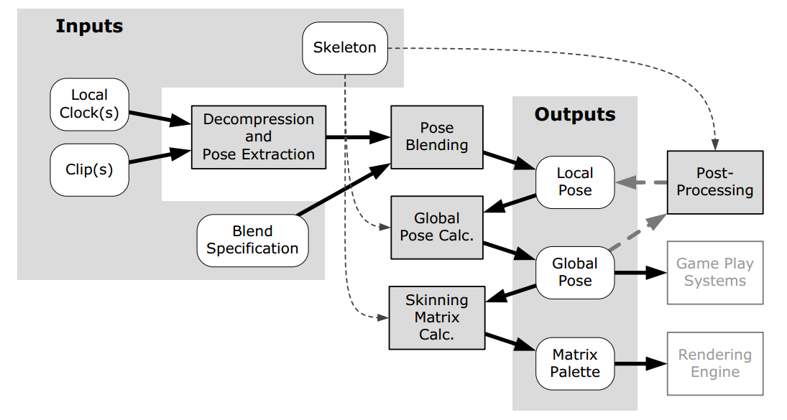

# Animation System

## Types of Character Animation

### Cel Animation

- `traditional animation` / `hand-drawn animation` 传统动画 / 手绘动画，所有游戏动画技术的先导，用于最早的动画片，通过快速连续地显示称为帧（`frame`）的一系列静止图像来产生运动的错觉。实时 3D 渲染可以被认为是传统动画的电子格式
- `Cel Animation` Cel 动画，一种特殊的传统动画。一个 Cel 是一个可以在其上绘制图像的塑料透明薄片。可以将动画的 Cel 序列放在固定的背景之上以产生运动的幻觉，而不必反复重绘静态背景
- `Sprite Animation` 精灵动画，Cel 动画的电子格式。一个精灵是一个可以覆盖在全屏背景图像上且不破坏它的小位图，通常由专门的图形硬件协助绘制。所以，精灵之于 2D 游戏动画等同 Cel 之于传统动画
- `looping animation` 循环动画，帧序列被设计为即使在无限重复时也能平滑地动画化。人物通常具有许多循环动画周期，包括各种空闲周期（`idle cycles`）、一个步行周期（`walk cycle`）、一个奔跑周期（`run cycle`）

### Rigid Hierarchical Animation

- 随着 3D 图形的出现，精灵技术开始失去吸引力。*毁灭战士*使用了一个类精灵动画系统：它的怪物只是面向相机的四边形，每个四边形显示一系列纹理位图（`animated texture`）来产生运动幻觉。这个技术至今仍用于低分辨率和遥远的物体
- `Rigid hierarchical animation` 刚体分层动画，3D 人物动画最早的方法。这个方法中，人物使用一个刚体件集合建模，这些刚体件以分层方式彼此约束，类似于哺乳动物的骨骼通过关节连接。该方法最大的问题是关节处的开裂问题，对于机器人和机械效果很好，但不适用与鲜活丰满的人物。一个典型的分层结构如下
  - 骨盆
    - 躯干
      - 上右臂
        - 下右臂
          - 右手
      - 上左臂
        - 下左臂
          - 左手
    - 上右腿
      - 下右腿
        - 右脚
    - 上左腿
      - 下左腿
        - 左脚

### Per-Vertex Animation and Morph Targets

- `Per-vertex animation` 每顶点动画，网格顶点由美术师动画化，运动数据导出用于描述运行时顶点如何运动。这个技术可以产生任何可以想象的网格变形，但是一个数据密集型技术，要为每个顶点保存时变运动信息，所以很少应用于实时游戏
- `Morph target animation` 变形目标动画，每顶点动画的变体。网格顶点由动画师移动，以创建一组相对较小的固定极端姿势。运行时可以混合两个或多个这些固定的姿势产生动画。每个顶点的位置可以使用每个极端姿势中顶点位置间的简单线性插值来计算，常用于面部动画
  - 一些工作室使用包含数百个关节的关节面部装备替换变形目标；另一些工作室则结合这两种技术，使用关节装备实现面部的主要姿势，然后通过变形目标应用微调

### Skinned Animation

- `skinned / skeletal animation` 蒙皮 / 骨骼动画，像刚体分层动画一样由刚性的“骨头”构造一个骨架（`skeleton`），但是不会直接渲染这些刚体件，而是让他们保持隐藏，在其上覆盖平滑连续的三角形网格，这些网格称为蒙皮（`skin`），与骨架的关节绑定，其顶点跟踪关节的运动。蒙皮网格的每个顶点可以加权到多个关节，所以当关节移动时，蒙皮可以以自然的方式伸展
- 骨骼动画可以像每顶点动画一样允许网格三角形变形，还享有刚体分层动画的更高的性能和内存使用特性，首先用于*超级马里奥 64*，至今仍然被游戏产业和故事片行业广泛使用。众多著名的现代游戏和电影角色全部或部分使用了蒙皮动画技术进行动画制作，包括*侏罗纪公园*中的恐龙，*合金装备4*中的 Solid Snake，*魔戒*中的咕噜，*神秘海域*中的 Nathan Drake，*玩具总动员*中的巴斯光年，*战争机器*中的 Marcus Fenix，*最后生还者*中的 Joel

### Animation Methods as Data Compression Techniques

- 最灵活的动画系统可以让动画师控制对象表面上每个无穷小的点，当然，像这样的动画会导致动画可能包含无限量的数据。每顶点动画、变形目标动画、蒙皮动画实际上可以看做是对这些无限量数据的压缩。我们通常的目标就是选择一个不会产生不可接受的视觉伪影的、提供最佳压缩的动画方法。
- 人物四肢大多数情况下像刚体一样随骨骼高效移动，这种情况下骨骼动画提供了最佳压缩；但是面部运动更加复杂，顶点的运动更独立，如果使用骨骼动画令人信服地动画化面部，则关节的数量趋近于顶点的数量，这减弱了其作为压缩算法的有效性。面部的动画使用变形目标压缩效果更好，因为顶点被约束为仅沿固定数量的预定义顶点位置之间的线性路径移动，而且变形目标往往是动画师工作的一种更自然的方式

## Skeletons

- 骨骼由称为关节（`joints`）的刚性件的层次结构组成。在游戏行业中，我们经常互换地使用术语关节和骨头（`bone`），但术语骨头实际上用词不当。从技术上讲，关节是动画师直接操作的物体，而骨头只是关节间的空白空间，游戏引擎不关心骨头，只有关节很重要。所以行业中使用“骨头”一词实际上 99% 是指关节。

### The Skeleal Hierarchy

- 骨骼动画的骨骼层次结构由关节组成，与典型的刚体层次结构看起来几乎相同
- 一个人形角色的关节层次结构可能如下，每个关节只有一个父亲，所以可以通过存储每个关节的父亲索引完全描述这个层级结构
  - 骨盆
    - 下脊椎
      - 中脊椎
        - 上脊椎
          - 右肩
            - 右肘
              - 右手
                - 右拇指
                - 右食指
                - 右中指
                - 右无名指
                - 右小指
          - 左肩
            - 左肘
              - 左手
                - 左拇指
                - 左食指
                - 左中指
                - 左无名指
                - 左小指
          - 颈部
            - 头
              - 左眼
              - 右眼
              - 各种面关节
    - 右大腿
      - 右膝盖
        - 右脚踝
    - 左大腿
      - 左膝盖
        - 左脚踝

### Representing a Skeleton in Memory

- 通常由一个小的顶部数据结构表示，该结构包含各个关节的数据结构数据
- 关节通常按顺序列出，以确保子关节始终出现在数组中的父关节之后，所以关节 0 总是骨架的根
- `Joint indices` 关节索引，通常用于指向动画数据结构中的关节。该方法在存储方面和查询一个关节的速度方面更高效
- 每个关节数据结构通常包含的信息
  - 关节名，一个字符串或一个散列 32 位字符串 ID
  - 父关节的索引
  - `inverse bind pose transform` 逆绑定姿势变换。关节的绑定姿势是该关节绑定到蒙皮网格顶点时的位置、方向、缩放
- 一个典型的骨架数据结构

  ```C
  struct Joint
  {
    Matrix4x3 m_invBindPose; // inverse bind pose transform
    const char* m_name; // human-readable joint name
    U8 m_iParent; // parent index or 0xFF if root
  };
  struct Skeleton
  {
    U32 m_jointCount; // number of joints
    Joint* m_aJoint; // array of joints
  };
  ```

## Poses

- 姿势是动画师给人物注入生命的主要工具，动画就是将角色的身体排列成一系列离散的静止姿势然后快速连续显示（通常在相邻姿势间线性插值而不是逐个显示姿势）
- 关节的姿势由关节的位置、方向和缩放定义，相对于某些参考帧。关节姿势通常用 $4\times 4$ 或 $4\times 3$ 矩阵或 SQT 数据结构（scale, quaternion rotation and vector translation）表示。骨架的姿势是关节姿势的集合，用一个简单的矩阵或 SQT 的数组表示

### Bind Pose

- `Bind pose` / `Reference pose` / `Rest pose` 绑定姿势，绑定到骨架前的 3D 网格的姿势。也称为 T 姿势（`T-pose`），因为人物通常站立时双脚略微分开，双臂伸出，形成字母 T 的形状

### Local Poses

- 关节的姿势通常相对于其父关节定义，我们通常使用术语局部姿势来描述相对于父关节的姿势。局部姿势大多数保存为 SQT 格式
- `Joint space` 关节空间，一个关节定义的坐标空间
- 一个关节姿势只不过是一个仿射变换，关节 $j$ 的姿势可以写成 $4\times 4$ 的仿射变换矩阵 $P_j$，由平移矢量 $T_j$，$3\times 3$ 的对角缩放矩阵 $S_j$，$3\times 3$ 的旋转矩阵 $R_j$ 组成。整个骨架的姿势 $P^{skel}$ 可以写成所有姿势 $P_j$ 的集合
  
  $$
  P_j=\begin{bmatrix}
    S_jR_j & 0 \\
    T_j & 1
  \end{bmatrix},\quad
  P^{skel}=\{P_j\}|_{j=0}^{N-1}
  $$

- `Joint Scale` 关节缩放
  - 有些引擎假设关节不会被缩放，所以 $S_j$ 被简单地省略并假设为单位矩阵
  - 有些引擎假设关节只会被均匀缩放（`uniform scale`），所以缩放可以用单个标量 $s_j$ 表示
  - 有些引擎允许非均匀缩放（`nonuniform scale`），所以缩放可以紧凑表示为三元向量 $s_j=\begin{bmatrix} s_{jx} & s_{jy} & s_{jz}\end{bmatrix}$。它对应 $S_j$ 的三个对角线元素，所以本身并不真的是一个向量
  - 几乎所有引擎不允许切变，因为切变需要一个完整的 $3\times 3$ 切变矩阵表示
  - 对缩放的省略或约束减少了内存使用，简化了数学逻辑和引擎处理
- `Representing a Joint Pose in Memory` 关节姿势在内存中的表示，通常以 SQT 格式保存，在 C++ 中的数据结构可能如下，S 被放在最后以优化结构体包装

  ```C++
  struct JointPose
  {
    Quaternion m_rot; // Q
    Vector3 m_trans; // T
    F32 m_scale; // S (uniform scale only)
    // Vector4 m_scale; // S (nonuniform scale is permitted)
  };
  struct SkeletonPose
  {
    Skeleton* m_pSkeleton; // skeleton + num joints
    JointPose* m_aLocalPose; // local joint poses
  };
  ```

- `The Joint Pose as a Change of Basis` 任何仿射变换可以认为是点或向量从一个坐标空间向另一个坐标空间的变换。关节姿势变换 $P_j$ 应用于表示在关节 j 空间中的点或向量，结果是表示在父关节空间中的该点或向量，所以关节 j 的局部姿势可以写作 $P_{j\to p(j)}$，其中 $p(j)$ 返回关节 j 的父关节索引

### Global Poses

- 有时在模型或自然空间中表示关节姿势十分方便，这称为全局姿势。关节的全局姿势可以这样计算：在骨架中从当前关节到根关节进行遍历，将路径上所有关节的局部姿势串联相乘

  $$
  P_{j\to M}=\prod_{i=j}^0P_{i\to p(i)}
  $$

- `Representing a Global Pose in Memory` 全局姿势在内存中的表示，扩展 `SkeletonPose` 结构体，使其包含全局姿势

  ```C++
  struct SkeletonPose
  {
    Skeleton* m_pSkeleton; // skeleton + num joints
    JointPose* m_aLocalPose; // local joint poses
    Matrix44* m_aGlobalPose; // global joint poses
  };
  ```

## Clips

- 游戏是互动体验，游戏人物的运动不是像电影一样的长连续帧序列，而是被细分为大量细粒度的动作，这些单独的动作称为动画片段（`animation clips`）或有时仅称为动画（`animation`）
- 每个片段使人物执行一个明确定义的动作，有些设计为循环的，如步行周期或奔跑周期，有些设计为执行一次，如抛物或绊倒在地上；有些影响整个身体，如人物跳到空中，有些只影响身体的一部分，如挥动右臂
- 游戏的不互动部分包含了特殊情况，称为游戏中的电影（`in-game cinematic / IGC`）、非交互序列（`noninteractive sequence / NIC`）或全动态视频（`full-motion video / FMV`）。他们通常用于交代故事元素，采用和电影一样的方式创建。`IGC` 和 `NIS` 通常指游戏引擎自己实时渲染的非交互序列，`FMV` 通常指提前渲染为 MP4、WMV 或其他格式电影文件的序列，运行时由引擎的全屏电影播放器回放
- `Quick time event / QTE` 快速反应事件，半交互序列，是非交互序列的一个变体。玩家必须在非交互序列中的正确时刻点击按钮才能看到成功动画并继续；否则会播放失败动画，玩家必须再次尝试，结果可能会丢失一条命或遭受其他后果

### The Local Timeline

- 可以认为动画片段有一个局部时间轴，通常用变量 $t$ 表示，在片段的开头 $t=0$，在片段的结尾 $t=T$，$T$ 为片段的持续时间，$t$ 的每个唯一值称为一个时间索引（`time index`）
- `Pose Interpolation and Continuous Time` 帧的显示速率和姿势的创建速率不一定是一样的。动画师只在动画片段的特定时间点生成重要的姿势，称为关键姿势（`key poses`）或关键帧（`key frames`），然后电脑通过线性或基于曲线的插值计算其间的姿势。
  - 动画片段的时间轴是连续的、可缩放的。时间 $t$ 是一个实数而不是整数，我们可以在片段的任意时间点采样；时间缩放可以通过更稠密或更稀疏的采样让人物移动得更慢或更快，一个负时间缩放甚至可以用于反向播放动画
- `Time Units` 最好用秒作为单位，也可以用帧作为单位，前提是预先定义了帧的持续时间。原则是保证帧间“渐变”或缩放动画播放速度时足够的分辨率
- `Frame versus Sample` 术语帧在游戏行业通常由多个含义，有时表示一个时间段，一秒有 30 或 60 帧，有时表示一个时间点，例如“第 42 帧的人物姿势”这种说法
  - 可以使用采样（`sample`）来指代时间点，帧只用于指代时间段，这样如果动画以每秒 30 帧的速率创建时，则每秒包含 31 个采样
- `Frames, Samples and Looping Clips` 当一个动画片段是不循环的，则 $N$ 帧动画包含 $N+1$ 个不同采样；当一个动画片段是循环的，则最后一个采样是冗余的，所以 $N$ 帧动画包含 $N$ 个不同采样
- `Normalized Time (Phase)` 有时使用标准化时间单位 $u$ 十分方便，这样动画开头 $u=0$，结尾 $u=1$，不用考虑动画持续时间 $T$。有时将标准化时间称为动画片段的相位（`phase`），类似正弦波的相位

### The Global Timeline

- 游戏角色有一个全局时间轴，开始于角色第一次产生的时间点或关卡及游戏的开始时间点。播放一个动画可以认为是动画片段局部时间轴到角色全局时间轴的简单映射。
- 动画片段映射到全局时间轴所需的信息
  - 全局时间轴开始时间 $\tau_{start}$
  - 动画片段回放速率 $R$
  - 动画片段持续时间 $T$
  - 动画片段循环次数 $N$
- 全局时间 $\tau$ 和局部时间 $t$ 的转换为
  
  $$
  t=(\tau-\tau_{start})R
  $$
  $$
  \tau=\tau_{start}+\frac{1}{R}t
  $$

- 动画片段不循环即$N=1$ 时
  
  $$
  t=clamp[(\tau-\tau_{start})R]|_0^T
  $$

- 动画片段无限循环即 $N=\infty$ 时
  
  $$
  t=((\tau-\tau_{start})R)\ mod\ T
  $$

- 动画片段循环有限次即 $1<N<\infty$ 时
  
  $$
  t=(clamp[(\tau-\tau_{start})R]|_0^{NT})\ mod\ T
  $$

- 大多数游戏引擎直接使用局部时间轴而不使用全局时间轴，但是直接使用全局时间可以带来一些非常有用的好处，例如同步动画

### Comparison of Local and Global Clocks

- 动画系统必须跟踪当前播放的每个动画的时间索引，有以下两个选择，它们有各自的优点，局部时钟是设计动画系统时最明显的选择
  - 局部时钟，动画片段开始播放时时间索引为零，为了及时推进动画，我们逐个推进每个动画片段的局部时钟。如果片段具有非单位播放速率 $R$，其局部时钟前进的量必须由 $R$ 缩放
  - 全局时钟，角色有一个全局时钟，每个片段简单记录其开始播放的全局时间 $\tau_{start}$，然后局部时钟可以由全局时间计算得到
- `Synchronizing Animations with a Local Clock` 使用局部时钟时，同步两个或多个动画片段，只需要它们在游戏的同一瞬间开始播放就可以简单实现。但是如果播放命令来自于引擎的不同子系统，同步可能会出现问题
- `Synchronizing Animations with a Global Clock` 全局时钟方法可以解决同步问题，因为根据定义，时间轴起点 $\tau=0$ 在所有片段中都是通用的。如果多个动画的全局开始时间一致，它们会完美同步开始；如果它们的回放速率一致，它们将保持同步，没有漂移。考虑到角色时钟间的差异，我们可以调整全局开始时间，也可以简单使所有角色共享一个主时钟

### A Simple Animation Data Format

- 通常，动画数据从一个 Maya 场景文件提取出，通过以每秒 30 或 60 采样的速率对骨架姿势进行离散采样。一个采样包括骨架中每个关节的完整姿势，这些姿势保存为 SQT 格式：对每个关节 $j$，缩放分量为单个浮点标量 $S_j$ 或三元向量 $S_j=\begin{bmatrix} S_{jx} & S_{jy} & S_{jz} \end{bmatrix}$，旋转分量为四元组 $Q_j=\begin{bmatrix} Q_{jx} & Q_{jy} & Q_{jz} & Q_{jw} \end{bmatrix}$，平移分量为三元向量 $T_j=\begin{bmatrix} T_{jx} & T_{jy} & T_{jz} \end{bmatrix}$。我们有时说动画每个关节最多包含 10 个通道，就是指 $S_j$、$Q_j$、$T_j$ 的这 10 个分量
- `Animation Retargeting` 动画重定向，重定向为一个骨骼制作的动画，以便他们可以在不同的骨架上工作。一个动画通常只与一个骨架兼容，但是多个密切相关的骨架是个例外，例如一组相同的骨架，只有一些可选的不影响基础层次结构的叶子关节不一样，则为一个骨架制作的动画可以在其他任意一个骨架上工作，只需要引擎能够忽略在骨架中找不到的关节的动画通道

### Continuous Channel Functions

- 一个动画片段的采样实际上只是关于时间的连续函数的定义，可以认为是 10 个标量值函数或两个向量值函数和一个四元组值函数。
- 理论上这些通道函数（`channel function`）平滑且连续（除非明确制作成不连续的，例如相机切割）；然而实际上，许多游戏引擎在采样之间线性插值，这种情况下实际使用的函数是潜在连续函数的分段线性近似（`piecewise linear approximations`）

### Metachannels

- 许多游戏允许为动画定义额外的“元通道”数据。这些通道可以编码游戏定义的信息，这些信息不必与骨架姿势直接相关，但是需要与动画同步
- 通常可以定义一个特殊通道，包含在各种时间索引处的事件触发器（`event triggers`），每当动画的局部时间索引通过其中一个触发器时，就会向游戏引擎发送一个事件，然后引擎以合适的方式响应。一个常见的用途是表示动画过程中哪个点应该播放哪个声音或粒子效果
- `Locators` 定位器，Maya 中的叫法，一种特殊的关节，允许与骨架本身的关节一起动画，可以用于编码游戏中几乎任何物体的位置和方向
- 定位器的一个典型应用是定义游戏镜头在动画过程中如何定位和定向。在 Maya 中将定位器约束到镜头，镜头的定位器导出，在游戏中被用于动画过程中移动游戏镜头。镜头的视野（焦距）、其他镜头属性也可以动画化，只需要将相关数据放入一个或多个浮点通道中
- 其他非关节动画通道包括
  - 纹理坐标滚动
  - 纹理动画（纹理坐标滚动的特殊情况，滚动范围为纹理内线性排列的帧）
  - 动画材质参数（颜色、镜面反射率、透明度等）
  - 动画照明参数（半径、锥角、强度、颜色等）
  - 其他随时间变化且以某种方式与动画同步的参数

## Skinning and Matrix Palette Generation

- `Skinning` 蒙皮，将 3D 网格的顶点附着到一个摆姿势的骨架的过程

### Per-Vertex Skinning Information

- 蒙皮网格通过它的顶点附着到骨架上。每个顶点可以绑定一个或多个关节，绑定一个关节时顶点精确跟踪关节的运动；绑定多个关节时，顶点的位置是假设它单独绑定每个关节时的位置的加权平均。所以给一个骨架蒙皮需要提供两个信息：顶点绑定的关节的索引、每个绑定关节的加权因子
- 通常游戏引擎对单个顶点能绑定的关节数量施加上限，典型的是四关节限制
- 因为所有绑定关节的加权和必须为一，所以最后一个加权因子可以省略，所以一个典型的蒙皮顶点数据结构可能如下

  ```C++
  struct SkinnedVertex
  {
    float m_position[3]; // (Px, Py, Pz)
    float m_normal[3]; // (Nx, Ny, Nz)
    float m_u, m_v; // texture coords (u,v)
    U8 m_jointIndex[4]; // joint indices
    float m_jointWeight[3]; // joint weights (last weight omitted)
  };
  ```

### The Mathematics of Skinning

- `skinning matrix` 蒙皮矩阵，可以将蒙皮网格顶点的原始位置（在绑定姿势中的位置）变换为骨架当前姿势对应的新位置，与其他变换矩阵不同的是，蒙皮矩阵不是一个空间到另一个空间的基础变换，它变换的点在变换前后的位置都在模型空间中
- `Simple Example: One-Jointed Skeleton`
  - 绑定姿势的顶点从模型空间到关节空间的变换，需要乘以绑定姿势逆矩阵

    $$
    v_j=v_M^BB_{M\to j}=v_M^B(B_{j\to M})^{-1}
    $$

  - 当前姿势的顶点从关节空间到模型空间的变换，需要乘以当前姿势矩阵

    $$
    v_M^C=v_jC_{j\to M}
    $$

  - 蒙皮矩阵 $K_j$ 的计算

    $$
    v_M^C=v_jC_{j\to M}=v_M^B(B_{j\to M})^{-1}C_{j\to M}=v_M^BK_j
    $$
    $$
    K_j=(B_{j\to M})^{-1}C_{j\to M}
    $$

- `Extension to Multijointed Skeletons`
  - 对于多关节骨架，要计算一个蒙皮矩阵 $K_j$ 的数组，每个元素对应一个关节，这个数组称为矩阵调色板（`matrix palette`）。引擎渲染蒙皮网格时为每一个顶点在调色板中查询对应关节的蒙皮矩阵，使用矩阵将顶点从绑定姿势变换到当前姿势
  - $B_{j\to M}$ 不变，通常用骨骼缓存 $(B_{j\to M})^{-1}$，$C_{j\to M}$ 随角色姿势变化而变化
  - 动画引擎通常为每个关节计算局部姿势 $C_{j\to p(j)}$，然后将它们转化为全局姿势 $C_{j\to M}$，最后将每个全局姿势与对应的已经缓存的绑定姿势逆矩阵 $(B_{j\to M})^{-1}$ 相乘，得到每个关节的蒙皮矩阵 $K_j$
- `Incorporating the Model-to-World Transform` 每个顶点必须从模型空间变换到自然空间，有些引擎将蒙皮矩阵调色板提前乘以物体的模型-自然变换矩阵以优化蒙皮几何图形的渲染，公式如下

  $$
  (K_j)_W=(B_{j\to M})^{-1}C_{j\to M}M_{M\to W}
  $$

  - 是否这样做取决于很多因素，例如一个动画同时应用于多个角色时（`animation instancing`），我们绝对不想这样做：保持模型-自然变换矩阵的分离，可以让单个矩阵调色板被所有角色共享
- `Skinning a Vertex to Multiple Joints` 当一个顶点绑定多个关节时，我们计算顶点与每个关节单独绑定时的最终位置，然后对这些位置加权平均得到结果位置，公式如下，顶点绑定的 $N$ 个关节为 $j_0$ 到 $j_{N-1}$，对应的权重为 $w_0$ 到 $w_{N-1}$

  $$
  v_M^C=\sum_{i=0}^{N-1}w_iv_M^BK_{j_i}
  $$

## Animation Blending

- 动画混合，混合组合多个输入姿势（`input poses`），产生骨骼的一个输出姿势（`output pose`）
- 通常结合某个时间点的多个姿势，生成同样时间点的一个姿势，无需手动创建它。例如，混合受伤的走路姿势和正常的走路姿势，可以生成受不同程度的伤时的走路姿势；混合角色瞄准左边的动画和瞄准右边的动画，可以生成角色瞄准左边到右边任意角度的动画
- 混合可用于在极端的面部表情、身体姿势、运动模式等之间插值
- 混合还可用于找到两个不同时间点的已知姿势的中间姿势
- 时间动画混合可用于动画间平滑过渡

### LERP Blending

- 线性插值，两个骨架姿势的插值可以分解为两个骨架对应关节的姿势的插值；使用关节的局部姿势进行插值计算，这样一个关节姿势的插值与其他关节姿势的插值无关，可以并行计算
- 直接插值矩阵是不实际的，这也是局部姿势表示为 SQT 格式的一个原因。局部姿势的插值可以分解为 $S$ 分量、$Q$ 分量、$T$ 分量的插值，公式如下，其中 $\beta$ 为混合百分比（`blend percentage`）或混合因子（`blend factor`）
  
  $$
  (T_{LERP})_j=LERP((T_A)_j,(T_B)_j,\beta)=(1-\beta)(T_A)_j+\beta(T_B)_j
  $$
  $$
  (Q_{LERP})_j=normalize(LERP((Q_A)_j,(Q_B)_j,\beta))=(1-\beta)(Q_A)_j+\beta(Q_B)_j
  $$  
  或
  $$
  (Q_{SLERP})_j=SLERP((Q_A)_j,(Q_B)_j,\beta)=\frac{sin((1-\beta)\theta)}{sin(\theta)}(Q_A)_j+\frac{sin(\beta\theta)}{sin(\theta)}(Q_B)_j
  $$
  $$
  (S_{LERP})_j=LERP((S_A)_j,(S_B)_j,\beta)=(1-\beta)(S_A)_j+\beta(S_B)_j
  $$

### Applications of LERP Blending

- `Temporal Interpolation` 时间插值，给定 $t_1$ 和 $t_2$ 两个时间点的采样姿势，计算两个时间点之间的时间点 $t$ 的姿势

  $$
  P_j(t)=LERP(P_j(t_1),P_j(t_2),\beta(t))=(1-\beta(t))P_j(t_1)+\beta(t)P_j(t_2),
  $$
  $$
  \beta(t)=\frac{t-t_1}{t_2-t_1}
  $$

- `Motion Continuity: Cross-Fading` 动作连续性：交叉衰落。角色动画通过拼接大量精细的动画片段来实现，这些动画片度的质量水平很难保持一致，所以角色从一个片段切到另一个片段时很容易发生“断裂”
  - 我们期望角色每个部分的移动都能完美平滑，即使在片段间的过渡。这样，每个关节移动的三维路径都不能有突然的“跳跃”，称为 C0 连续性（`C0 continuity`）。同样，这些路径的一阶导数即速度也应该是连续的，称为 C1 连续性；这些路径的二阶导数即加速度也应该是连续的，称为 C2 连续性。更高的连续性赋予动画角色运动更好的感知质量和真实感
  - 基于线性插值的动画混合能实现相当好的 C0 运动连续性以及很好的近似 C1 连续性。当通过这种方式在片段间过渡时，线性插值混合有时称为交叉衰落（`cross-fading`）
  - 线性插值混合有时会产生“滑动脚”这样的失真
  - 为了在两个动画间交叉衰落，需要将两个片段的时间轴合理地部分重叠，将片段的重叠部分混合
  - `Types of Cross-Fades` 交叉衰落的类型
    - `Smooth transition` 平滑过渡，两个动画片段同时播放，混合因子 $\beta$ 从 $0$ 到 $1$ 增加。为了使其正常工作，两个片段必须是循环动画，并且他们的时间轴必须同步
    - `Frozen transition` 冻结过渡，第一个片段的局部时钟在第二个片段开始播放时停止，骨架来自于第一个片段的姿势冻结，第二个片段逐渐接管运动。这个方法不要求两个片段必须相关和可以同步时间
  - 混合因子 $\beta$ 可以随时间线性变换，如果要实现更平滑的过渡，可以使用一个关于时间的立方函数，如一维贝塞尔曲线
  - `Core Poses` 核心姿势。如果动画师能确定任何给定片段中的最后一个姿势与其后面片段的第一个姿势匹配，则不使用混合就能实现运动连续性。在实践中，动画师通常决定一组核心姿势，确保角色在每个片段的开始和结尾都是核心姿势且片接拼接在一起时核心姿势相匹配，则可以实现 C0 连续性；确保角色从一个片段结尾的动作平滑过渡到下一个片段开始的动作，则可以实现 C1 或更高的连续性，这可以通过创作单个平滑动画然后将其分为多个片段来实现
- `Directional Locomotion` 定向运动
  - `pivotal movement` 枢轴运动，角色向各个方向移动时，面向的方向始终是前进的方向，即角色转向时绕着他的垂直轴旋转
    - 可以在角色转向时简单播放前进的动画
    - 更自然的方式是在基本前进或跑步上设置三种变化动画，一个径直前进、一个向左转、一个向右转，然后可以在径直前进和向左转之间线性插值混合实现自然的带倾斜的向左转
  - `targeted movement` 目标运动，角色向各个方向移动时，始终保持面向一个方向，即角色移动时眼睛或武器保持关注目标，在游戏世界中称为扫射（`strafing`）
    - 分别定义三个可以称为定向运动片段（`directional locomotion clips`）的循环动画片段，一个向前移动，一个向左移动，一个向右移动，这三个定向运动片段分布在一个半圆周上，当角色向前移动时，找到前进方向对应的相邻两个定向运动片段进行基于线性插值的混合，以产生自然的向前的目标运动
    - 可以使用相同的方法定义向后的定向运动片段和半圆周，产生向后的目标运动，当角色从一个半球到另一个半球时，可以播放显示过渡动画来调整角色的步态和腿交叉

### Complex LERP Blends

- 游戏引擎通常会“预包装”某些常用类型的复杂混合以便于使用各种复杂混合达到各种目的
- `Generalized One-Dimensional LERP Blending` 通用一维线性插值混合，在一个线性范围内进行插值
- `Simple Two-Dimensional LERP Blending` 简单二维线性插值混合。如果二维混合包含四个动画片段，这四个片段位于正方体区域的四个角，则可以通过多个一维线性插值混合得到一个二维线性插值混合：分别使用水平混合因子混合顶部两个片段和底部两个片段得到两个中间姿势，然后使用垂直混合因子混合这两个中间姿势得到最终姿势
- `Triangular Two-Dimensional LERP Blending` 三角形二维线性插值混合。对于任意多个动画片段的线性插值混合其实只是一个加权平均；对于三个动画片段，可以使用三个权重计算线性插值混合，这三个权重可以通过计算在二维混合空间中混合点关于三角形的重心坐标（`barycentric coordinates`）得到，三角形由三个动画片段组成
- `Generalized Two-Dimensional LERP Blending` 通用二维线性插值混合。重心坐标技术可以扩展到二维混合空间中任意位置的任意多个动画片段。使用 Delaunay 三角剖分（`Delaunay triangulation`）找到给定位置的多个动画片段组成的一组三角形，则任意一个混合点都落在其中一个三角形中

### Partial-Skeleton Blending

- 允许骨架的不同关节定义不同的混合因子，以独立控制骨架的不同部分。有时整个骨架的混合因子集合也称为混合掩模（`blend mask`）
- 会导致角色运动不自然
  - 每顶点混合因子的突然改变会导致身体的一部分看起来与其他部分断开，通过逐渐改变混合因子而不是突然改变可以缓和这一点
  - 真实人体的运动不是完全独立的，例如跑步时的挥手臂比慢走时的看起来更具有弹性和失控，但是使用部分骨架混合，跑步和慢走时的挥手臂动作是一样的，这个问题很难克服。所以更多开发者趋于使用看起来更自然的技术加性混合（`additive blending`）

### Additive Blending

- 给定两个输入片段，一个称为源片段 $S$（`source clip`），一个称为引用片段 $R$ （`reference clip`），可以计算一个差异片段（`difference clipse`）$D=S-R$，差异片段对一个姿势变换为另一个姿势需要进行的更改进行编码，并且可以部分应用更改以生成 $R$ 和 $S$ 的中间动画
- $S$ 和 $R$ 的持续时间应该是一样的，否则会有一段时间 $S$ 或 $R$ 未定义，意味着 $D$ 也未定义
- 差异片段在游戏行业中通常称为加性动画片段（`additive animation clips`）
- 差异片段生成后不仅可用于引用片段生成源片段，还可用于其他无关的片段，我们称这些片段为目标片段（`target clips`）
- 一个差异片段可以加到各种常规动画片段生成一系列有趣自然的动画；可以创建一系列差异片段，每个片段加到目标片段上产生不同的效果
- `Mathematical Formulation` 数学公式
  - 给定关节 $j$ 的源姿势 $S_j$ 和引用姿势 $R_j$，差异姿势为

    $$
    D_j=S_j-R_j=S_jR_j^{-1}
    $$

  - 将差异姿势 $D_j$ 加到目标姿势 $T_j$ 上生成一个新姿势 $A_j$

    $$
    A_j=D_jT_j=(S_jR_j^{-1})T_j
    $$
  
  - `Temporal Interpolation of Difference Clips` 差异片段的时间插值与非差异片段的时间插值相同
  - `Additive Blend Percentage` 加性混合因子，同样需要分解为 $S$ 分量、$Q$ 分量、$T$ 分量的插值

    $$
    A_j=LERP(T_j,D_jT_j,\beta)=(1-\beta)T_j+\beta(D_jT_j)
    $$

- `Additive Blending versus Partial Blending` 加性混合和部分混合相比，动画不会看起来有“断开”的现象，因为加性混合不替换关节子集的动画或在两个无关姿势间插值，而是向源动画添加动作。一个差异动画知道如何改变一个姿势使得角色做一些具体的事情，如累了、挥手臂等；这些改变可以应用于各种各样的动画且结果通常看起来是自然的
- `Limitations of Additive Blending` 加性混合的限制，有时可能会造成过度旋转，例如目标动画中肘部弯曲 90 度的情况下再加一个肘部旋转 90 度的差异动画，则上臂和下臂会互相穿透
  - 选择引用片段和目标片段时必须认真，有以下几个原则
    - 在引用片段中保持臀部旋转最小
    - 在引用片段中肩部和肘部关节通常应处于中立姿势
    - 动画师应该为每个核心姿势创建一个新的不同的差异动画
  - 需要实践，如果团队第一次使用加性混合，会花费大量时间学习加性混合的艺术

### Applications of Additive Blending

- `Stance Variation` 姿势变化，对于每个期望的姿势，动画师创建一个一帧的差异动画，当差异动画加性混合到一个基础动画时，导致角色的整个姿势大幅变化
- `Locomotion Noise` 运动噪音，真实人类的运动不是完全不变的，而是随时间变化，尤其是当人类被敌人攻击干扰这样的场景；加性混合在完全重复的运动周期之上添加了随机性和对干扰的反应
- `Aim and Look-At` 瞄准和观察，动画师将头或武器的方向变化到最右边然后保存一个一帧或多帧的差异动画，为最左、最上、最下分别重复此过程，得到四个差异动画，它们加性混合到原始的朝向正面的动画上，使得角色可以在上下左右之间随意观察和瞄准
- `Overloading the Time Axis` 重载时间轴，使用帧数而不是时间定位帧，例如一个两帧动画，一帧向前瞄准、一帧向右瞄准，可以将局部时钟固定到帧 0.5，以得到两帧的 50% 混合即向右 45 度瞄准的动画

## Post-Processing

- `animation post-processing` 一旦一个骨架由一个或多个动画片段使用线性插值或加性混合方法混合构成，通常需要在角色渲染前对姿势进行修改，这称为动画后期处理

### Procedural Animations

- 程序动画是任何运行时生成的动画，而不是由 Maya 这样的动画工具导出的数据驱动。有时，手工动画片段用于骨架的初始化姿势，然后在后期处理阶段通过程序动画以某种方式修改姿势；程序动画也可以作为系统的输入取代手工动画片段
- 例 1：常规动画片段用于使汽车移动时看起来在地形上上下弹跳，它的方向由玩家控制，对动画产生的姿势进行后期处理可以调整前轮的旋转，让汽车转向更自然。假设原始动画中前轮处于中立位置，我们可以使用当前转动角度创建一个使前轮关于垂直轴偏移所需量的四元组，将前轮关节的 $Q$ 通道乘以这个四元组就可以产生前轮的最终姿势。这个调整在局部姿势上进行，且在全局姿势计算和矩阵调色板生成之前
- 例 2：让游戏世界中的树和灌木丛在风中自然摇摆；当角色穿过灌木丛时，让它们偏向一边。我们可以用简单骨架蒙皮对树和灌木丛进行建模，用程序动画替代或补充手工动画片段，让关节以看起来自然的方式移动。可以应用一个或多个正弦曲线或一个柏林噪声函数于各个关节的旋转，让它们在风中摇摆；当角色穿过有一个灌木或草的区域时，可以将它的根关节四元组急速向外偏斜，使它看起来似乎被角色推倒了

### Inverse Kinematics

- 角色弯身捡地上物体的动画在 Maya 中看起来不错，但是在游戏中由于地面不完全是平的，角色的手可能有时没够到物体，有时超过了物体，这种情况下需要调整骨架的最终姿势使得角色的手与目标物体完全对齐。反向运动学（`inverse kinematics / IK`）技术用于解决这种问题
- 常规动画片段是正向运动学（`forward kinematics / FK`）的例子。在 `FK` 中，输入是一组局部关节姿势，输出是一个全局姿势和每个关节的蒙皮矩阵。在 `IK` 中输入是单个关节的期望全局姿势，这个关节称为末端执行器（`end effector`），我们解决骨架中其他关节的局部姿势，将末端执行器带到所需位置
- 在数学上，`IK` 归结为误差最小化（`error minimization`）问题。对于大多数最小化问题，可能有一个、多个解或无解。当骨架开始姿势合理接近所需目标时 `IK` 效果最好。假设一个两关节骨架，每个关节只能绕一个轴旋转，则它们的旋转可以用一个二维角向量 $\theta=\begin{bmatrix}\theta_1 & \theta_2\end{bmatrix}$ 表示，$\theta$ 的所有可能值的集合形成一个二维空间，称为配置空间（`configuration space`）。在配置空间上对末端执行器到所需目标的距离进行作图可以得到一个曲面，`IK` 就是找到这个曲面的最低点

### Rag Dolls

- 布娃娃物理，用于产生自然的“无生命”身体运动。一个布娃娃是一组物理模拟刚体，每个刚体表示角色身体的一个半刚性部分，例如下臂或上腿，这些刚体互相约束，其位置和方向由物理系统决定，然后用于驱动角色骨架中某些关键关节的位置和方向。物理系统到骨架的数据传输通常作为一个后期处理步骤完成

## Compression Techniques

- 动画数据十分占内存，所以游戏工程师要投入大量精力来压缩动画数据，以便以最小的内存成本允许最大的丰富性和多样化的运动

### Channel Omission

- 通过省略无关的通道来减小动画片段的大小
- 例 1：由于人物通常不需要非均匀缩放，所以三个缩放通道可以减少为一个均匀缩放通道，有些游戏中所有关节的缩放通道实际上都被省略了，除了脸上的关节
- 例 2：由于人形角色的骨头通常不能拉伸，所以所有关节的平移通道通常可以省略，除了根关节、面部关节和有时的锁骨
- 例 3：因为四元组总是标准化的，所以每个四元组可以只保存三个分量，第四个分量可以运行时重建
- 例 4：对于在整个动画过程中不会变化的姿势，其通道可以保存为时间 $t=0$ 处的采样加一个比特位，这个比特位表明通道是常量

### Quantization

- 通过减小每个通道的大小来减小动画片段的大小
- 对于旋转四元组，通道值范围为 $[-1,1]$，当值为 1 时，IEEE 浮点数的指数为 0，23 位精度可以提供小数点后 7 位的精度。经验表明 16 位精度的四元组可以很好被编码，所以使用 32 位浮点数保存四元组实际上浪费了 16 位
- 将 32 位 IEEE 浮点数转化为 n 位整数表示称为量化（`quantization`）
- 量化包含两个操作：编码（`encoding`）将原始浮点数值转化为量化的整数表示；解码（`decoding`）从量化的整数恢复原始浮点数值的近似值（量化是有损压缩方法）
- 编码过程：首先将可能输入值的有效范围划分为相等大小的 N 个区间，然后决定特定浮点数值位于哪个区间内，用这个区间的整数索引表示该值
- 解码过程：将这个整数索引转化为浮点数格式，然后移位并缩放到原始范围
- 编码的两种方式
  - T 编码（`T encoding`）：将浮点数截断到（`trancate`）下一个最低区间边界
  - R 编码（`R encoding`）：将浮点数四舍五入（`round`）到封闭区间的中间
- 解码的两种方式
  - L 重建（`L reconstruction`）：返回原始值映射区间左侧（`left-hand side`）的值
  - C 重建（`C reconstruction`）：返回区间中间（`center`）的值
- 编码和解码方式有四种组合：TL、TC、RL、RC，TL 和 RC 需要避免，因为它们倾向于删除或添加数据集的能量，造成灾难性的影响；TC 是在带宽方面最有效的方法，但是无法表示值 0，所以 RL 通常是最好的选择
- 平移通道的压缩比旋转通道更棘手，因为平移通道值的范围理论上是无限的。值得庆幸的是，角色关节实际上不会移动很远，所以可以决定移动的一个合理范围，当动画包含有效范围外的平移时标记错误。IGC 是个例外，IGC 在自然空间时，角色根关节的平移可以变得非常大。为了解决这个问题，可以根据每个片段中实际实现的最大平移，基于每个动画或基于每个关节选定有效平移的范围。因为这个范围可能动画间或关节间不同，所以必须保存到压缩片段数据中，这将为每个片段添加少量数据，但影响通常可以忽略不计

### Sampling Frequency and Key Omission

- 动画数据往往很大的三个原因
  - 一个关节姿势可以包含多达 10 个浮点数通道
  - 一个骨架包含大量关节（一个人形角色在 PS3 或 Xbos 360 上有 250 或更多个关节，在一些 PS4 或 Xbox One 游戏中超过 800 个）
  - 角色姿势通常高速率采样（例如30 帧或 60 帧每秒）
- 第一个问题可以通过通道省略和量化解决，第二个问题只能坚持，因为高分辨率角色的关节数量没法减少，第三个问题有两种解决方法
  - 整体降低采样率：一些动画以每秒 15 采样的速率导出时仍然看起来不错
  - 省略一些采样：如果一个通道的数据在片段中某个时间区间内以近似线性的方式变化，可以省略这个区间除了端点的所有采样，省略的采样在运行时可以通过线性插值恢复。这要求我们保存每个采样的时间信息，通过省略采样节省的空间最终要减掉这些额外数据所占的空间

### Curve-Based Compression

- 基于曲线的压缩：Rad Game Tools 的 Granny 是最强大、易于使用和深思熟虑的动画 API 之一，它不将动画保存为规则间隔的姿势采样序列，而是一个 n 阶非均匀非理性 B 样条的集合，描述一个关节的 $S$、$Q$、$T$ 通道随时间的路径
- Granny 首先像传统动画数据一样以规则间隔采样关节姿势来导出动画，然后对于每个通道，Granny 将一组 B 样条以用户指定的容差拟合到采样数据集

### Selective Loading and Streaming

- 选择性加载和流式传输：大多数游戏不需要每个动画片段同时在内存中，例如有些动画只应用于某种类型的角色，所以在遇不到这种角色的关卡中不需要加载这些动画；有些动画可能只播放一次。这些动画可以在需要时再加载或流式传输到内存，在完成播放后从内存倾销
- 大多数游戏在首次启动时加载一套核心动画片段到内存并在游戏期间保留它们，包括角色的核心动作集和整个游戏中反复出现的对象的动画，比如武器和能量提升，所有其他动画通常根据需要加载
- 一些游戏引擎单独加载动画片段，但许多游戏引擎将它们打包成逻辑组，作为一个单元加载和卸载

## Animation System Architecture

- 大多数动画系统由最多三个不同的层组成
  - `Animation pipeline` 动画流水线。对于游戏中每个动画角色和物体，动画流水线以一个或多个动画片段和对应的混合因子作为输入，生成一个骨架局部姿势作为输出；同时还计算一个骨架的全局姿势和一个渲染引擎使用的蒙皮矩阵调色板；通常还提供后期处理钩子，允许在最终全局姿势和矩阵调色板生成前修改局部姿势，这个钩子是应用 IK、布娃娃物理和其他形式程序动画的到骨架的点
  - `Action state machine (ASM)` 动作状态机。游戏角色的动作（站立、行走、跑步、跳跃等）通常最好通过有限状态机建模，这个有限状态机通常称为动作状态机。ASM 子系统位于动画流水线上层，提供一个状态驱动动画接口给几乎所有更上层游戏代码使用。它保证角色可以在状态之间平滑过渡。此外，大多数动画引擎允许角色身体的不同部分同时做不同的、独立的动作，例如在奔跑时瞄准和射击武器，这可以通过允许多个独立的状态机通过状态层（`state layers`）控制一个角色实现
  - `Animation controller` 动画控制器。在许多游戏引擎中，玩家或非玩家角色的行为最终由动画控制器的上层系统控制。每个控制器都是定制的，以便在特定模式下管理角色的行为，可能有一个控制器处理角色在空旷地移动和战斗时的动作（“run-and-gun” mode），有一个角色在掩护时的，有一个角色驾驶车辆的，有一个爬梯子的，等等。上层动画控制器允许封装几乎所有动画相关的代码，让顶层玩家控制或 AI 逻辑通过动画微管理保持整洁
- 一些游戏引擎在这些层之间的关系与上述不同，或者引入了其他层，其他引擎将两个或更多层合并到单个系统中，但是所有动画引擎都需要以某种形式执行这些任务

## The Animation Pipeline

- 由底层动画引擎执行的操作形成流水线，输入为动画片段和混合规格，输出为局部姿势、全局姿势和用于渲染的矩阵调色板
- 典型的动画流水线
  
  

- 动画流水线的阶段
  - `Clip decompression and pose extraction` 片段解压和姿势提取
    - 输入：局部时钟和动画片段
    - 处理：解压每个片段，为所讨论的时间索引提取静态姿势
    - 输出：每个输入片段的骨架局部姿势，可能为包含骨架所有关节信息的全身姿势、仅包含关节子集的部分姿势、用于加性混合的差异姿势
  - `Pose blending` 姿势混合
    - 输入：局部姿势和混合规格
    - 处理：通过全身 LERP 混合、部分骨架 LERP 混合或加性混合组合输入姿势
    - 输出：骨架的一个局部姿势
    - 其他：这个阶段只有混合超过一个动画片段时才会执行，否则直接使用输入姿势作为输出姿势
  - `Global pose generation` 全局姿势生成
    - 输入：骨架的一个局部姿势
    - 处理：遍历骨架层次结构，计算骨架的全局姿势
    - 输出：骨架的一个全局姿势
  - `Post-processing` 后期处理
    - 输入：骨架和骨架的一个局部或全局姿势
    - 处理：在完成姿势之前修改骨架的局部或全局姿势
    - 输出：骨架的一个局部姿势
    - 其他：用于 IK、布娃娃物理和其他形式的程序动画
  - `Recalculation of global poses` 重新计算全局姿势。由于许多类型的后期处理需要以全局姿势作为输入但是生成局部姿势作为输出，所以后期处理阶段执行后，需要再次执行全局姿势生成阶段
  - `Matrix palette generation` 矩阵调色板生成
    - 输入：骨架和骨架的一个全局姿势
    - 处理：每个关节的绑定姿势逆矩阵乘以全局姿势矩阵
    - 输出：一个蒙皮矩阵调色板，作为渲染引擎的输入

### Data Structures

- `Shared Resource Data` 共享资源数据，同类型的角色或物体通常共享一组资源数据，通常包含如下数据
  - `Skeleton` 骨架，描述关节层次结构和绑定姿势
  - `Skinned meshes` 蒙皮网格，一个骨架可以蒙皮一个或多个网格，一个蒙皮网格中每个顶点包含了一个或多个骨架关节的索引和蒙皮权重
  - `Animation clips` 动画片段，可以为一个角色的骨骼创建数千个动画片段，包括全身片段、部分骨骼片段和用于加性混合的差异片段
- 游戏设计师经常尝试将游戏中独特骨架的数量减少到最少，因为每个新骨架通常需要一组全新的动画片段。为了提供不同类型角色的幻觉，通常最好在可能的情况下创建蒙皮到同一骨架的多个网格，这样所有角色可以共享一组动画。高质量的实时骨架重定向技术的出现解决了这个问题
- 重定向技术可以将为一个骨架创作的动画应用于一个不同的骨架。如果两个骨架形态相同，重定向归结为简单的关节索引重映射问题；当两个骨架不完全匹配的时候，重定向问题更加复杂。顽皮狗的动画师定义了一个称为重定向姿势（`retarget pose`）的特殊姿势，这个姿势捕捉源骨架和目标骨架绑定姿势间的本质区别，允许运行时重定向系统调整源姿势，让它在目标角色上工作得更自然
- `Per-Instance Data` 每实例数据