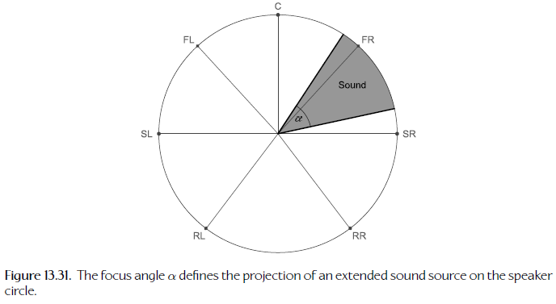
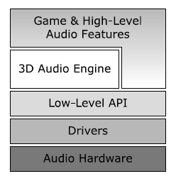

# Audio

<!-- TOC -->

- [Audio](#audio)
  - [The Physics of Sound](#the-physics-of-sound)
    - [Properties of Sound Waves](#properties-of-sound-waves)
    - [Perceived Loudness and the Decibel](#perceived-loudness-and-the-decibel)
    - [Sound Wave Propagation](#sound-wave-propagation)
  - [The Mathematics of Sound](#the-mathematics-of-sound)
    - [Signals](#signals)
    - [Manipulating Signals](#manipulating-signals)
    - [Linear Time-Invariant (LTI) Systems](#linear-time-invariant-lti-systems)
    - [Impulse Response of an LTI System](#impulse-response-of-an-lti-system)
    - [The Frequency Domain and the Fourier Transform](#the-frequency-domain-and-the-fourier-transform)
  - [The Technology of Sound](#the-technology-of-sound)
    - [Analog Audio Technology](#analog-audio-technology)
    - [Digital Audio Technology](#digital-audio-technology)
  - [Rendering Audio in 3D](#rendering-audio-in-3d)
    - [Overview of 3D Sound Rendering](#overview-of-3d-sound-rendering)
    - [Modeling the Audio World](#modeling-the-audio-world)
    - [Distance-Based Attenuation](#distance-based-attenuation)
    - [Pan](#pan)
    - [Propagation, Reverb and Acoustics](#propagation-reverb-and-acoustics)
    - [Doppler Shift](#doppler-shift)
  - [Audio Engine Architecture](#audio-engine-architecture)
    - [The Audio Processing Pipeline](#the-audio-processing-pipeline)
    - [Concepts and Terminology](#concepts-and-terminology)
    - [The Voice Bus](#the-voice-bus)
    - [Master Mixer](#master-mixer)
    - [The Master Output Bus](#the-master-output-bus)
    - [Implementing a Bus](#implementing-a-bus)
    - [Asset Management](#asset-management)
    - [Mixing Your Game](#mixing-your-game)
    - [Audio Engine Survey](#audio-engine-survey)
  - [Game-Specific Audio Features](#game-specific-audio-features)
    - [Supporting Split-Screen](#supporting-split-screen)
    - [Character Dialog](#character-dialog)
    - [Music](#music)

<!-- /TOC -->

## The Physics of Sound

- 声音是在空气中传播的压缩波，声波振幅（`amplitude`）的单位为压强（`pressure`），SI 单位中压强的单位为帕斯卡（`Pascals / Pa`），$1Pa=1N/m^2=1kg/(m\cdot s^2)$
- `instantaneous acoustic pressure` 瞬间声压，为环境大气压加特定时刻声波引起的扰动

  $$
  p_{inst}=p_{atmos}+p_{sound}
  $$

- 可以将瞬间声压绘制为关于时间的函数，这样的时变函数在信号处理原理（`signal processing theory`）中称为信号（`signal`）

  

### Properties of Sound Waves

- 乐器演奏长而稳定的音符时，声压信号是周期性的（`periodic`），波形由特定乐器的重复模式组成，任意重复模式的周期（`period`）$T$ 描述连续模式实例间经过的最短时间，SI 单位中通常单位为秒
- `frequency` 声波的频率 $f=1/T$，单位为赫兹（`Hertz / Hz`）
- `angular frequency` 角频率  $w=2\pi f=2\pi/T$，单位为弧度每秒
- `phase` 相位，周期信号沿时间轴向左或向右偏移的量，是一个相对术语，例如 $\sin(t)$ 可由 $\cos(t)$ 沿 $t$ 轴相移 $+\frac{\pi}{2}$ 得到
- `speed` 速度 $v$ 取决于介质的材质和物理属性，包括物态（固态，气态或液态）、压强、温度、密度

### Perceived Loudness and the Decibel

- 为了判断听到的声音的响度，耳朵在短暂的滑动时间窗口内连续平均输入声音信号的振幅，这个平均效果使用有效声压（`effective sound pressure`）建模，它定义为特定时间间隔内瞬间声压的均方根（`root mean square / RMS`）
- 对于 $n$ 个离散的声压 $p_i$

  $$
  p_{rms}=\sqrt{\frac{1}{n}\sum_{i=1}^np_i^2}
  $$

- 对于从时间 $T_1$ 开始持续到时间 $T_2$ 的连续的瞬间声压 $p(t)$

  $$
  p_{rms}=\sqrt{\frac{1}{T_2-T_1}\int_{T_1}^{T_2}(p(t))^2\mathrm{d}t}
  $$

- 感知响度与声强（`acoustic intensity`）成正比，声强与 RMS 声压的平方成正比

  $$
  I\propto p_{rms}^2
  $$

- 人类可以感知的声压范围很大，为了管理这样大的动态范围，我们通常以分贝（`decibels / dB`）作为声强的单位。声强以分贝测量时称为声压级（`sound pressure level / SPL`），如下

  $$
  L_p=10\log_{10}(\frac{p_{rms}^2}{p_{ref}^2})\mathrm{dB}=20\log_{10}(\frac{p_{rms}}{p_{ref}})\mathrm{dB}
  $$

  - 常用的空气中的参考声压为 $p_{ref}=20Pa$
- `Equal-Loudness Contours` 等响度轮廓线。人类耳朵对频率为 2-5 kHz 间的声音最敏感，当频率超出这个范围时，产生相同的感知响度需要更大的声强。每个等响度轮廓线对应不同的感知响度等级，最低的等响度轮廓线表示最安静的声压或听觉的绝对阈值，最高的等响度轮廓线是疼痛的阈值
- `The Audible Frequency Band` 典型的成年人可以听见低至 20 Hz 高至 20 kHz 的声音，等响度轮廓线可以帮助解释为什么人类耳朵能感知的声音在频率的有限“带”里

### Sound Wave Propagation

- 声波是纵波（`longitudinal wave`），声压振荡发生在波的传播方向上，没有偏振（`polarization`）
- 游戏中我们通常对虚拟声波的吸收、反射和有时衍射进行建模，但是通常会忽略折射效果，因为人类听觉不容易注意到这些效果
- `Fall-Off with Distance` 假设声源在所有方向上辐射相等，声压和声强随半径 $r$ 增大而减小

  $$
  p(r)\propto\frac{1}{r}
  $$
  $$
  I(r)\propto\frac{1}{r^2}
  $$
  $$
  L_p(r)=L_p(0)+10\log_{10}(\frac{1}{4\pi r^2})\mathrm{dB}=L_p(0)-10\log_{10}({4\pi r^2})\mathrm{dB}
  $$

  - 声源不总是全方位的

    

- `Atmospheric Absorption` 由于高频率的波更容易被大气吸收，低频率的声音可以被听到的距离更长
- 声音的减弱依赖于距离、频率、温度和湿度
- `Phase Shift and Interference` 相移和干涉。多个波交互称为干涉，波相互增强振幅称为建设性干涉（`Constructive interference`），波相互抵消称为破坏性干涉（`Destructive interference`）。两波频率匹配，干涉简单增强或减弱振幅；两拨频率显著不同，波的同相和不同相周期交替，导致交替的较高和较低振幅的周期
  - `Comb Filtering` 梳状滤波，声波从表面反射，几乎完全抵消或完全增强某些频率，结果频率有很多狭窄的峰谷，绘制时看起来像梳子。这对音频录制和重现有很大影响
- `Reverb and Echo` 混响和回声
  - 来自声源的三种声波
    - `Direct (dry)` 声波沿直接的无遮挡的路径从声源到达接听者，称为直接或干燥声
    - `Early reflections (echo)` 声源沿间接的路径，在周边表面反射和部分吸收后，经过更长的路径和时间到达接听者，第一组反射声波到达接听者时只与一个或两个表面交互过，还是相对“干净”的信号，所以感知为回声
    - `Late reverberations (tail)` 声波反射一段时间后，叠加和干涉使得接听者再也无法检测出明显的回声，这称为后期混响或扩散尾部（`diffuse tail`）。我们谈到空间声学时，很大程度上在说后期混响对声音质量和音色的影响
  - 回声和混响与干燥声结合可以创建湿（`wet`）声
  - `pre-delay` 预延迟，直接声波到达和第一个反射声波到达间的时间间隔，反映房间或空间的大小
  - `decay` 衰变，反射声波消失花费的时间，反映多少声音被周边吸收，间接说明周边表面的材质
  - `reverb` 混响，用于描述声音湿部件的质量。现在，数字信号处理芯片或软件不仅可用于在录制的音效和音乐中重现自然的混响，还可以增加有各种有趣效果的录音，这些效果通常不会在自然中听到
  - `anechoic chamber` 消音室，用于录制没有混响的纯的声音，这种纯的声音通常是输入数字信号处理流水线的完美候选
- `Sound in Motion: The Doppler Effect` 多普勒效应，由于听者和声源间的相对速度，声源靠近听者时声音听起来更高，声源远离听者时声音听起来更低。多普勒频移是频率的变换，可以表示为

  $$
  f'=(\frac{c+v_l}{c+v_s})f
  $$

  - $f$ 为原始频率，$f'$ 为在听者处的多普勒频移频率，$c$ 为声音在空气中的速度，$v_l$ 和 $v_s$ 分别为听者和声源的速度
  - 如果声源的速度相对于声音的速度非常小，上式可以近似为

    $$
    f'=(\frac{1+(v_l-v_s)}{c})f=(\frac{1+\Delta{v}}{c})f
    $$

- `Perception of Position` 感知声音位置的一些因素
  - `Fall-off with distance` 提供对声音远近的大致了解，需要了解作为“基准”的近距离声音的响度
  - `Atmospheric absorption` 导致声音远离听者时高频部分消失
  - `Having two ears` 耳间时差（`interaural time difference`）与耳间强度差（`interaural intensity difference`），右边的声音右耳听起来比左耳响度大，右耳比左耳早听到，左耳听到略微低沉
  - `Ear shape` 耳朵杯状朝前，来自后面的声音听起来比前面的声音略微低沉
  - `The head-related transfer function (HRTF)` 耳朵褶皱对来自不同方向的声音的微小影响的一个数学模型

## The Mathematics of Sound

### Signals

- 信号是一个或多个自变量的任意函数，通常描述某种物理现象的行为
- `Be Discrete, Continuously` 信号有两种基本类型：连续和离散
  - `continuous-time signal` 自变量为实数，$t\in\mathbb{R}$
  - `discrete-time signal` 自变量为整数，$t\in\mathbb{I}$

### Manipulating Signals

- 关于 $t=0$ 反射一个信号，可以将信号方程中的 $t$ 替换为 $-t$
- 将整个信号向右时移 $s$，可以将信号方程中的 $t$ 替换为 $t-s$
- 扩展或压缩一个信号的域，可以缩放自变量

### Linear Time-Invariant (LTI) Systems

- 系统定义为将输入信号转化为新的输出信号的任何设备或处理过程
- 时不变系统是一个系统，它的输入信号的时移会导致输出信号的相等的时移，即该系统的行为不随时间改变
- 线性系统是一个有叠加（`superposition`）属性的系统，如果一个输入信号由其它信号的加权和组成，则输出信号是每个其它信号单独通过该系统产生的输出信号的加权和
- 线性时不变系统是非常有用的，因为它的行为很好理解且容易用数学方法工作，许多真实的物理系统可以用 LTI 系统精确建模
- 可以使用带有输入信号和输出信号的黑盒将系统可视化
  - A 系统的输出可以与 B 系统的输入连接，称为串联（`serial connection`）
  - 两个系统的输出可以加在一起
  - 一个系统的输出可以反馈到早先的输入，称为反馈回路（`feedback loop`）
  - LTI 系统的连接是顺序无关的

### Impulse Response of an LTI System

- 将任意输入信号描述为简单信号的加权和，则可以通过仅仅描述这些简单信号的响应来描述系统的行为
- `The Unit Impulse` 单位脉冲
  - 离散时间中的单位脉冲

    $$
    \delta[n]=\begin{cases}
    1 & \mathrm{if\ n=0} \\
    0 & \mathrm{otherwise}
    \end{cases}
    $$

  - 连续时间中的单位脉冲

    $$
    \delta(t)=\lim_{T\rightarrow 0}b(t)
    $$
    $$
    b(t)=\begin{cases}
    1/T & \mathrm{if\ t\ge 0\ and\ t\lt T} \\
    0 & \mathrm{otherwise}
    \end{cases}
    $$

  - 通常将单位脉冲绘制为一个箭头，它的高度表示曲线下面积
- `Using an Impulse Train to Represent a Signal` 信号可以表示为一连串缩放的脉冲

  $$
  x[n]=\sum_{k=-\infty}^{+\infty}x[k]\delta[n-k]
  $$
  $$
  x(t)=\int_{\tau=-\infty}^{+\infty}x(\tau)\delta(t-\tau)\mathrm{d}\tau
  $$

- `Convolution` 卷积。LTI 系统中单位脉冲的转化可以表示为 $\delta[n]\Rightarrow h[n]$，脉冲响应信号 $h[n]$ 完全描述这个系统。输入信号 $x[n]$ 对应的输出信号可以表示为以下称为卷积和的等式，操作符 * 表示卷积操作

  $$
  y[n]=x[n]*h[n]=\sum_{k=-\infty}^{+\infty}x[k]h[n-k]
  $$

  - 连续时间 LTI 系统的输入信号 $x(t)$ 对应的输出信号可以表示为以下称为卷积积分的等式

    $$
    y(t)=x(t)*h(t)=\int_{\tau=-\infty}^{+\infty}x(\tau)h(t-\tau)\mathrm{d}\tau
    $$

- `Visualizing Convolution` 对于某个特定的 $t$ 值，先绘制 $x(\tau)$，再绘制 $h(t-\tau)$，然后将这两个信号在整个 $\tau$ 轴上相乘，沿 $\tau$ 轴从 $-\infty$ 到 $+\infty$ 积分，得到结果曲线下面积就是 $y(t)$ 在这个特定 $t$ 值处的值。对于每个可能 $t$ 值重复该过程得到完整的输出信号 $y(t)$

  

- `Some Properties of Convolution` 卷积的一些属性

  $$
  \mathrm{commutative:\ }x(t)*h(t)=h(t)*x(t) \\
  \mathrm{associative:\ }x(t)*(h_1(t)*h_2(t))=(x(t)*h_1(t))*h_2(t) \\
  \mathrm{distributive:\ }x(t)*(h_1(t)+h_2(t))=(x(t)*h_1(t))+(x(t)*h_2(t))
  $$

### The Frequency Domain and the Fourier Transform

- 可以将信号表示为正弦波的加权和，这种表示方法本质上将信号分解为频率分量（`frequency components`），允许我们使用一个强大的数学工具：傅里叶变换（`the Fourier transform`）
- `The Sinusoidal Signal` 当二维圆运动投影到单个轴时产生正弦信号，正弦形式的音频信号产生一个特定频率的“纯”音，实值正弦信号的最一般形式如下

  $$
  x(t)=A\cos(w_0t+\phi)\tag{1}
  $$

  - $A$ 为正弦波的振幅，$w_0$ 为角频率，$\phi$ 为相位偏移
- `The Complex Exponential Signal` 复指数信号，可以将正弦波表示为复数
  - 复数由实部和虚部组成，可以写为 $c=a+jb$，其中 $a$ 和 $b$ 是实数，$j=\sqrt{-1}$ 是虚数单位（`imaginary unit`），实部为 $a=\mathfrak{Re}(c)$，虚部为 $b=\mathfrak{Im}(c)$
  - 复数可以可视化为称为复数平面的二维空间中的向量 $[a,b]$，不过复数和向量是不可互换的，它们的数学行为完全不同
  - 可以定义 2D 向量的长度作为复数的大小（`magnitude`），$|c|=\sqrt{a^2+b^2}$，向量与实轴的夹角称为它的辐角（`argument`），$\arg c=\tan^{-1}(b/a)$，有时称为它的相位（`phase`）
  - 复数以代数方式相乘

    $$
    c_1c_2=(a_1+jb_1)(a_2+jb_2)=(a_1a_2-b_1b_2)+j(a_1b_2+a_2b_1)
    $$
    $$
    |c_1c_2|=|c_1||c_2|
    $$
    $$
    \arg (c_1c_2)=\arg c_1+\arg c_2
    $$
  
  - 复数相乘导致它们的辐角相加，即复数相乘产生旋转，这可以解释为什么单位四元数可以在三维空间中作为旋转，一个四元数本质上是一个有一个实部和三个虚部的四维复数
  - 对于任意复数 $c$，$|c|=1$，函数 $f(n)=c^n$，$n$ 在一个递增正实数序列上取值，则函数 $f(n)$ 将在复数平面上绘制一个圆形路径，这个圆形路径投影到单个轴上产生正弦波

    

  - 对一个复数提高实数幂在复数平面中产生旋转，事实证明，同样的旋转效果可以通过提高一个实数的复数幂得到，因此等式 $(1)$ 可以写为如下复数形式

    $$
    e^{jw_0t}=\cos w_0t+j\sin w_0t,\ t\in\mathbb{R} \\
    \mathfrak{Re}(e^{jw_0t})=\cos w_0t \\
    \mathfrak{Im}(e^{jw_0t})=\sin w_0t
    $$

    - $e$ 为自然对数的底
    - 上式是所有数学中最重要的公式之一，称为欧拉公式（`Euler’s formula`）
- `The Fourier Series` 信号可以表示为正弦波的和，当信号是周期性的时这样做最容易，这种情况下可以将信号写为成谐波关系（`harmonically related`）的正弦波的和，如下

  $$
  x(t)=\sum_{k=-\infty}^{+\infty}a_ke^{j(kw_0)t}
  $$

  - 这称为信号的傅里叶级数（`Fourier series`）表示
  - 复指数函数 $e^{j(kw_0)t}$ 是构成信号的正弦波分量，这些分量是成谐波关系的，每个分量的频率是称为基频的 $w_0$ 的整数 $k$ 倍，系数 $a_k$ 表示每个谐波在信号 $x(t)$ 中出现的“量”
- `The Fourier Transform` 任何满足狄利克雷条件（`Dirichlet conditions`，一个信号存在傅里叶变换的充分不必要条件）的信号，甚至非周期性信号，可以表示为正弦波的一个线性组合。可以使用傅里叶变换从信号的时间域（`time domain`）表示得到信号的频率域（`frequency domain`）表示，反之亦然

  $$
  X(w)=\int_{-\infty}^{+\infty}x(t)e^{-jwt}\mathrm{d}t
  $$
  $$
  x(t)=\frac{1}{2\pi}\int_{-\infty}^{+\infty}X(w)e^{jwt}\mathrm{d}w
  $$

  - 可以使用连续函数 $X(w)$ 而不是离散的系数 $a_k$ 描述频率分量的“量”
- `Bode Plots` 通常实值信号的傅里叶变换是一个复值信号，$X(w)\in\mathbb{C}$。可视化傅里叶变换通常绘制两个图，可以绘制它的实部和虚部，或者可以绘制它的大小和辐角，后者称为 Bode 图
- `The Fast Fourier Transform (FFT)` 存在一组计算离散时间内的傅里叶变换的快速算法，这个算法家族称为快速傅里叶变换
- `Fourier Transforms and Convolution` 给定一个系统的脉冲响应 $h(t)$，输入信号 $x(t)$ 对应的输出信号 $y(t)$ 为

  $$
  y(t)=x(t)*h(t)
  $$

  - 在频率域，给定这个脉冲响应的傅里叶变换 $H(w)$ 和输入信号的傅里叶变换 $X(w)$，输出信号的傅里叶变换如下

    $$
    Y(w)=X(w)H(w)
    $$
  
  - 有时使用卷积形式方便，有时使用乘积方式方便
  - 事实证明 LTI 系统有对偶性（`duality`），可以扭转时间和频率的角色，几乎相同的数学规则继续适用，例如时间域中信号的调制（`modulation`，两个信号相乘）可以通过卷积频率轴上两个信号的傅里叶变换来理解
- `Filtering` 滤波器（`filter`）是一个 LTI 系统，衰减选定范围的输入频率，其他频率不变
  - `Low-pass filter` 低通滤波器，保持低频率，衰减高频率
  - `High-pass filter` 高通滤波器，衰减低频率，保持高频率
  - `Band-pass filter` 带通滤波器，衰减低频率和高频率，保持有限通带（`passband`）内的频率
  - `Notch filter` 陷波滤波器，保持低频率和高频率，衰减有限阻带（`stopband`）内的频率
  - 滤波器用于立体声系统的均衡器（`equalizer`），基于用户输入衰减或提高特定频率
  - 滤波器还可用于衰减噪声，如果噪声信号和所需信号的频谱占据频率轴的不同区域
  - 理想滤波器的频率响应 $H(w)$ 看起来像一个矩形盒，通带内值为 1，阻带内值为 0
  - 大多数真实世界的滤波器的频率响应在通带和阻带间逐渐下降，这有助于在所需频率与不需要的频率间没有单一明确的线的情况下进行滤波

## The Technology of Sound

### Analog Audio Technology

- 最早的音频硬件基于模拟电子设备
- `Microphones` 麦克风，将音频压缩波转化为电子信号的传感器，动圈麦克风（`dynamic microphone`）使用电磁感应，电容式麦克风（`condenser microphone`）利用电容的变换，其他类型的麦克风使用压电发生或光调制来产生电压信号
  - 不同麦克风有不同敏感度模式，称为极性模式（`polar patterns`），描述麦克风对围绕其中心轴的各个角度声音的敏感程度，全向麦克风（`omnidirectional mic`）在各个方向上敏感度相等，双向麦克风（`bidirectional mic`）有两个敏感度“波瓣”，形状为阿拉伯数字 8，心形麦克风（`cardioid mic`）有一个单向敏感度分布，形状类似心形
- `Speakers` 扬声器，将变化的输入电压信号转化为薄膜振动的传感器，薄膜振动会产生气压变化从而产生声压
- `Speaker Layouts: Stereo` 声音系统通常支持多个扬声器输出声道，一般至少有两个扬声器来支持左和右立体声声道；一些高保真立体声系统还拥有两个额外的高频扬声器（`tweeters`，能重现左右声道中最高频率声音的微型扬声器），允许两个主扬声器更大，因此更好地覆盖低音；一些立体声系统还支持低音炮或 LFE （`(low-frequency effects`）扬声器，这样的系统有时称为 2.1 系统，2 代表左和右，.1 代表 LFE 扬声器
  - `Headphones Versus Speakers` 房间中的立体声扬声器通常在听者前方向任一侧偏移，每个耳朵会同时接受来自左和右扬声器的声波，来自远处扬声器的相移声波往往会干涉来自近处扬声器的声波；耳机与耳朵直接接触，不会发生干涉，且由于耳机几乎直接将声音传递到耳道，耳朵形状的 HRTF 无法发挥作用，听者受到的空间信息较少
- `Speaker Layouts: Surround Sound` 家庭影院环绕音系统通常有两种风格：5.1 和 7.1。.1 指低音炮，5.1 系统的 5 个主扬声器为中、前左、前右、后左、后右，7.1 比 5.1 多了环绕左侧和环绕右侧两个主扬声器，杜比数字 AC-3（`Dolby Digital AC-3`）和 `DTS` 是两个流行的环绕音技术
- `Analog Signal Levels` 音频电压信号可以以各种电压电平发送。麦克风通常产生低振幅的电压信号，称为麦克风电平（`mic-level`）信号。对于组件之间的连接，使用更高电压的线路电平（`line-level`）信号。专业音频设备的线路电平与消费电子产品存在很大差异，连接音频设备时匹配输入和输出信号的电平十分重要，传入过高电压导致信号削波，传入过低电压导致音频听起来比它应该的更安静
- `Amplifiers` 放大器，模拟电子电路，在输出端产生几乎完全复制的输入信号，但信号的振幅显著增加。麦克风产生的电压很小，必须通过放大器来驱动扬声器产生可听见的声波。放大器系统的增益 $A$ 定义为输出功率与输入功率之比，单位通常为分贝

  $$
  A=10\log_{10}(\frac{P_{out}}{P_{in}})\mathrm{dB}
  $$

- `Volume/Gain Controls` 音量 / 增益控制，基本上是反向放大器，也称为衰减器（`attenuator`）

  $$
  A=10\log_{10}(\frac{P_{volume}}{P_{max}})\mathrm{dB},\ P_{volume}\lt P_{max}
  $$

- `Analog Wiring and Connectors` 模拟单声道音频电压信号可以由一对导线承载，立体声信号则需要三根导线，接线可以在设备内部，称为总线（`bus`），也可以在外部，用于连接不同设备。外部连接通常有直接的“夹子”，高端扬声器使用的螺柱连接器，或各种标准化连接器，如大多数耳机和 PC 声卡使用的 TRS mini-jack

### Digital Audio Technology

- CD 的引入标志着音频行业向数字音频存储和处理的转折点。模拟和数字音频技术的分别完全对应信号处理原理中连续时间和离散时间信号的分别
- `Analog-to-Digital Conversion: Pulse-Code Modulation` 脉冲编码调制，编码采样的模拟声音信号让它可以保存到电脑内存，通过数字电话网络传输或刻录到光盘的标准方法。电压测量以规则的时间间隔进行并以浮点数形式保存或量化后以固定位数的整数形式保存。测量模拟电压并转化为量化数字形式的处理称为模数转换（`analog-to-digital conversion` / `A/D conversion`），以规则的时间间隔重复此过程称为采样（`sampling.`），执行 A/D 转换或采样的硬件或软件组件称为 A/D 转换器或 ADC
  - 数学方面，给定连续时间音频信号 $p(t)$，可以构造采样版本的 $p[n]$，对于每个采样，$p[n]=p(nT_s)$，其中 $n$ 为用于采样索引的非负整数，$T_s$ 是每个采样的时间间隔，称为采样周期
  - PCM 采样的数字信号有两个重要属性
    - `Sampling rate` 采样率，采样的频率，根据香农-奈奎斯特采样定理，由于人类可以听到的声音是带限（`and-limited`，20 Hz - 20 kHz）的，所以可以使用略高于 40 kHz 的采样率忠实采样所有音频信号
    - `Bit depth` 位深，有时也称为分辨率（`resolution`），描述用于表示每个量化电压测量的数字位数。量化误差（`Quantization error`）是将测量电压值四舍五入到最近量化值引入的误差，相同情况下更大的位深导致更小的量化误差，产生更高质量的记录。未压缩音频数据格式中位深通常为 16
- `Digital-to-Analog Conversion: Demodulation` 解调，需要与模数转换相反的过程，称为数模转换（`digitalto-analog conversion` / `D/A conversion`），数模转换电路称为 DAC。用离散电压电平序列驱动模拟电压电路时通常会引入不必要的高频振荡，可以使用低通或带通滤波器消除这些不必要的振荡
- `Digital Audio Formats and Codecs` 数字音频格式和编解码器，一些音频格式用未压缩形式保持 PCM 数据；其他的使用各种数据压缩形式降低文件大小或传输带宽，一些压缩方案是有损的（`lossy`），其他压缩方式是无损的（`lossless`）
  - `Raw header-less PCM data` 原始无头 PCM 数据，有时用于信号的元信息如采样率和位深已知的情况
  - `Linear PCM (LPCM)` 线性 PCM，未压缩音频格式，振幅测量使用线性标度而不是对数标度
  - `WAV` 微软和 IBM 创建的未压缩文件格式，常见于微软操作系统，是资源交换文件格式（`resource interchange file format / RIFF`，TIFF 文件由块组成，每个块由四字符码定义块内容和大小）家族的一员，文件中的比特流符合 LPCM 格式。WAV 文件可以包含压缩音频，但最常用于保存未压缩音频数据
  - `WMA (Windows Media Audio)` 微软设计的专有音频压缩技术，可替代 MP3
  - `AIFF (audio interchange file format)` 音频交换文件格式，苹果开发的格式，与 WAV/RIFF 文件相似，AIFF 文件通常包含未压缩 PCM 数据，由块组成。AIFF-C 是 AIFF 的压缩变体
  - `MP3` 有损压缩音频文件格式，已成为大多数数字音频播放器事实上的标准。利用感知编码（`perceptual coding`），MP3 压缩可以使文件只有十分之一大小，但与原始未压缩音频的感知差异很小
  - `ATRAC (Adaptive Transform Acoustic Coding)` 自适应变换声学编码，索尼开发的专有音频压缩技术家族
  - `Ogg Vorbis` 提供有损压缩的开源文件格式，Ogg 指的是通常与 Vorbis 数据格式结合使用的“容器”格式
  - `Dolby Digital (AC-3)` 有损压缩格式，支持从单声道到 5.1 环绕声的声道格式
  - `DTS` DTS 开发的一系列影院音频技术
  - `VAG` PS3 开发者可使用的专有音频文件格式，利用了自适应差分 PCM（`adaptive differential PCM (ADPCM)`）。差分 PCM（`Differential PCM (DPCM)`）保存采样间的增量而不是采样的绝对值以允许信号更高效的压缩，自适应差分 PCM 动态改变采样率以进一步提高可实现的压缩比
  - `MPEG-4 SLS, MPEG-4 ALS and MPEG-4 DST` 提供无损压缩的格式
- `Parallel and Interleaved Audio Data` 并行和交错音频数据，多声道音频数据可以使用单独的缓冲区保存每个单声道的采样，或将这些数据按预定义顺序交错保存在单个缓冲区中
- `Digital Wiring and Connectors` 数字接线和连接器
  - `S/PDIF (Sony/Philips Digital Interconnect Format)` 索尼 / 飞利浦数字互连格式，以数字方式传输音频信号的互连技术。S/PDIF 标准物理上通过同轴电缆连接（也称为 S/PDIF）或光纤连接（称为 `TOSLINK`）实现，S/PDIF 传输协议仅限于 LPCM 未压缩音频，相同的物理接口还可用于比特流编码音频如杜比数字或 DTS 有损压缩数据
  - `HDMI (high-definition multimedia interface)` 高清多媒体接口，未压缩多声道 LPCM 在消费类音频设备上只能通过 HDMI 连接发送，HDMI 连接器用于传输未压缩数字视频和压缩或未压缩数字音频信号
  - `USB connections` 有时用 USB 连接发送音频信号，大多数游戏主机上 USB 输出仅用于驱动耳机
  - `Wireless audio connections` 无限音频连接，蓝牙标准是最常用的音频信号无线传输方法

## Rendering Audio in 3D

- 任意发生在虚拟三维世界的游戏需要某种 3D 音频渲染引擎（`3D audio rendering engine`），高质量的 3D 音频系统应该给玩家提供一个丰富、沉浸和可信的音景，匹配 3D 世界中正在发生的声音，同时支持故事和保持对游戏音调设计的忠诚
  - 这个系统的输入为来自整个游戏世界的无数 3D 声音（`3D sounds`），如脚步声、碰撞声、炮火声、风或雨这样的环境声音等
  - 这个系统的输出为一些声道，在扬声器中播放时尽可能可信地重现玩家如果在虚拟世界中会真正听到什么
- 游戏音频引擎还负责播放不是来源于虚拟世界的声音，如音乐曲目、游戏菜单系统发出的声音、叙述者的画外音、可能某些环境声音等，称为 2D 声音（`2D sounds`），这些声音设计为与 3D 空间化引擎的输出混合后“直接”在扬声器中播放

### Overview of 3D Sound Rendering

- 3D 音频引擎的主要任务
  - `Sound synthesis` 声音合成，生成游戏世界中发生的事件对应的声音信号，可以播放预先录制的声音片段（`clip`）或运行时程序生成
  - `Spatialization` 空间化，从听者角度看，产生每个 3D 声音来自游戏世界中正确位置的幻觉。通过以以下两种方式控制声波的振幅来实现
    - `Distance-based attenuation` 基于距离衰减，控制声音的整体音量来指示其与听者的径向距离
    - `Pan` 平移，控制每个可用扬声器中声音的相对音量来指示声音到达方向
  - `Acoustical modeling` 声学建模，通过模拟表征聆听空间的早期反射和后期混响，以及考虑存在部分或完全阻塞声源和听者间路径的障碍物，来增强渲染音景的真实性。一些声音引擎还建模大气吸收的频率依赖效应和 HRTF 效应
  - `Doppler shifting` 多普勒频移，用于说明声源和听者间的相对运动
  - `Mixing` 混合，控制游戏中所有 2D 和 3D 声音的相对音量，部分由物理驱动，部分由游戏声音设计师的美学选择驱动

### Modeling the Audio World

- 音频世界模型有以下几个元素
  - `3D sound sources` 3D 声源。游戏世界中每个 3D 声音由特定位置发出的单声道音频信号组成，同时还需要提供它的速度、辐射模式（`radiation pattern`，全方向、锥、平面）和范围（超过后声音是听不见的）
  - `Listener` 听者，位于游戏世界的“虚拟麦克风”，通过位置、速度和方向定义
  - `Environmental model` 环境模型，描述虚拟世界中存在的物体和表面的几何和属性，或者描述游戏发生的聆听空间的声学属性
- 声源和听者的位置以及声源的辐射模式用于基于距离衰减的计算
- 听者的方向定义一个参考帧，在其中计算声音的角位置，角度反过来决定平移（`pan`）
- 应用多普勒频移时会用到声源和听者的相对速度
- 环境模型用于建模聆听空间的声学，说明声音路径的部分或完全阻塞

### Distance-Based Attenuation

- `Fall-Off Min and Max` 每个声源通常用衰减（`fall-off / FO`）参数注释，衰减最小值（`fall-off min / FO min`）为一个最小半径，表示为 $r_{min}$，该半径内声源完全不衰减，衰减最大值（`fall-off max / FO max`）为一个最大半径，表示为 $r_{max}$，超过该半径声源衰减为零，可以忽略。我们需要在半径 FO min 和 FO max 间从全音量平滑混合到零
- `Blending to Zero` 混合最大音量到零
  - 可以使用 FO min 和 FO max 间的线性混合
  - 增益与声压的振幅成正比，衰减为 $1/r$，所以可以使用 $1/r$ 曲线从全音量到零混合声音增益。由于 $1/r$ 曲线是渐进的，永远不为零，可以稍微向下移动曲线让它与 $r$ 轴交于 $r_{max}$ 或者简单将所有 $r\gt r_{max}$ 的声强夹为零
- `Bending the Rules` 顽皮狗的最后生还者中使用了复杂的衰减曲线允许对话在很长的距离内可以被听见，而且衰减曲线会根据隐形状态和战斗状态运行时动态调整。有时确保玩家能清楚听见对话比真实的衰减建模更重要，可以选择启用”甜味剂“混响允许角色声音在拐角处散开，即使直接路径完全是阻塞的。3D 音频模型设计有很多种”作弊“方式，最重要的是要满足游戏的需求，不用担心物理定律被冒犯
- `Atmospheric Attenuation` 大气衰减，一些游戏，包括顽皮狗的最后生还者，将这种现象通过为每个 3D 声音应用低通滤波器建模，随着声源和听者距离的增加，通带向更低的频率滑动

### Pan

- 通过控制每个可用扬声器的音量，可以产生声音在三维空间中的幻像。这种平移方法称为振幅平移（`amplitude panning`），有时也称为 IDD 平移，因为它依赖于耳间强度差的感知效果产生声音的幻像
- 设想听者位于一个圆的圆心，扬声器位于圆周上各点，这个圆可以称为扬声器圈（`speaker circle`），它的半径近似于听者与任一扬声器间的平均距离。为了平移一个声音，先判断它的方位角 $\theta_s$，然后找到圆周上与它相邻的两个扬声器的方位角，计算如下百分比 $\beta$，用于决定每个扬声器的增益

  $$
  \beta=\frac{\theta_s-\theta_1}{\theta_2-\theta_1}
  $$

  

- `Constant Gain Panning` 恒定增益平移，给定未平移声音的增益 $A$，在每个扬声器中播放的声音的增益如下

  $$
  A_1=(1-\beta)A \\
  A_2=\beta A
  $$

  - 净增益 $A=A_1+A_2$ 是恒定的
  - 这个方法最主要的问题是不产生恒定感知响度，因为感知响度与声压的平方成正比
- `The Constant Power Pan Law` 恒定功率平移法，保持恒定的感知响度

  $$
  A_1=\sin(\frac{\pi}{2}\beta)A
  $$
  $$
  A_2=\cos(\frac{\pi}{2}\beta)A
  $$
  当 $\beta=\frac{1}{2}$ 时
  $$
  A_1^2+A_2^2=2(\frac{1}{\sqrt{2}}A)^2=A^2
  $$
  电压增益（或振幅增益）
  $$
  20\log_{10}(\frac{A_{out}}{A_{in}})=20\log_{10}(\frac{1}{\sqrt{2}})\approx -3\ \mathrm{dB}
  $$

  - “3 dB rule”：如果声音平均混合到两个扬声器，每个扬声器的增益应该相对于声音只在一个扬声器中播放的增益减少 3 dB
- `Headroom` 净空，减小最大音量范围，保留空间，防止高音量声音播放超过扬声器最大功率
- `To Center or Not To Center?` 电影院中，中声道用于演讲，只有声音效果会被平移到房间周围其他扬声器，因为观众期望从前方中心听到电影中角色的对话，而且声音效果不会耗尽可用净空。3D 游戏中场景不同，玩家摆动相机时听到的对话应该来自不同角度，也需要被平移，但是这让我们又回到了净空问题。顽皮狗通过分裂差异（`splitting the difference`）解决该问题，总是在中声道播放一些对话，其他一些与声音效果一起平移到其他扬声器
- `Focus` 声源在进入扬声器圈后，无法再作为通过单个角度表示的点源准确建模，这种情况下需要将声源建模为扬声器圈上的弧而不是点。弧的角度称为聚焦角度（`focus angle`），表示为 $\alpha$。为了渲染有非零聚焦角度的声音，可以将声音强度或功率分到弧上和与弧相邻的扬声器，产生延伸穿过弧的幻像的感知。分法有很多种，例如可以让弧上的扬声器收到相等的最大功率，然后分摊少许声音到与弧相邻的扬声器来产生衰减，这个过程要遵循恒定功率平移法

  

- `Dealing with Verticality` 处理垂直度。上述的扬声器圈是平面扬声器布置，为了建模一个真正的全向声系统（`periphonic`）声场，需要使用球形扬声器布置。鲜为人知的 Ambisonic 技术可以适应平面和球形扬声器布置，但是目前不支持游戏主机。
  - 可以利用聚焦的概念一定程度上模拟垂直度。简单将所有声音投影到水平面，对于所有投影在扬声器圈内的声音使用非零聚焦角度；远处的不同高度的声音几乎以相同的方式渲染，但是高处的声音从头顶过去时，将它混合到多个扬声器，产生一个扬声器圈内的幻像，再结合基于距离的衰减和频率依赖的大气吸收，可以提供听者足够的线索让声音似乎位于听者上方或下方

### Propagation, Reverb and Acoustics

- `Sound propagation modeling` 声音传播建模，该术语可用于任何设计为考虑声波在在空间中传播方式的技术。研究和交互式媒体与游戏中使用了多种不同方法，可以分为以下三种基本分类
  - `Geometric analysis` 几何分析，试图建模声波的实际路径
  - `Perceptually based models` 基于感知的模型，专注于使用聆听空间声学的 LTI 系统模型再现耳朵感知的内容
  - `Ad hoc methods` 专有方法，采用各种近似方法，以最小的数据和处理带宽产生合理准确的声学效果
- `Modeling Propagation Effects with an LTI System` 可以使用 LTI 系统建模传播效果，理论上，对于每对给定的代表声源和听者的点，可以计算一个脉冲响应，然后使用该脉冲响应卷积干燥声

  $$
  p_{wet}(t)=p_{dry}(t)*h(t)
  $$

  - 虚拟空间中脉冲响应计算需要执行复杂和耗时的模拟，且要为很多对声源和听者的点计算脉冲响应，并且卷积的计算也很耗时。随着游戏硬件的发展，基于卷积的方法变得更可行，但是大多数游戏仍然不使用它，而是依赖各种专有方法
- `Reverb Regions` 建模游戏世界的湿特性的一个常见方法是用手动放置的区域注释游戏世界，每个区域使用适当的混响设置如预延迟、衰减、密度和扩散进行标记。听者穿越游戏空间时，可以在混响设置间平滑地交叉混合
- `Obstruction, Occlusion and Exclusion` 物体和表面影响声波传播的三种方式
  - `Occlusion` 闭塞，声源和听者间的直接和间接路径都被阻断。声音的干燥和湿成分都被衰减或完全消失
  - `Obstruction` 阻塞，声源和听者间的直接路径被阻断，间接路径可用。声音的干燥成分衰减或完全消失，湿成分可能也被改变，考虑声波以更长更反射的路径到听者
  - `Exclusion` 排斥，声源和听者间的间接路径被阻断，直接路径可用。声音的干燥成分不变，湿成分被衰减或完全消失

    

  - `Analyzing the Direct Path` 可以投射从声源到听者的射线，对每个接触点查询表面材质属性判断多少声音能量被吸收。如果所有声音能量都被吸收，则声音不会被听见；如果没有全部被吸收，可以使用对应的量来衰减声音干燥成分的增益，模拟声音的传输
  - `Analyzing the Indirect Path` 游戏中不使用精确的路径跟踪方法，而是近似建模间接路径。例如可以利用混响区域判断间接路径是否存在，如果声源和听者在同一区域，假设间接路径存在；如果声源和听者在不同区域，假设间接路径被阻断
  - `Accounting for Diffraction` 由于衍射，声音可以在拐角周围听到，就像存在一个直接路径一样。可以通过“曲线”投射判断是否存在衍射，由于大多数碰撞引擎不支持曲线路径跟踪，我们可以使用多个射线投射模拟曲线投射，即使用曲线路径的分段线性近似
  - `Applying the Model Using Reverb and Gain` 渲染声音的一个简单方法是基于直接路径和间接路径是否完全或部分阻断，分别衰减声音的干燥和湿成分，还可以基于判断声音路径时收集的启发信息给声音的每个成分应用或多或少的混响。每个游戏的需求不同，需要大量试验与错误
  - `Blending Obstructed Sounds` 声源从自由、闭塞、阻塞、排斥四个状态间变换时声音的音调和响度似乎会“跳跃”，有很多方法平滑这些过渡。可以应用些许滞后，延迟声音系统对声源状态变换的响应，然后使用这个短延迟窗口平滑交叉混合两组混响设置。这个延迟可能会引人注意，所以不是一个理想解决方案。顽皮狗的高级声音程序员发明了一个称为随机传播建模（`stocastic propagation modeling`）的专有系统，这个系统投射一组射线到每个声源，有些是直接的，有些是间接的，在多个帧上累积这些命中或未命中结果，通过这个数据生成一个每个声源的干燥和湿成分经历的遮挡程度的概率模型，允许声音从完全阻塞到完全自由的平滑过渡
- `Sound Portals in The Last of Us` 使用互连区域的网络，区域有两种：房间（`rooms`）和门户（`portals`）。对于每个声源，使用声音设计师布置区域时提供的连接信息找到听者到声音的路径。如果声源和听者在同一个房间，使用神秘海域系列中使用的经过验证的方法执行闭塞/阻塞/排斥分析；如果声源在与听者房间通过一个门户直接连接的房间中，则播放声音，好像它们位于门户区域中

  

### Doppler Shift

- 与时间无关的音高变换技术，如相位声码器（`phase vocoder`）和时域谐波缩放（`time domain harmonic scaling`）方法，在音频引擎中是很强大的东西，可以在不改变时间的情况下改变音高，还可以在不改变音高的情况下加速或减慢声音

## Audio Engine Architecture

- 游戏引擎音频渲染软件通常为分层硬件和软件组件的栈

  

### The Audio Processing Pipeline

- 渲染 3D 声音的几个步骤
  - 合成干燥的数字（PCM）信号
  - 应用基于距离的衰减和混响产生湿的信号
  - 干燥和湿信号平移到一个或多个扬声器，生成信号在三维空间的最终“图像”
  - 所有 3D 声音的平移的多声道信号混合到单个多声道信号，通过并行的 DAC 和放大器发送驱动模拟扬声器输出，或者直接发送到数字输出如 HDMI 或 S/PDIF
- 渲染 3D 音频的过程可以认为是一个流水线，有时也称为音频处理图（`audio processing graph`），如下是音频图的高级视图

  

### Concepts and Terminology

- `Voices` 每个通过音频渲染图的 2D 或 3D 声音称为一个语音（`voice`）。特定音频硬件/软件栈支持的语音最大数由通过音频图的独立并行的路径数量决定，这个数量有时称为系统支持的复音（`polyphony`）程度
  - 2D 声音处理与 3D 的主要区别
    - 3D 声音起源于干燥单声道信号，2D 声音起源于多声道信号，对应每个可用扬声器，因此不需要平移
    - 2D 声音可以包含“烘焙”的混响或其他效果，不利用渲染引擎的混响功能
  - 因此，2D 声音通常在主混音器前进入流水线，与 3D 声音结合产生最终混音
- `Buses` 总线，音频图组件间的互连

### The Voice Bus

- 更详细的组件流水线视图

  

- `Sound Synthesis: Codecs` 音频信号以数字形式通过渲染图，术语合成描述生成这些数字信号的过程。编解码器是一种设备或软件组件，用于将每个源音频片段转换为原始 PCM 数据流
  - 编解码器解释源数据格式，必要时解压缩数据，然后将其传输到语音总线上
  - 源音频信号可以通过简单播放预先录制的音频片段合成或者程序生成，但大多数游戏几乎完全使用预先录制的音频片段，这里限制讨论
- `Gain Control` 录制音频片段时可以设置录制级别产生所需响度的声音；可以在离线工具中调整增益处理片段；运行时可以使用音频图中的增益控制组件动态调整片段音量
- `Auxiliary send / Aux Sends` 录音室或现场音乐会的声音工程师可以将声音传送到多声道调音台应用声音效果，这个输出称为辅助发送输出；音频处理图中，辅助发送描述流水线的一个分叉点，将信号分为两个并行信号，一个信号为声音的干燥成分，另一个通过混响效果组件创建声音的湿成分
- `Reverb` 湿信号路径通常路由通过一个添加早期反射和后期混响的组件。混响可以使用卷积实现，如果由于主机或 PC 缺乏 DSP 硬件或游戏 CPU 或内存预算不足导致卷积实时不实用，混响可以使用混响槽（`reverb tank`）实现。混响槽本质是一个缓冲系统，缓存延时的声音副本，然后与原始声音混合来模拟早期反射和后期混响，结合一个滤波器，模拟干扰效应和反射声波中高频成分的一般衰减
- `Pre-Send Filter` 在辅助发送分叉之前，应用于声音的干燥和湿成分，通常用于建模发生在声源的现象，如模拟戴防毒面具者的声音
- `Post-Send Filter` 在辅助发送分叉之后，应用于声音的干燥成分，可用于建模直接声音路径上的阻塞消声效果，顽皮狗也用它实现大气吸收导致的频率衰减
- `Pan Pots` 声象移动器，3D 声音的干燥和湿成分都是单声道信号，需要在流水线的末端平移到多个扬声器

### Master Mixer

- 每个声象移动器的输出是一个多通道总线，包含每个所需输出声道的信号。游戏通常同时播放大量 3D 声音，主混音器将所有这些多声道输入混合成单个多声道信号，输出到扬声器
- 取决于实现细节，主混音器可以在硬件中实现，执行模拟混合或数字混合，也可以完全在软件中实现，执行数字混合
- `Analog Mixing` 模拟混音器本质只是一个求和电路
- `Digital Mixing` 可以在专用 DSP 芯片或通用 CPU 上执行数字混合，数字混音器的输入为多个 PCM 数据流，输出单个 PCM 数据流。与模拟混合不同的是，PCM 声道的采样率和位深可能不同，必须在所有输入信号上执行采样位深转换（`sample depth conversion`）和采样率转换（`sample rate conversion`）将它们变成相同格式。转换完成后，所有输入采样的值简单相加，必要时调整最终输出振幅
- `Sample Depth Conversion` 输入采样值解量化为浮点格式，再重新量化为所需输出位深
- `Sample Rate Conversion` 理论上采样率转换包含 D/A 转换和重新采样，但这在实践中往往会引入不必要的噪声，所以几乎总是直接在 PCM 数据流上执行数字到数字的算法。例如将采样率提高一倍，可以插值相邻采样并插入作为新的采样，它不是这么简单-例如必须考虑避免在结果信号中引入混叠

### The Master Output Bus

- 语音混合后由主输出总线（`master output bus`）处理，这是发送到扬声器前处理输出的一组组件

  

  - `Pre-amp` 前置放大器
  - `LFE generator` LFE 生成器，提取最终混合信号的最低频率，用于驱动 LFE 声道
  - `Equalizer` 均衡器，允许信号中的特定频段单独提升或衰减，一个典型的 EQ 将频谱分为四到数十个可调谐频段
  - `Compressor` 压缩器在音频信号上执行动态范围压缩（`dynamic range compression / DRC`），减低信号最响亮部分的音量，提高最安静时刻的音量
  - `Master gain control` 主增益控制，允许控制整个游戏的总音量
  - `Outputs` 主总线的输出为一组对应扬声器声道的线路电平模拟信号，或数字 HDMI 或 S/PDIF 多声道信号

### Implementing a Bus

- `Analog Buses` 模拟总线，通过许多并行电子连接实现，上游组件的输出信号立即被下一个下游组件消耗
- `Digital Buses` 数字总线，为了解决组件间连接的同步问题，通常使用环缓冲（`ring buffers`）
  - 一个环缓冲被两个客户端共享：读客户端（`reader`）和写客户端（`writer`）
  - 每个环缓冲维护两个指针或索引，称为读头（`read head`）和写头（`write head`）。读客户端消耗读头处的数据，读头随数据消耗推进，到达缓冲区末尾时进行包装；写客户端保存数据到写头处，也推进和包装。两个头都不允许超过对方，保证两个客户端不相互冲突
  - 运行在单 CPU 线程上，或者运行在多核电脑相同核或不同核的两个进程上的组件间可以使用共享的缓冲；如果两个组件运行在无法共享内存的不同核上，数据必须从一个缓冲区拷贝到另一个缓冲区，这可以通过直接内存访问控制器（`direct memory access controller / DMAC`）实现（PS3 上 PPU 与 SPU 间就是这样传输数据），也可以通过专门的总线实现，例如 PC 上连接主 CPU 与插件外设卡的 PCI Express（PCIe）总线
- `Bus Latency` 总线时延。包含数字总线的输入和输出缓冲的大小决定声音系统的时延，缓冲越小时延越小。通常用微秒测量一块音频硬件的时延而不是缓冲大小，因为缓冲大小取决于编解码器支持的数据格式和压缩程度。专业音频系统需要非常短的时延，大约为 0.5 ms，硬件网络也会引入时延。游戏主机可以接受更长的时延，以 60 FPS 渲染的游戏可以接受不超过 1/60 ms 的时延，渲染引擎使用多重缓冲会引入几帧延迟，例如三重缓冲 60 Hz 的游戏实际可以接受 3/60 ms 的时延

### Asset Management

- `Audio Clips` 音频片段，最原子的音频资产，是有自己局部时间轴的单个数字声音资产，有时称为声音缓冲（`sound buffer`），可以封装单声道音频数据或多声道音频数据，可以用引擎支持的任意音频文件格式保存
- `Sound Cues` 声音提示，是一组音频片段加描述它们应该如何被处理和播放的元数据，通常是游戏请求声音播放的主要方式，且有时是唯一方式。有多种方式解释和播放声音提示中的这组音频片段，如声音提示可以包含预先混合录音的多个声道的片段，可以包含一组可随机选择的一组原始声音，可以包含预定义序列的一组原始声音，提供主声音播放中途被打断时播放的一个或多个可选声音，定义封装声音是否循环播放、 3D 还是 2D 播放、声源衰减曲线、FO min、FO max、声音播放时可以应用的特殊效果、滤波、均衡等。
  - 音频引擎提供的 API 通常还可以定义 3D 位置、速度、源缓冲是在内存中还是流式传输等。大多数 API 返回一个声音句柄，允许跟踪声音播放、修改或取消。声音句柄通常实现为全局句柄表的索引，而不是描述声音实例的数据的原始指针，便于自动回收和使系统线程安全
- `Sound Banks` 单独的音频片段太细粒度，数量太大，无法单独管理，大多数游戏引擎将声音片段和提示打包为粗粒度单元，称为声音银行。一些声音银行可以在游戏启动时加载并永远留在内存中，其他声音银行可以随游戏需求的改变动态加载和卸载。一些声音引擎允许声音银行在内存中迁移（`relocated`），消除内存碎片问题
- `Streaming Sounds` 对于音乐、演说这样长持续时间的，无法一次性加载到内存的声音，许多游戏支持流声音。可以为每个流声音维护一个相对小的环缓冲来实现流

### Mixing Your Game

- 声音设计师产生最终混音的目标
  - 声音逼真和沉浸
  - 声音不分散注意力，不嘈杂或难以听见
  - 有效传递游戏或故事相关的所有信息
  - 给定游戏中的事件和游戏总体设计，保持始终合适的情绪和色调
- `Groups` 一些声音引擎支持声音分组，对整个组的声音提示一起进行控制，如修改增益、暂停、重新播放或静音
  - 可以对声音提示进行简单归类
  - 可以提供机制将一组音频信号物理混合为单个信号，索尼的 Scream 引擎中称之为生成一个主前次混音（`pre-master submix`），它可以路由通过额外的滤波器或其他处理阶段，给声音设计师更多对混音的控制
- `Ducking` 躲避，临时减低特定声音的音量使其他声音听得更清楚。可以通过声音分组实现，也可以将一个声音信号路由到另一个语音总线上的动态范围压缩器（DRC）的侧链（`side-chain`）输入，在一个信号中安排增加的强度，以减少另一个信号的动态范围
- `Bus Presets and Mix Snapshots` 许多声音引擎允许声音设计师设置配置参数，保存它们并在运行时方便地调用和应用它们，这在索尼的 Scream 引擎中有两种基本风格：总线预设和混音快照
  - 总线预设为控制单个总线上组件方面的一组配置参数，如描述一个特定混响设置，或控制主输出总线上的 DRC 设置
  - 混音快照为控制增益的一组配置参数
- `Instance Limiting` 实例限制，控制允许同时播放的声音数量
  - `Per-Group Limits` 不同组应用的实例限制可以不同
  - 一些声音引擎支持大量虚拟语音（`virtual voices`），每个虚拟语音代表技术上播放的声音，但可以暂时静音或停止来释放资源，引擎使用各种标准动态判断任意给定时刻虚拟语音应该映射到哪个“真实”的语音
  - 限制同时播放声音数量的一个简单方法是定义 FO max，听者距离声源超出该半径时声音的虚拟语音暂时静音或停止，释放资源用于其他语音，这个自动静音虚拟语音的处理称为语音窃取（`voice stealing`）
  - 另一个常用方法是给每个声音提示或声音提示分组分配优先级，一次播放的虚拟语音过多时低优先级的先被静音或窃取
  - 声音引擎可以提供其他各种机制控制语音窃取算法的细节，如一个声音提示可以给定一个最小播放时间，过了这个时间才允许被窃取；声音被窃取时可以逐渐淡出而不是突然切断；一些声音提示可以暂时标记为不可窃取，确保他们的播放，甚至不管他们的优先级设置
- `Mixing In-Game Cinematics` 混合游戏的过场动画更接近与混合电影，声音引擎需要“打破规则”做一些物理上不一定现实的事情。例如长镜头对话中为了让听者即使在离得很远的情况下也能听到角色对话，可以将听者从相机分离开来放在角色附近

### Audio Engine Survey

- `Windows: The Universal Audio Architecture` 对于 Windows Vista 和更高版本，微软引入了一个称为通用音频架构（UAA）的新标准。标准 UAA 驱动程序 API 只支持一组有限的硬件功能，所有其他功能在软件中实现（尽管硬件厂商仍然可以提供额外的“硬件加速”功能）
  - 不同于老的 DirectSound，UAA 标准允许 OS 要求对通过 PC 扬声器听到的最终混音的最终控制权，使多个应用程序最终可以以合理一致的方式共享声卡
  - UAA 在 Windows 上通过 Windows Audio Session API 实现，它支持的大多数高级音频处理功能只在软件中，对硬件减速的支持有限，因此并不真正用于游戏。游戏通常使用 XAudio2 API
- `XAudio2` Xbox360、XboxOne 和 Windows 上提供音频硬件访问的高性能底层 API，替代 DirectAudio，提供对各种硬件加速功能的访问，包括可编程 DSP 效果、次混音、支持各种压缩和解压缩音频格式、多速率处理，减轻主 CPU 负载
  - `X3DAudio` XAudio2 上的 3D 音频渲染库
  - `Cross-platform audio creation tool / XACT` 强力的离线工具，用于创建与 XAudio2 和 X3DAudio 一起使用的资产，XACT 资产还可以在微软的 XNA 游戏开发平台中使用
- `Scream and BoomRangBuss` PS3 和 PS4 上，顽皮狗使用索尼的 3D 音频引擎 Scream 和它的合成库 BoomRangBuss
  - PS3 上的音频硬件很像一个 UAA 兼容音频设备，支持多达八个音频声道，支持完整的 7.1 环绕声，加一个硬件混音器和 HDMI、S/PDIF、模拟和 USB/Bluetooth 输出
  - 这些音频硬件通过一组 OS 级库封装，包括 libaudio、libsynth 和 libmixer。在这些库上，开发者可以实现自己的音频软件栈，索尼提供了一个强大的 3D 功能音频栈，称为 Scream，模拟一个功能齐全的多声道调音台，在 PS3、PS4 和 PSVita 平台上可用
  - 在 Scream 上，顽皮狗实现了一个专有的 3D 环境音频系统，用于神秘海域系列和最后生还者。这个系统提供了随机阻塞/闭塞模型和基于门户的音频渲染系统
  - `Advanced Linux Sound Architecture` UAA 驱动程序模型的 Linux 等效。这个 Linux 核心组件替代了原始的 Open Sound System (OSSv3)，作为向应用程序和游戏公开音频功能的标准方式
  - `QNX Sound Architecture` QNX Neutrino real-time OS 的驱动程序级别音频 API，作为游戏程序员可能永远不会使用 QNX，但是它的文档提供了音频硬件的概念和典型功能集的一个出色图片
- `Multiplatform 3D Audio Engines` 功能强大、随时可用的跨平台 3D 音频引擎
  - `OpenAL` 跨平台 3D 音频渲染 API，它的设计故意模仿 OpenGL 的设计，早期版本开源，现在是许可软件
  - `AeonWave 4D` Windows 和 Linux 的低成本音频库
  - `FMOD Studio` 具有“专业音频”外观和感觉的音频创作工具，一个功能齐全的运行时 3D 音频 API 允许 FMOD Studio 中创建的资产在 Windows、Mac、iOS 和 Android 平台上实时渲染
  - `Miles Sound System` Rad Game Tools的一个流行的音频中间件解决方案，提供一个强大的音频处理图，在几乎所有可以想象的游戏平台上可用
  - `Wwise` Audiokinetic 的 3D 音频渲染引擎，不基于多声道调音台的概念和功能，而是提供基于游戏物体和事件的独特接口
  - `UnrealEngine` Unreal 引擎提供自己的 3D 音频引擎和强大的集成工具链

## Game-Specific Audio Features

- 在 3D 音频渲染流水线之上，游戏通常实现各种特定于游戏的功能和系统
  - `Split-screen support` 分屏支持。支持分屏播放的多人游戏必须提供机制，允许 3D 游戏世界中的多个听者共享玩家房间中的一组扬声器
  - `Physics-driven audio` 物理驱动音频。支持动态物理模拟物体（如废墟、可破坏物、布娃娃）的游戏需要一种方式播放冲击、滑动、滚动和破碎等对应的合适音频
  - `Dynamic music system` 动态音乐系统。许多故事驱动的游戏需要音乐实时适应游戏中事件的气氛和张力
  - `Character dialog system` 角色对话系统。AI 驱动的角色在它们跟彼此或玩家角色说话时看起来更真实
  - `Sound synthesis` 声音合成。一些引擎继续支持通过以各种音量和频率结合各种波形来从头开始合成声音
    - `Musical instrument synthesizers` 乐器合成器。在不使用预先录制音频的情况下，再现模拟乐器的自然声音
    - `Physically based sound synthesis` 基于物理的声音合成。包含广泛的技术，它们尝试精确再现物体与虚拟环境物理交互产生的声音，这样的系统利用来自现代物理模拟引擎的可用的接触、动量、力、扭矩和变形信息，以及物体材质的属性和几何形状，来合成冲击、滑动、滚动、弯曲等的合适声音
    - `Vehicle engine synthesizers` 车辆引擎合成器。旨在给定输入，如虚拟引擎的加速度、RPM 和负载，车辆的机械运动，重现车辆发出的声音（顽皮狗神秘海域游戏中的车辆追逐序列使用了各种形式的动态引擎建模，但这些系统技术上不是合成器，因为它们通过各种预先录制声音间的交叉渐变产生输出）
    - `Articulatory speech synthesizers` 发音语音合成器。通过人类声带的 3D 模型从头开始产生人类语言
  - `Crowd Modeling` 人群建模。以人群为特色的游戏需要渲染人群声音的一些方式。通常建模人群为多层声音，包括一个背景氛围加个人发声

### Supporting Split-Screen

- 支持分屏多人十分棘手，因为虚拟游戏世界中有多个听者，且必须共享玩家房间中的一组扬声器。简单将所有声音平移多次，每个听者一次，结果不总是合理的
- 不存在完美的解决方案：例如玩家 A 站在爆炸旁边而 B 站在远处，B 仍然能清晰大声地听到爆炸声。一个游戏能做到的最好的方法是拼凑一个混合解决方案，一些声音以物理正确的方式处理而其他的声音被“捏造”

### Character Dialog

- `Giving a Character a Voice` 在角色需要说话时简单播放合适的预先录制声音足够给游戏角色一个语音，但游戏引擎中的对话系统通常非常复杂
  - 需要编目每个角色可能被要求说出的所有可能的对话行，给每个对话行提供 ID
  - 游戏中每个唯一可识别的角色需要以可识别和一致的声音说话
  - 通常需要由各种配音演员录制相同对话行多次
  - 大多数对话系统提供在一组可能性中随机选择特定对话行的方式，让对话多种多样
  - 对话音频往往持续时间长且只播放一次，所以通常按需流式传输
  - 也可以利用对话系统产生效果声音
- `Defining a Line of Dialog` 大多数对话系统在说话请求和要播放的特定音频片段的选择间引入一定程度的间接，游戏程序员或设计师请求对话的逻辑行，以字符串或哈希字符串 ID 这样的 ID 表示，然后声音设计师给每个逻辑行填充一个或多个音频片段，提供所需的声音质量变化或内容变化
  - 通常最好将对话行按角色分成单独的文件，便于声音设计师工作，有助于更高效管理内存
- `Playing a Line of Dialog` 给定对话行定义数据，对话系统可以简单将逻辑行请求转换为特定音频片段：在表中查询角色的特定语音 ID，然后在各种可能行间做一个随机选择
  - 通常使用某种机制确保对话行不会经常重复，一个简单方法是遍历数组，遍历完成后打乱数组重新遍历
  - 最好提供简单的、即发即弃的对话行请求接口
- `Priority and Interruption` 可以给每个对话行分配一个优先级，当收到说出对话行的请求时，系统查询当前播放行和它们的优先级来确定是否播放新行，必要时中断当前播放行。中断对话的实现一般为简单停止当前行并立即播放新行，也可以在中间加入某种声门停止声音
- `Conversations` 角色需要能说出相当长的一链对话行，以及两个或更多角色间来回的玩笑。最后生还者中的会话由逻辑段组成，每个段对应一个逻辑行，由表示它们的 ID 链接成会话
- `Interrupting Conversations` 优先级也可应用于会话。最后生还者中会话作为第一类实体实现，每个会话有一个优先级
- `Exclusivity` 任何对话行或会话可以标记为非独占（`non-exclusive`）、派独占（`faction-exclusive`）或全局独占（`globally exclusive`），控制对话行或会话的中断如何运作
  - 非独占行或会话不会中断其他任何行或会话
  - 派独占行或会话会中断角色派系内所有其它行或会话
  - 全局独占行或会话会中断所有其它行或会话
- `Choices and Branching Conversations` 通常允许会话根据玩家行为、AI 选择或游戏世界状态的其它方面以不同方式播放。顽皮狗实现了这样的系统，受到了 Valve 开发的早期系统的部分启发。在顽皮狗的会话系统中，会话的每个段可以包含一个或多个可选的对话行，每个可选对话行可以携带一个选择规则，这个规则评估为真时行被选定，否则被忽略；每个规则包含一个或多个标准，每个标准都是一个布尔表达水，如 (`'health > 5`) 和 (`'player-death-count == 1`)，这些表达式都为真时规则才评估为真。将会话分为包含一个或多个可选行的段开辟了制作分支会话的可能性
  - `Speaker and Listener` 说话者和听者的抽象使会话定义更灵活，顽皮狗支持多达三个听者，尽管绝大多数会话只在两个角色之间
  - `Fact Dictionaries` 规则的标准中引用的量如 `'health` 和 `'player-death-count` 通过包含键值对的字典数据结构实现，字典中的值有一个关联的数据类型。每个角色有自己的事实字典，包含角色自己的信息，如健康、武器类型、意识级别等；每个派系也有自己的事实字典，表示派系作为一个整体的信息，如派系中还剩下多少角色；还存在一个单例全局事实字典，包含游戏作为一个整体的信息，如游戏时间、当前关卡名称、任务重试次数等
  - `Criterion Syntax` 写标准时，可以定义从任一字典获取信息，如 (`('self 'health) > 5`) 从角色自己的事实字典获取，(`('global 'seconds-playing) <= 23.5`) 从全局事实字典获取。如果不显式定义字典，则先在角色自己的事实字典查找，然后在角色所在派系的事实字典查找，最后在全局事实字典查找
- `Context-Sensitive Dialog` 最后生还者中敌方角色可以聪明地说出角色位置，这通过用区域标记游戏世界实现。每个区域用两种位置标签之一标记，一个特定标签为非常具体的位置如柜台后面、树旁边，一个通用标签为更一般的位置，如商店里、街上。敌方 NPC 与玩家在同一通用区域内，用特定标签选择对话行；不在同一通用区域，用通用标签选择对话行
- `Dialog Actions` 没有肢体语言的对话通常看起来怪异不真实，最后生还者中使用加性动画实现了一个手势系统，手势可以用 C++ 代码或脚本显示调用，每个对话行有一个关联的脚本，其时间轴与音频同步，允许在关键对话行中的精确时刻触发手势

### Music

- 游戏引擎的音乐系统通常有以下职责
  - 作为流式音频片段播放音乐曲目
  - 提供音乐变化
  - 匹配音乐与游戏中发生的事件
  - 一段音频到下一段的无缝过渡
  - 以合适愉快的方式混合声音
  - 允许音乐暂时躲避，增强特定音乐或会话的可听性
  - 允许称为 `stingers` 的简短的音乐或声音效果暂时中断当前播放的音乐曲目（或音乐曲目暂时躲避）
  - 允许音乐暂停和重现开始
- 可以创建多个播放列表，每个列表对应一个不同的气氛和张力级别。一些游戏实现一个张力级别不断增加的音乐选择的栈
