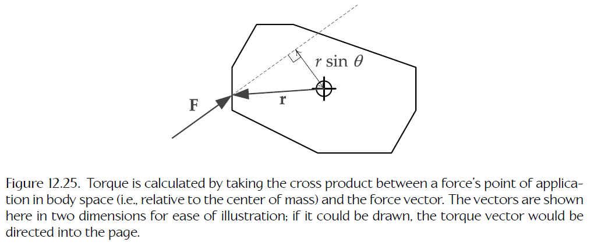
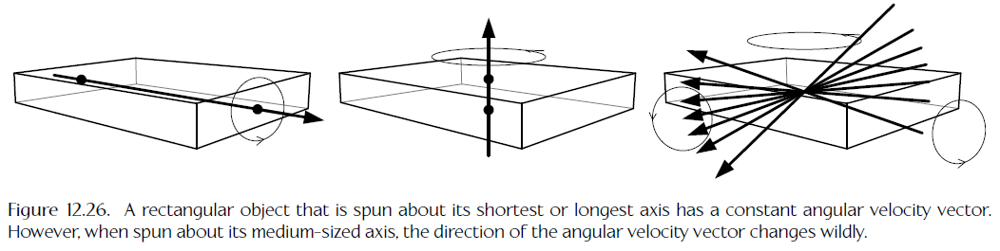
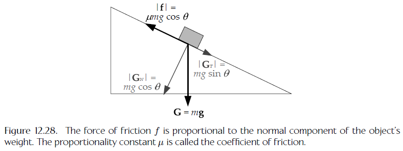
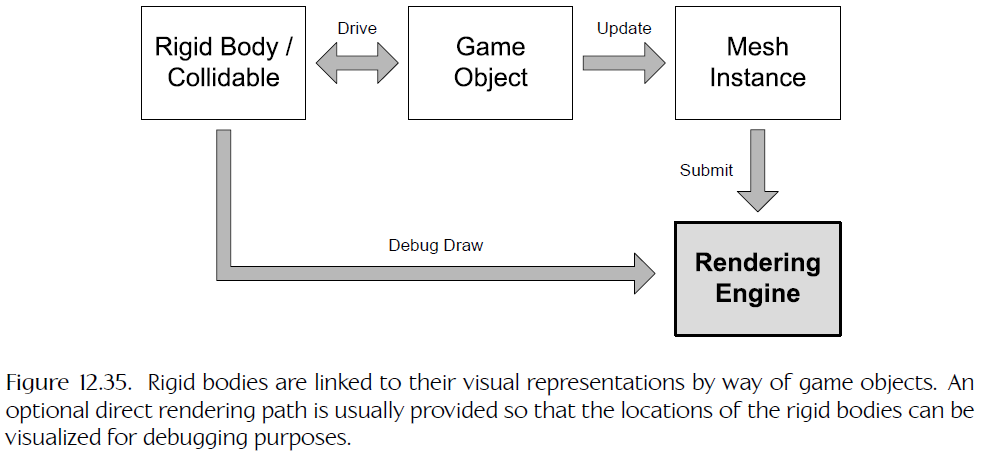

# Collision and Rigid Body Dynamics

<!-- TOC -->

- [Collision and Rigid Body Dynamics](#collision-and-rigid-body-dynamics)
  - [Do You Want Physics in Your Game](#do-you-want-physics-in-your-game)
    - [Things You Can Do with a Physics System](#things-you-can-do-with-a-physics-system)
    - [Is Physics Fun](#is-physics-fun)
    - [Impact of Physics on a Game](#impact-of-physics-on-a-game)
  - [Collision/Physics Middleware](#collisionphysics-middleware)
    - [I-Collide, SWIFT, V-Collide and RAPID](#i-collide-swift-v-collide-and-rapid)
    - [ODE](#ode)
    - [Bullet](#bullet)
    - [TrueAxis](#trueaxis)
    - [PhysX](#physx)
    - [Havok](#havok)
    - [Physics Abstraction Layer (PAL)](#physics-abstraction-layer-pal)
    - [Digital Molecular Matter (DMM)](#digital-molecular-matter-dmm)
  - [The Collision Detection System](#the-collision-detection-system)
    - [Collidable Entities](#collidable-entities)
    - [The Collision/Physics World](#the-collisionphysics-world)
    - [Shape Concepts](#shape-concepts)
    - [Collision Primitives](#collision-primitives)
    - [Collision Testing and Analytical Geometry](#collision-testing-and-analytical-geometry)
    - [Performance Optimizations](#performance-optimizations)
    - [Collision Queries](#collision-queries)
    - [Collision Filtering](#collision-filtering)
  - [Rigid Body Dynamics](#rigid-body-dynamics)
    - [Some Foundations](#some-foundations)
    - [Solving the Equations of Motion](#solving-the-equations-of-motion)
    - [Numerical Integration](#numerical-integration)
    - [Angular Dynamics in Two Dimensions](#angular-dynamics-in-two-dimensions)
    - [Angular Dynamics in Three Dimensions](#angular-dynamics-in-three-dimensions)
    - [Collision Response](#collision-response)
    - [Constraints](#constraints)
    - [Controlling the Motions of Rigid Bodies](#controlling-the-motions-of-rigid-bodies)
    - [The Collision/Physics Step](#the-collisionphysics-step)
  - [Integrating a Physics Engine into Your Game](#integrating-a-physics-engine-into-your-game)
    - [Linking Game Objects and Rigid Bodies](#linking-game-objects-and-rigid-bodies)
    - [Updating the Simulation](#updating-the-simulation)
    - [Example Uses of Collision and Physics in a Game](#example-uses-of-collision-and-physics-in-a-game)
  - [Advanced Physics Features](#advanced-physics-features)

<!-- /TOC -->

## Do You Want Physics in Your Game

- `collision detection system` 碰撞检测系统，游戏引擎的核心组件之一，确保物体不会相互穿过，通常与物理引擎（`physics engine`）紧密集成
- `Rigid body dynamics simulation` 刚体动态模拟。物理学领域是巨大的，现在大多数游戏引擎称呼为“物理学（`physics`）”的东西描述为刚体动态模拟更准确

### Things You Can Do with a Physics System

- 检测动态物体和静态世界几何之间的碰撞
- 模拟受重力和其他力影响的自由刚体
- `Spring-mass systems` 弹簧质点系统
- 可破坏的建筑物和结构
- 射线和形状（用于确定视线、子弹撞击等）
- `Trigger volumes` 触发体（决定物体何时进入、离开或位于游戏中的预定义区域）
- 复杂的机器（起重机、移动平台拼图等）
- 陷阱（如崩落的巨石）
- 具有逼真悬架的可驾驶车辆
- 布娃娃角色死亡
- `Powered rag doll` 传统动画和布娃娃物理的现实融合
- 悬垂的道具（水壶、项链、剑），半真实的头发，衣服的动作
- 布料模拟
- 水面模拟和浮力
- 音频传播
- ...
- 物理模拟可以运行时执行或作为生成动画片段的离线预处理步骤执行，例如 Maya 中有大量可用的物理插件

### Is Physics Fun

- `Simulations (Sims)` 模拟游戏的主要目标是重现真实的体验，例如飞行模拟器、GT 赛车、纳斯卡赛车系列游戏，刚体动力学系统提供的真实性非常适合这类游戏
- `Physics Puzzle Games` 物理益智游戏的主要想法是让用户玩动态模拟玩具，这种游戏的核心机制几乎完全依赖于物理学，例如 Bridge Builder、不可思议的机器、奇妙装置、蜡笔物理学
- `Sandbox Games` 沙盒游戏中，可能根本没有目标，或者可能存在大量可选目标，玩家的主要目标通常是“乱搞”和探索游戏世界中的物体可以做什么，例如侠盗猎车手 5、孢子、小小大星球 2、撕纸小邮差、我的世界。沙盒游戏可以很好地使用真实动态模拟，尤其是如果许多乐趣来源于游戏世界中物体间的真实或半真实交互。有时动态模拟可能通过各种方式微调以实现正确的感觉或增加乐趣因素，如比真实大的爆炸，比正常更强或更弱的重力
- `Goal-Based and Story-Driven Games` 基于目标的游戏有规则和玩家必须完成以推动进度的特定目标，故事驱动的游戏中讲故事至关重要。将物理系统集成到这类游戏中十分棘手。我们通常会放弃控制以换取逼真的模拟，这种失控会抑制玩家完成目标和游戏讲述故事的能力。开发者必须小心应用物理并采取措施以各种方式控制模拟的行为，以确保它不阻碍游戏玩法。为玩家提供一个摆脱困境的方法通常也是个好主意，例如光晕系列游戏玩家可以按 X 翻转颠倒的车辆

### Impact of Physics on a Game

- `Design Impacts` 设计影响
  - `Predictability` 可预测性。将物理模拟行为从动画行为中分离的固有的混乱和多变性是不可预测性的一个来源。如果某些事情总是以具体的方式发生，通常最好使用动画，而不是尝试强迫动态模拟来产生可靠运动
  - `Tuning and control` 调整和控制。物理定律（准确建模时）是固定的，游戏中可以调整重力值或刚体恢复系数，但是调整物理参数的结果通常是间接的，难以可视化。调整力让角色向所需方向移动比调整角色行走动画难得多
  - `Emergent behaviors` 应急行为。有时物理会在游戏中引入意想不到的功能，例如军团要塞中的火箭发射器跳跃技巧，光晕中的高空爆炸疣猪，心理战中的飞行的“冲浪板”
- `Engineering Impacts` 工程影响
  - `Tools pipeline` 工具流水线。良好的碰撞/物理流水线需要时间来构建和维护
  - `User interface` 用户接口。玩家如何控制物理物体，如 Trespasser 中使用虚拟手臂握住他们，半条命 2 中使用“重力枪”
  - `Collision detection` 碰撞检测。旨在动态模拟中使用的碰撞模型比非物理驱动的可能要更详细和更精心的构造
  - `AI` 人工智能。在存在物理模拟物体的情况下，可能无法预测路径，引擎可能需要处理可以移动或爆炸的动态覆盖点
  - `Misbehaved objects` 行为不端的物体。物体由动态模拟驱动时，可能由意想不到的方式相互反弹或抖动严重。可能需要应用碰撞过滤允许物体稍微互相穿透，需要建立机制确保物体稳定并适当进入睡眠状态
  - `Rag doll physics` 布娃娃物理。布娃娃需要大量微调且通常受到在模拟中不稳定的影响。动画可能驱动角色身体的部分穿透到其他碰撞体，当角色变为布娃娃时，这些互相穿透可能造成巨大的不稳定性。需要采取措施避免这个问题
  - `Graphics` 物理学。物理驱动的运动可能影响可渲染物体的包围体（否则它们将是静态的或更可预测的），可破坏建筑和物体的存在可能使某些预计算照明和阴影方法无效
  - `Networking and multiplayer` 网络和多人游戏。不影响游戏玩法的物理效果可以独立地只在每个客户端机器上模拟，影响游戏玩法的物理效果必须在服务器上模拟并准确复制到所有客户端
  - `Record and playback` 记录和回放。记录游戏并在以后播放它，作为调试和测试辅助手段十分有用，还可以作为一个有趣的游戏功能。这个功能要求每个引擎系统以确定的方式运行
- `Art Impacts` 美术影响
  - `Additional tool and workflow complexity` 额外的工具和工作流复杂度。装配具有质量、摩擦力、约束和其他用于动态模拟的属性的物体的需求使得美术部门的工作也更加困难
  - `More-complex content` 更复杂的内容。可能需要为物体提供多个视觉相同但具有不同碰撞和动态配置的版本，例如一个原始版本和一个可破坏版本
  - `Loss of control` 失控。物理驱动物体的不可预测性使控制场景的美术构成更加困难
- `Other Impacts` 其他影响
  - `Interdisciplinary impacts` 跨学科影响。在游戏中引入动态模拟需要工程、美术、音频和设计之间的紧密合作
  - `Production impacts` 生产影响。物理学会增加项目的开发成本、技术和组织复杂度以及风险

## Collision/Physics Middleware

### I-Collide, SWIFT, V-Collide and RAPID

- `I-Collide` 是 UNC 开发的开源碰撞检测库，它可以检测凸（`convex`）体间的交叉。I-Collide 已经被更快、功能更丰富的库 `SWIFT` 取代。UNC 还开发了可以处理复杂非凸形状的碰撞检测库 `V-Collide` 和 `RAPID`。这些库无法正确地开箱即用，但是它们可以为构建功能齐全的游戏碰撞检测引擎提供良好的基础

### ODE

- `ODE` 代表“开放动力学引擎（`Open Dynamics Engine`）”，是开源的碰撞和刚体动力学 SDK。其功能集与商业产品 Havok 相近。好处是免费和完整代码可用

### Bullet

- `Bullet` 是开源的碰撞检测和物理库，用于游戏和电影行业。它的碰撞引擎集成到了它的动态模拟中，但是提供了钩子使碰撞系统可以单独使用或集成到其他物理引擎中。它支持连续碰撞检测（`continuous collision detection / CCD`），也称为碰撞时间（`time of impact / TOI`）碰撞检测，当模拟包含小且快速移动的物体时非常有帮助

### TrueAxis

- 碰撞/物理 SDK，可以免费用于非商业用途

### PhysX

- `PhysX` 最开始是由 Ageia 制作和发行的称为 Novodex 的库，作为推出他们的专用物理协处理器的战略的一部分，后被 NVIDIA 购买和改良，使它能使用 NVIDIA 的 GPU 作为协处理器运行。Ageia 和 NVIDIA 的部分营销策略是完全免费提供 SDK 的 CPU 版本，以推动物理协处理器市场向前发展。开发者可以付费获取完全源代码和根据需要定制库的能力。PhysX 现在与 APEX 绑定，APEX 是 NVIDIA 的可扩展多平台动态框架。PhysX / APEX 可用于 Windows、Linux、Mac、Android、Xbox 360、PlayStation 3、Xbox One、PlayStation 4 和 Wii

### Havok

- `Havok` 是商业物理 SDK 的黄金标准，提供了最丰富的功能集之一，并在所有支持平台上具有出色的性能特征。Havok 由一个核心碰撞/物理引擎和一些可选附加产品，包括车辆物理系统、用于建模可破坏环境的系统、一个直接集成到 Havok 布娃娃物理系统的功能齐全的动画 SDK 组成。可用于 Xbox 360、PlayStation 3、Xbox One、PlayStation 4、PlayStation Vita、Wii、Wii U、Windows 8、Android、Apple Mac 和 iOS

### Physics Abstraction Layer (PAL)

- 开源库，允许开发者在一个项目上使用多个物理 SDK，为 PhysX（Novodex）、Newton、ODE、OpenTissue、Tokamak、TrueAxis 和其他一些 SDK 提供钩子

### Digital Molecular Matter (DMM)

- Pixelux Entertainment S.A. 制作的一个独特物理引擎，使用有限元方法来模拟可变形体和易碎物体的动力学。该引擎同时具有离线和运行时组件。可以在 LucasArts 的星球大战：原力释放中看到

## The Collision Detection System

- 游戏引擎的碰撞检测系统主要目的是决定游戏世界中的任何物体是否接触。每个逻辑物体表示为一个或多个几何形状，如球形、盒形、胶囊形等，碰撞系统决定任何这些形状在任何给定时间点是否相交，所以碰撞检测系统本质上是一种美化的几何交叉测试仪
- 碰撞系统可用于多种目的：避免屏幕上不真实的视觉异常，例如物体间的相互穿透；导弹击中目标时让导弹爆炸；玩家角色通过漂浮的健康包时给予角色健康提升；等等
- 刚体动态模拟通常是碰撞系统的要求最高的客户端，用碰撞系统模拟物理逼真的行为如弹跳、滚动、滑动、静止等；但是，即使是没有物理系统的游戏仍然可以大量使用碰撞检测引擎

### Collidable Entities

- 想要游戏中的特定逻辑物体有能力与其他物体碰撞，需要给它提供一个碰撞表示（`collision representation`），描述物体的形状和在游戏世界中的位置和方向。这是一个独特的数据结构，不同于物体的游戏表示（`gameplay representation`，定义物体在游戏中的角色和行为）和视觉表示（`visual representation`，可能是三角形网格实例、细分曲面、粒子效果或其他视觉表示）
- 从检测交叉的角度看，我们通常更喜欢几何和数学简单的形状。理想情况下，只有当简单表示证明不足以在游戏中实现期望的行为时才采用更复杂的形状
- Havok 使用术语 `collidable` 描述一个可以参与碰撞检测的独特的刚体，每个 collidable 表示为 C++ 类 `hkpCollidable` 的一个实例；PhysX 称它的刚体为 `actors`，将它们表示为类 `NxActor` 的实例。两个库中可碰撞实体都包含两个基本信息：形状和变换。需要变换信息有三个原因
  - 一个形状必须变换以在自然空间中正确定位和定向
  - 移动任何复杂形状时，如果我们不得不单独移动它的所有特性（顶点、平面等），成本很高，而使用变换可以低成本移动形状，不管它的特性有多复杂
  - 描述形状的信息占用大量内存，所以允许多个可碰撞实体共享一个形状描述是有益的
- 游戏中任何特定物体可能根本没有 collidable（不需要碰撞检测）、有一个 collidable（物体是一个简单刚体）或有多个 collidable（例如每个表示铰接机器人臂的一个刚性组件）

### The Collision/Physics World

- 碰撞系统通常通过单例数据结构碰撞世界（`collision world`）跟踪它所有的可碰撞实体，碰撞世界是明确设计用于碰撞检测系统的游戏世界的一个完整表示。Havok 中碰撞世界是类 `hkpWorld` 的一个实例，PhysX 中是 `NxScene`，ODE 中是 `dSpace`
- 碰撞世界通常是表示游戏中所有可碰撞形状的几何体的层次结构的根
- 将所有碰撞信息维护在一个私有数据结构中与试图将碰撞信息保存到游戏物体本身相比有多个优点
  - 碰撞世界只需要包含潜在可能相互碰撞的物体的 Collidable，避免迭代任何不相关数据结构
  - 这个设计允许碰撞数据以可能最高效的方式组织，例如可以利用缓存一致性最大化性能
  - 碰撞世界是一种有效的封装机制，从可理解性、可维护性、可测试性、可重用性的角度看通常是一个优点
- `The Physics World` 刚体动态系统通常与碰撞系统紧密集成，通常与碰撞系统共享“世界”数据结构，模拟中的每个刚体通常与碰撞系统中的一个 Collidable 关联。这种设计在物理引擎中很常见，因为物理系统需要频繁和详细的碰撞查询。通常由物理系统实际驱动碰撞系统的操作，每个模拟时间步骤指示它执行碰撞测试最少一次，或有时多次，因此碰撞世界通常称为碰撞/物理世界（`collision/physics world`）或有时仅称为物理世界（`physics world`）
- 动态模拟中每个动态刚体通常与碰撞系统中的一个 Collidable 关联，尽管不是所有 Collidable 都需要动态刚体。例如 Havok 中刚体表示为 `hkpRigidBody` 的实例，每个刚体有一个指向一个 `hkpCollidable` 的指针；PhysX 中 Collidable 和刚体的概念混合在一起，`NxActor` 类用于这两个目的，尽管刚体的物理属性单独保存在 `NxBodyDesc` 实例中。两个 SDK 中都可以告诉刚体它的位置和方向在空间中固定，意味着他们将被动态模拟省略，只作为一个 Collidable
- 尽管紧密集成，大多数物理 SDK 确实至少做过尝试将碰撞库与刚体动态模拟分开。这允许碰撞系统作为独立库使用，对于不需要物理但需要检测碰撞的游戏十分重要；也意味着游戏工作室理论上可以完全替换一个物理 SDK 的碰撞系统而不需要重写动态模拟，这实际上比听起来要难

### Shape Concepts

- 丰富的数学理论是日常形状概念的基础。可以将形状想象为由边界描述的一个空间区域，有明确的内部和外部。二维空间中，形状有区域，边界由曲线或多条边（多边形）定义；三维空间中，形状有体积，边界由曲面或多边形（多面体）定义
- 有些游戏物体，例如地形、河或薄壁，可能最好用表面表示，三维空间中，表面是二维几何体，有前和后，但是没有内部或外部。许多碰撞 SDK 提供对表面基元的支持，扩展形状的概念以包括封闭体积和开放表面
- 碰撞库通常允许表面通过可选的挤出参数给定体积，这样的参数定义表面的“厚度”，有助于减少小且快速移动的物体与无限薄的表面间错过碰撞的发生
- 碰撞系统通常打包接触信息到一个数据结构内，例如 Havok 将接触作为 `hkContactPoint` 类的实例返回。接触信息通常包含一个分离向量（`separating vector`），沿这个向量移动物体可以使其有效地从碰撞中移开；通常还包含接触的两个 Collidable 的信息：哪些形状相交，甚至这些形状的哪些特性接触。系统可能还返回额外的信息，例如投射到分离法线上的物体速度
- `Convexity` 凸和非凸形状是一个重要分别，通常凸形状间比凹形状间的碰撞检测更简单且计算密度更低

### Collision Primitives

- `Spheres` 球，最简单的三维体，最高效的碰撞元，由一个中心点和一个半径表示，可以方便装到一个四元浮点向量中
- `Capsules` 胶囊，一个圆柱和两个半球端盖组成，通常由两个点和一个半径表示，比圆柱和盒高效
- `Axis-Aligned Bounding Boxes (AABB)` 轴对齐包围盒，每个面都与坐标轴平行，由两个点定义：一个包含盒沿每个主轴的最小坐标，一个包含最大坐标。优点是盒间的交叉测试十分高效，缺点是物体旋转后需要重计算包围盒，且包围盒可能与物体形状相似度极差
- `Oriented Bounding Boxes (OBB)` 方向包围盒，可以相对于其坐标系旋转，通常由三个长度（半宽、半深、半高）和一个变换（定位和定向盒中心点）表示
- `Discrete Oriented Polytopes (DOP)` 离散定向多面体，是 AABB 和 OBB 的更一般情况，是凸多面体。AABB 和 OBB 都是 6-DOP。构造 DOP 通常的方法是先构造一个 OBB，然后使用额外的平面将边或角倾斜 45 度
- `Arbitrary Convex Volumes` 任意凸体，大多数碰撞引擎允许 3D 美术师在像 Maya 这样的包中构造任意凸体，离线工具分析凸体的三角形，确保他们形成一个凸多面体，然后这些三角形被转化为平面集，表示为 k 个平面方程，或 k 个点和 k 个法线向量
- `Polygon Soup / Poly Soup` 多边形集合，一些碰撞系统也支持完全任意的非凸形状，称为多边形集合，常用于建模复杂的静态几何，如地形和建筑
  - 多边形集合的碰撞检测是最耗时的，必须测试每个三角形，并正确处理相邻三角形共享边的假交点，所以大多数游戏尝试限制多边形集合的使用，使其不参与动态模拟
  - 多边形集合不需要表示体积，即表示一个开放表面。可以使用三角形绕序提供表面的前后信息或体的内外信息；也可以伪造开放表面的内外部，例如用多边形集合表示地势时，可以判断任意表面的前面总是指向远离地球的地方
- `Compound Shapes` 复合形状，对于非凸物体的建模，通常可以是多边形集合的更有效的替代，多个凸体通常可以胜过单个多边形集合。一些碰撞系统可以在测试碰撞时利用复合形状作为一个整体的凸包围体，在 Havok 中称为中期碰撞检测（`midphase collision detection`），复合形状的凸包围体测试如果不相交，则系统根本不需要测试子形状的碰撞

### Collision Testing and Analytical Geometry

- 碰撞系统可以使用解析几何（`analytical geometry`，三维体和面的数学表示）在计算上检测形状间的相交
- `Point versus Sphere` 判断点是否在球中，可以简单比较点到球心的距离与球半径
- `Sphere versus Sphere` 判断两球是否相交，可以简单比较两球心的距离与两球半径的和
  - 为避免计算距离的平方根操作，可以将距离的比较转化为距离的平方的比较
- `The Separating Axis Theorem` 分离轴定理，被大多数碰撞系统大量使用。它指出，如果可以找到一个轴，使得两个凸形状在这个轴上的投影不重叠，则这两个形状不相交
  - 二维空间中，如果可以找到一条线，使得形状 A 完全在线的一边，形状 B 完全在线的另一边，则 A 和 B 不相交，这条线称为分界线（`separating line`），分界线总是与分离轴垂直
  - 某些类型的形状具有使潜在分离轴明显的属性，可以将两个形状轮流投影在这些潜在分离轴上，然后检查投影区间是否重叠
- `AABB versus AABB` AABB 间的相交可以简单应用分离轴定理判断
- `Detecting Convex Collisions: The GJK Algorithm` 检测凸形状碰撞的 GJK 算法
  - `Minkowski difference` Minkowski 差，形状 B 内每个点与形状 A 内每个点的差的集合。当两个形状都是凸形状时，这个集合中包含原点，当且仅当两个形状相交。两个凸形状的 Minkowski 差本身也是一个凸形状
  - `Simplex` 单形，是一组点，一个点的单形是点，两个点的单形是线段，三个点的单形是三角形，四个点的单形是四面体（`tetrahedron`）
  - GJK 算法利用了 Minkowski 差，但是只关心差的凸包（`convex hull`），而不是内部所有点，GJK 的主要过程就是尝试去找位于凸包上且包含原点的四面体，找得到则形状相交，否则不相交。GJK 是迭代算法，开始于 Minkowski 差凸包上任意一点，即一个点的单形，尝试构建可能包含原点的更高阶单形。在每个迭代中，查看当前已有的单形，判断原点位于单形的哪个方向，在该方向上找到支持顶点即离原点最近的凸包上的点，将该点加入当前单形来创建更高阶的单形。如果新创建的单形包含原点，则算法结束，两形状相交；如果无法找到支持顶点，则两形状不相交
- `Other Shape-Shape Combinations` 形状间的绑定数量非常大，对于 $N$ 个形状类型，需要按对测试的数量为 $O(N^2)$，这是碰撞引擎通常限制基元数量的一个原因，也是 GJK 算法流行的原因：它一举处理所有凸形状类型间的碰撞检测。
  - 给定任意两个形状，需要选择合适的碰撞测试函数。许多碰撞引擎使用双重调度（`double dispatch`）方法，通常使用二维函数查找表实现，查找关键字是要测试的物体的形状类型；也可以实现为安排基于物体 A 的虚函数调用基于物体 B 的虚函数
- `Detecting Collisions between Moving Bodies` 游戏中的动作通常在离散的时间步骤中模拟，当物体小且高速移动时，每个时间步骤间覆盖的距离远大于它的尺寸。碰撞世界两次连续快照中快速移动物体的图像中间会有一个间隙，如果其他物体刚好在这个间隙中，会完全错过碰撞，这个问题称为“子弹穿过纸张（`bullet through paper`）”问题或者“隧道（`tunneling`）”问题
  - `Swept Shapes` 可以使用扫掠形状避免隧道问题。扫掠形状是一个形状从一个点到另一个点的运动形成的新形状，例如一个扫掠球是一个胶囊形状。可以测试物体从前一个快照的位置和方向移动到当前快照的位置和方向形成的扫掠形状，而不是测试碰撞世界的静态快照。这相当于在快照间线性插值可碰撞物的运动，但是线性插值不适用于沿曲线运动或自旋转的物体，这两种情况下物体运动的扫掠形状可能是非凸形状
  - `Continuous Collision Detection (CCD)` 连续碰撞检测，CCD 的目的是找到给定时间间隔内两个移动物体间的最早影响时间（`time of impact / TOI`）。CCD 算法本质上通常是迭代的，对于每个可碰撞物，维护它前一个时间步骤和当前时间的位置和方向，用于独立地线性插值位置和旋转，产生可碰撞物在前一个和当前时间步骤间任意时间点的变换的近似，然后在运动路径上查找最早 TOI。通常使用很多查找算法，包括 Brian Mirtich 的 conservative advancement 方法

### Performance Optimizations

- 判断两个形状相交需要的计算很耗时，且大多数游戏世界包含大量物体，当物体数量增加时所需的碰撞测试数急剧增长
- `Temporal Coherency / frame-to-frame coherency` 利用时间一致性：当可碰撞物以合理速度移动时，它们的位置和方向在时间步骤间通常十分相似。通常可以通过跨多个时间步骤缓存结果来避免每帧重新计算某些类型的信息
- `Spatial Partitioning` 空间划分，将空间分为一些小区域，如果一对可碰撞物不出现在同一区域，则不需要为它们执行具体的碰撞测试，显著减少所需的碰撞测试数。可以使用各种层次划分模式，例如八叉树、BSP、kd-tree、球树等，树的一个分支上的物体不能与其它兄弟分支上的物体碰撞
- `Broad Phase, Midphase and Narrow Phase` Havok 使用三层方法修剪需要测试碰撞的可碰撞物集合
  - `Broad Phase` 粗略阶段，使用总的 AABB 测试判断可碰撞物是否潜在相交
    - `The Sweep and Prune Algorithm` 扫描和修剪算法，按三个主轴对可碰撞物的 AABB 的最小和最大坐标进行排序，然后遍历排序列表检查重叠的 AABB。该算法可以使用帧间一致性将 $O(n\log{n})$ 的排序操作减少到 $O(n)$ 的预期执行时间
  - `Midphase` 中间阶段，测试复合类型的粗略包围体
  - `Narrow Phase` 细测阶段，测试各可碰撞物的基元

### Collision Queries

- 碰撞查询，碰撞检测系统回答关于游戏世界中碰撞体的假想问题，例如子弹从玩家的武器向给定方向飞行，将击中的第一个目标是什么？一辆车可否从 A 点移动到 B 点而不会在路上撞到任何东西？找到角色给定半径内的所有敌方物体
- 最常用的查询为碰撞投射（`collision cast`），有时仅称为投射（`cast`，`trace` 和 `probe` 的同义词），一个投射确定一个假想物体放进碰撞世界并沿一条射线或线段移动会击中的物体。投射与常规碰撞检测操作不同的是投射物体不是真的在碰撞世界中，它不会影响世界中其他物体
- `Ray Casting` 最简单的碰撞投射类型是射线投射（`ray cast`），这里实际有点用词不当，我们真正投射的是一个有向线段，有开始端点 $p_0$ 和结束端点 $p_1$，表示为

  $$
  p(t)=p_0+td,\ t\in[0,1]
  $$

  - 这条线段与碰撞世界中的可碰撞物进行测试，如果它们相交，则返回接触点。大多数碰撞检测系统可以返回最早接触点，即离 $p_0$ 最近的接触点，对应 $t$ 的最小值；有些系统可以返回与线段相交的所有可碰撞物的完整列表。返回的信息通常包括 $t$ 的值，击中的可碰撞物的 ID，接触点表面法线和其他击中的形状或表面相关的属性
  - 射线投射在游戏中大量使用于武器系统（判断子弹命中）、玩家机制（判断角色脚下是否存在坚实地面）、AI 系统（视线检测、定位、移动查询等）、车辆系统（定位并将车辆的轮胎卡在地形上）等
- `Shape Casting` 其他常用查询包括查询假想凸形状沿有向线段在击中坚实物体之前能移动多远，沿有向线段投射一个形状称为形状投射（`shape cast`），Havok 中称为线性投射（`linear cast`），当投射体是球时也称为球投射（`sphere cast`）。形状投射通常描述为开始点 $p_0$，要移动的距离 $\overrightarrow{d}$，投射形状的类型、尺寸和方向
  - 投射一个凸形状有两种情况需要考虑
    - 投射形状已经与至少一个可碰撞物相互穿透或接触，阻止它从开始点移开。该情况下碰撞系统通常直接上报投射形状与可碰撞物间的接触点（在投射形状内部或表面）
    - 投射形状与其他可碰撞物不相交，可以沿其路径自由移动一个非零距离。该情况下投射形状通常只击中一个可碰撞物，但是也可能同时击中多个可碰撞物，或与非凸形状的多边形集合的多个部分同时接触（但是接触点总是在投射形状表面）
  - 与射线投射相同，一些 API 返回投射形状经历的最早接触点，其他 API 则允许形状继续沿假想路径移动并返回它经历的所有接触点。返回信息通常包括 $t$ 的值，击中的可碰撞物 ID 和 接触点，接触点表面法线和其他击中的形状或表面相关的属性。当返回信息是列表且未按 $t$ 排序时，可能需要我们自己进行排序
  - 形状投射在游戏中十分有用。球投射可以用于判断虚拟相机是否与游戏世界中的物体碰撞，球或胶囊投射通用于实现角色运动，例如角色在不均匀地形上向前滑动，可以在运动方向上投射一个位于角色脚之间的球或胶囊，然后通过二次投射将脚调高或调低，保持其与地面接触
- `Phantoms` 幻影，Havok 支持的特殊可碰撞物类型，与距离向量 $\overrightarrow{d}$ 为零的形状投射十分相似，且返回数据本质上与零距离形状投射格式相同。与形状投射不同，幻影在碰撞世界中是持久的，这意味着可以完全利用时间一致性优化；与常规可碰撞物不同，幻影对碰撞世界中其他可碰撞物（包括其他幻影）不可见，不参与动态模拟，不影响其他可碰撞物
  - 用于判断哪些可碰撞物位于游戏世界中一些特殊体内，例如得到玩家角色给定半径内的所有敌人的列表
- `Other Types of Queries` 一些碰撞引擎支持其他类型的查询，例如 Havok 支持最近点（`closest point`）查询，用于查找碰撞世界中与给定可碰撞物最近的其他可碰撞物上的点的集合

### Collision Filtering

- 大多数碰撞引擎允许根据游戏特定标准接受或拒绝可碰撞物间的接触，这称为碰撞过滤（`collision filtering`）
- `Collision Masking and Layers` 碰撞掩蔽和分层，将物体分类，然后查询表来判断特定类物体是否允许与其他类物体碰撞，例如 Havok 中一个可碰撞物可以是一个碰撞层的成员，每个碰撞层维护一个 32 位掩码，表示该层物体是否可以与其它层的物体碰撞
- `Collision Callbacks` 碰撞回调，让碰撞库在检测到碰撞时调用一个回调函数，让回调函数基于合适的标准决定接受还是拒绝这个碰撞，例如接触点首次添加到世界后，Havok 回调 `contactPointAdded()`，如果回调函数判断接触点合法，再回调 `contactPointConfirmed()`
- `Game-Specific Collision Materials` 许多游戏实现了与渲染引擎中使用的材质系统（`material system`）在很多方面类似的碰撞形状分类机制，一些游戏团队使用碰撞材质（`collision material`）描述这种分类。主要思想是关联每个可碰撞物表面和一组定义表面如何从物理和碰撞角度来表现的属性，可以包括声音和粒子效果，物理属性如恢复系数、摩擦系数，碰撞过滤信息，等等

## Rigid Body Dynamics

- 游戏物理系统几乎只关注称为经典刚体动力学（`classical rigid body dynamics`）的一个子学科
  - `Classical (Newtonian) mechanics` 经典（牛顿）力学，物体的模拟遵循牛顿运动定律。物体足够大，不存在量子效应；物体足够慢，不存在相对论效应
  - `Rigid bodies` 刚体，所有模拟的物体都是坚固、不可变形的
- 物理引擎确保刚体的运动遵循各种约束（`constraints`），最常见的约束是刚体不能相互穿透，其他可能包括铰接、棱柱关节（滑块）、球关节、轮子、布娃娃等
- 物理系统通常共享碰撞世界数据结构，作为时间步更新程序驱动碰撞检测算法执行
- 物理引擎中的刚体不同于从游戏角度看组成虚拟世界的逻辑物体。为了通过物理模拟驱动游戏物体的位置和方向，我们每帧向物理引擎查询每个刚体的变换，通过某些方式将它应用于对应游戏物体的变换。由其他引擎系统（如动画系统或角色控制系统）决定的游戏物体的运动也可以反过来驱动物理世界中刚体的位置和旋转

### Some Foundations

- `Units` 单位，大多数刚体动态模拟在 MKS 单位系统上运行。MKS 系统中距离以米（`meter`）为单位，质量以千克（`kilogram`）为单位，时间以秒（`second`）为单位。配置物理系统使用其他单位时要确保模拟中的所有内容都是一致的
- `Separability of Linear and Angular Dynamics` 线性和角动力学的可分离性
  - `unconstrained rigid body` 不受约束的刚体，可以沿三个笛卡尔轴自由平移，还可以关于这三个轴自由旋转，我们称这样的刚体有六个自由度（`degrees of freedom / DOF`）
  - 不受约束的刚体的运动可以分离为两个单独的组成部分
    - `Linear dynamics` 线性动力学，对体的运动的描述，忽略所有旋转效果
    - `Angular dynamics` 角动力学，对体的旋转运动的描述
- `Center of Mass` 质量中心，本质上是刚体所有可能方向的平衡点，或者说，刚体质量绕质量中心在所有方向上均匀分布
  - 对于均匀密度的体，其质量中心位于体的形心（`centroid`）
  - 对于不均匀密度的体，可以将其分为 N 个加权的小部分计算质量中心
- `Linear Dynamics` 线性动力学，刚体位置可以完全表示为其质量中心的位置
- `Linear Velocity and Acceleration` 线性速度和加速度，定义体的质量中心移动的速度、加速度和方向

  $$
  v(t)=\frac{\mathrm{d}r(t)}{\mathrm{d}t}=\dot r(t)
  $$
  $$
  a(t)=\frac{\mathrm{d}v(t)}{\mathrm{d}t}=\dot v(t) \\
  =\frac{\mathrm{d}^2r(t)}{\mathrm{d}t^2}=\ddot r(t)
  $$
- `Force and Momentum` 力和动量。力定义为导致具有质量的物体加速或减速的作用，有大小和方向，用向量表示，通常表示为 $F$。
  - $N$ 个力作用于一个刚体时，体的线性运动的净效应

    $$
    F_{net}=\sum_{i=1}^NF_i
    $$

  - 牛顿第二定律

    $$
    F(t)=ma(t)=m\ddot{r}(t)
    $$

  - 体的线性速度和质量的乘积称为线性动量（`linear momentum`）

    $$
    p(t)=mv(t)
    $$

  - 当体的质量不恒定，例如火箭的燃料逐渐耗尽转换为能量时，力的正确公式

    $$
    F(t)=\frac{\mathrm{d}p(t)}{\mathrm{d}t}=\frac{\mathrm{d}(m(t)v(t))}{\mathrm{d}t}
    $$

### Solving the Equations of Motion

- 刚体动力学的核心问题是给定一组已知的作用于体的力，解决体的运动
- `Force as a Function` 力可以是不变的，也可以是关于时间、体的位置、体的速度或其他量的一个函数

  $$
  F(t,r(t),v(t),\dots)=ma(t)=m\ddot{r}(t)
  $$

  - 例如，弹簧施加的力与它拉伸后离自然静止位置的距离成正比，机械粘滞阻尼器（缓冲器）施加的力与缓冲器活塞的速度成正比
- `Ordinary Differential Equations / ODE` 常微分方程，通常是一个等式，包含一个自变量的函数和该函数的各阶导数，如果自变量是时间，函数是 $x(t)$，则一个 ODE 的形式如下

  $$
  \frac{\mathrm{d}^nx}{\mathrm{d}t^n}=f(t,x(t),
  \frac{\mathrm{d}x}{\mathrm{d}t}),
  \frac{\mathrm{d}^2x}{\mathrm{d}t^2},\dots,
  \frac{\mathrm{d}^{n-1}x}{\mathrm{d}t^{n-1}})
  $$

  - 力是关于时间、位置和速度的的函数，如下式，明显是一个 ODE，我们希望解决这个 ODE 来得到 $v(t)$ 和 $r(t)$

    $$
    \ddot{r}(t)=\frac{1}{m}F(t,r(t),\dot{r}(t))
    $$
- `Analytical Solutions` 极少的情况下，运动的微分方程可以通过分析求解，这意味着可以找到一个简单的封闭函数描述体在所有可能时间 $t$ 的位置。然而这在游戏物理中几乎不可能，因为某些微分方程的封闭解决方案是未知的，而且游戏是交互式模拟，通常无法预测物体在某个时间所受的力。这个经验法则当然也有例外，例如求解封闭表达式来决定抛射物要击中预定目标的必须的发射速度很常见

### Numerical Integration

- 数值积分，使用时间分步（`time-stepped`）方式来解决微分方程。时间步的持续时间通常大致不变，用 $\Delta{t}$ 表示，给定体在当前时间 $t_1$ 的位置和速度，以及力关于时间、位置和速度的函数，我们期望找到体在下个时间步 $t_2=t_1+\Delta{t}$ 的位置和速度，即给定 $r(t_1)$，$v(t_1)$ 和 $F(t,r,v)$ 求 $r(t_2)$ 和 $v(t_2)$
- `Explicit Euler` 显示欧拉方法，ODE 最简单的数值解法之一，常被新游戏程序员采用
  - $v(t)=\dot{r}(t)$ 的近似显示欧拉解为
    $$
    r(t_2)=r(t_1)+v(t_1)\Delta{t}
    $$
  - $a(t)=\frac{F_{net}}{m}=\dot{v}(t)$ 的近似显示欧拉解为
    $$
    v(t_2)=v(t_1)+\frac{F_{net}}{m}\Delta{t}
    $$
  - `Interpretations of Explicit Euler` 显示欧拉的解释
    - 假设了物体的速度在下个时间步不变
    - 可以解释为两个有限差分的商，即 $\frac{\mathrm{d}r}{\mathrm{d}t}=\frac{\Delta{r}}{\Delta{t}}$
    - 当时间步中速度大致不变或 $\Delta{t}$ 趋向于零时运作得很好
- `Properties of Numerical Methods` 常微分方程的数值解法有三个重要且相互关联的属性
  - `Convergence` 收敛，随着时间步 $\Delta{t}$ 趋向于 $0$，近似解是否越来越靠近真实解
  - `Order` 阶数，我们称一个数值方法为 $n$ 阶，如果它的误差项为 $O(\Delta{t}^{n+1})$。误差项可以用 ODE 的数值解法方程减去 ODE 的精确解法的无限泰勒级数展开得到。下式误差项为 $O(\Delta{t}^2)$

    $$
    r(t_2)=r(t_1)+\dot{r}(t_1)\Delta{t}+O(\Delta{t}^2)
    $$

  - `Stability` 数值解法是否随着时间推移而稳定下来。如果数值方法给系统添加能量，物体的速度最终会“爆炸”，系统将变得不稳定；如果数值方法趋于从系统中移除能量，将具有整体阻尼效果，系统将稳定
- `Alternatives to Explicit Euler` 显示欧拉误差大、稳定性差，一般不用于通用动态模拟，解决 ODE 的各种其他数值方法如下
  - `Backward Euler` 一阶方法
  - `Midpoint Euler` 二阶方法
  - `Runge-Kutta` Runge-Kutta 方法家族，四阶的 Runge-Kutta 方法（RK4）特别受欢迎
- `Verlet Integration` 最常用的 ODE 数值解法，有两个变体
  - `Regular Verlet` 由两个泰勒级数展开相加得到

    $$
    r(t_1+\Delta{t})=r(t_1)+\dot{r}(t_1)\Delta{t}+\frac{1}{2}\ddot{r}(t_1)\Delta{t}^2+\frac{1}{6}r^{(3)}(t_1)\Delta{t}^3+O(\Delta{t}^4)
    $$
    $$
    r(t_1-\Delta{t})=r(t_1)-\dot{r}(t_1)\Delta{t}+\frac{1}{2}\ddot{r}(t_1)\Delta{t}^2-\frac{1}{6}r^{(3)}(t_1)\Delta{t}^3+O(\Delta{t}^4)
    $$
    $$
    r(t_1+\Delta{t})=2r(t_1)-r(t_1-\Delta{t})+a(t_1)\Delta{t}^2+O(\Delta{t}^4)
    $$

    - 速度可是使用下式模拟，误差较大

      $$
      v(t_1+\Delta{t})=\frac{r(t_1+\Delta{t})-r(t_1)}{\Delta{t}}+O(\Delta{t})
      $$

  - `Velocity Verlet` 更常用，需要四步处理

    $$
    r(t_1+\Delta{t})=r(t_1)+v(t_1)\Delta{t}+\frac{1}{2}a(t_1)\Delta{t}^2 \tag{1}
    $$
    $$
    v(t_1+\frac{1}{2}\Delta{t})=v(t_1)+\frac{1}{2}a(t_1)\Delta{t} \tag{2}
    $$
    $$
    a(t_1+\Delta{t})=a(t_2)=\frac{1}{m}F(t_2,r(t_2),v(t_2)) \tag{3}
    $$
    $$
    v(t_1+\Delta{t})=v(t_1+\frac{1}{2}\Delta{t})+\frac{1}{2}a(t_1+\Delta{t})\Delta{t} \tag{4}
    $$

    - 第 (3) 步中，力函数与下个时间步的位置和速度相关，$r(t_2)$ 已经在第 (1) 步中计算，所以如果力与速度无关，则我们已经得到了所有需要的信息。如果力与速度相关，我们必须得到下个时间步的近似速度，也许使用显示欧拉方法

### Angular Dynamics in Two Dimensions

- `Angular dynamics` 对施加的力响应的体旋转运动的研究称为角动力学。二维中刚体可以视为一块薄薄的材料，这样的体在一些物理文章中称为平面层（`plane lamina`），它的所有线性运动发生在 xy 平面中，所有的旋转运动都关于 z 轴
- `Orientation` 二维刚体的方向使用一个角度 $\theta$ 完全描述，这个角度相对于商定的零旋转，单位为弧度（$rad$），例如一辆赛车正面朝自然空间 x 轴正方向时可以定义 $\theta=0$。这个角度是关于时间的函数，所以表示为 $\theta(t)$
- `Angular Speed and Acceleration` 角速度和加速度，角速度测量体的旋转角度随时间变化的速率，单位为弧度每秒（$rad/s$），表示为 $w(t)$；加速度测量角速度的变化速率，单位为弧度每秒平方（$rad/s^2$），表示为 $\alpha(t)$

  Angular | Linear
  :- | :-
  $w(t)=\frac{\mathrm{d}\theta(t)}{\mathrm{d}t}=\dot{\theta}(t)$ | $v(t)=\frac{\mathrm{d}r(t)}{\mathrm{d}t}=\dot{r}(t)$
  $\alpha(t)=\frac{\mathrm{d}w(t)}{\mathrm{d}t}=\dot{w}(t)=\ddot{\theta}(t)$ | $a(t)=\frac{\mathrm{d}v(t)}{\mathrm{d}t}=\dot{v}(t)=\ddot{r}(t)$

  - 这边速度表示为 speed 而不是 velocity，因为二维中角速度是标量
- `Moment of Inertia` 惯性矩，是质量的旋转当量，质量描述改变一个点质量的线性速度的难易程度，而惯性矩描述改变一个刚体关于特定轴的旋转速度的难易程度，质量分布越集中在旋转轴附近，难度越小，惯性矩越小。通常表示为 $I$，在二维中是一个标量
- `Torque` 扭矩。如果力的作用线穿过体的质量中心，则这个力只产生线性运动，否则除了线性运动外这个力还引入一个称为扭矩的旋转力。假设从质量中心到力 $F$ 的作用点的向量可以表示为 $r$，则 $F$ 产生的扭矩 $N$ 为 $N=r\times F$，如下图

  

  - 多个扭矩可以像多个力一样简单相加，表示为 $N_{net}$
  - 在二维中扭矩总是平行于 z 轴，所以二维扭矩可以表示为标量 $N_z$。力与线性加速度和质量有关，同样地，扭矩与角加速度和惯性矩有关

    Angular | Linear
    :- | :-
    $N_z(t)=I\alpha(t)=I\dot{w}(t)=I\ddot{\theta}(t)$ | $F(t)=ma(t)=m\dot{v}(T)=m\ddot{r}(t)$

- `Solving the Angular Equations of Motion in Two Dimensions` 解决二维角运动方程可以使用应用于线性动力学问题中的相同的数值积分技术。我们期望解决的 ODE 如下

  Angular | Linear
  :- | :-
  $N_{net}(t)=I\dot{w}(t)$ | $F_{net}(t)=m\dot{v}(T)$
  $w(t)=\dot{\theta}(t)$ | $v(t)=\dot{r}(t)$

### Angular Dynamics in Three Dimensions

- `The Inertia Tensor` 惯性张量。三维中，刚体的旋转质量表示为 $3\times 3$ 矩阵，这个矩阵称为惯性张量，通常用 $I$ 表示

  $$
  I=\begin{bmatrix}
  I_{xx} & I_{xy} & I_{xz} \\
  I_{yx} & I_{yy} & I_{yz} \\
  I_{zx} & I_{zy} & I_{zz}
  \end{bmatrix}
  $$

  - 这个矩阵的对角线元素为体关于它三个主轴的惯性矩，非对角线元素称为惯性积（`products of inertia`）。当体关于三个主轴分别对称时惯性积为零，当惯性积非零时常常产生物理上现实但是普通玩家可能认为是“错误”的不直观的动作，所以游戏引擎中惯性张量通常简化为三元向量 $\begin{bmatrix}I_{xx} & I_{yy} & I_{zz}\end{bmatrix}$
- `Orientation in Three Dimensions` 三维中体的方向可以表示为三个欧拉角 $\begin{bmatrix}\theta_x & \theta_y & \theta_z\end{bmatrix}$，每个角分别表示体关于一个主轴的旋转，但是欧拉角存在万向节锁定问题且数学上不好处理，所以三维中体的方向通常表示为 $3\times 3$ 矩阵 $R$ 或四元数 $q$。商定的零旋转可以是任意方向，但是在游戏所有组件间要一致
- `Angular Velocity and Momentum in Three Dimensions` 三维角速度和角动量，角速度不守恒（`not conserved`），动量守恒，所以我们在动态模拟中将角动量作为主要量，角速度作为次要量，而不是像线性速度一样作为主要量，通常在模拟的时间步中只在决定角动量值后才决定角速度值
  - 角速度向量 $\mathbf{w}(t)$ 可以看作定义旋转轴的单位向量 $\mathbf{u}$ 用体关于旋转轴的二维角速度 $w_u=\dot{\theta}_u$ 缩放

    $$
    \mathbf{w}(t)=w_u(t)\mathbf{u}=\dot{\theta}_u(t)\mathbf{u}
    $$
  
  - $\mathbf{w}(t)$ 不守恒，因为旋转轴可能会不停变化方向

    

  - 角动量是线性动量的旋转当量

    Angular 3D | Linear
    :- | :-
    $\mathbf{L}(t)=\mathbf{Iw}(t)$ | $\mathbf{p}(t)=m\mathbf{v}(t)$

- `Torque in Three Dimensions` 三维中扭矩的计算同样满足 $N=r\times F$，但总是用角动量表示，因为角速度不守恒

  $$
  N=I\alpha(t)=I\frac{\mathrm{d}w(t)}{\mathrm{d}t}=\frac{\mathrm{d}}{\mathrm{d}t}(Iw(t))=\frac{\mathrm{d}L(t)}{\mathrm{d}t}
  $$

- `Solving the Equations of Angular Motion in Three Dimensions` 解决三维角运动方程不能使用与线性运动和二维角运动完全相同的方法，因为三维角运动常微分方程有以下两个不同点
  - 要求解角动量而不是角速度
  - 给定三元向量形式的角速度，无法直接求解四元数形式的方向，需要额外的处理
- 可以构造角速度四元数 $w=\begin{bmatrix}w_x & w_y & w_z & 0\end{bmatrix}$，得到 ODE 如下

  Angular 3D | Linear
  :- | :-
  $N_{net}=\dot{L}(t)$ | $F_{net}=\dot{p}(t)$
  $\mathbf{w}(t)=I^{-1}L(t)$ | $v(t)=m^{-1}p(t)$
  $w(t)=\begin{bmatrix}\mathbf{w}(t) & 0\end{bmatrix}$ | $v(t)=\dot{r}(t)$
  $\frac{1}{2}w(t)q(t)=\dot{q}(t)$ |

### Collision Response

- 当物体相互碰撞时，动态模拟必须采取措施确保它们对碰撞做出真实的反应，并且在模拟步骤完成后永远不会处于互相穿透的状态，这称为碰撞响应（`collision response`）
- `Energy` 力的作用给刚体系统增加或减少能量。能量有两种形式，物体相对于力场（如重力场或磁场）所具有的的势能（`potential energy`）$V$，物体相对于系统中其他物体移动产生的动能（`kinetic energy`）$T$，总能量 $E=V+T$ 是守恒量

  $$
  T_{linear}=\frac{1}{2}mv^2 \\
  T_{linear}=\frac{1}{2}p\cdot v \\
  T_{angular}=\frac{1}{2}L\cdot w
  $$

- `Impulsive Collision Response` 脉冲碰撞响应
  - `Newton’s law of restitution for instantaneous collisions with no friction` 无摩擦瞬间碰撞的牛顿恢复法则。真实世界中两个物体相互碰撞时会轻微挤压然后反弹，在这个过程中速度会改变，并且部分能量转换为声音和热量损失，大多数刚体动态模拟将这些细节近似为一个简单模型，这个模型基于对碰撞物体的动量和动能的分析，称为无摩擦瞬间碰撞的牛顿恢复法则，它对碰撞做了如下的简化假设
    - 碰撞力的作用时间无限短，称为一个理想化的脉冲（`impulse`），这导致物体的速度瞬间改变
    - 物体表面的接触点没有摩擦力，碰撞脉冲没有切向分量
    - 碰撞中物体间复杂分子交互的本质可以近似为称为恢复系数（`coefficient of restitution`）的量，通常用符号 $\varepsilon$ 表示。这个系数描述碰撞中损失多少能量，$\varepsilon=1$ 时，碰撞是完全弹性（`elastic`）的，无能量损失；$\varepsilon=0$ 时，碰撞是完全非弹性（`inelastic`）或完全塑性（`plastic`）的，物体的动能都会损失，并且碰撞后会粘在一起沿着碰撞前相互质心移动的方向继续移动
  - 所有碰撞分析基于动量和动能守恒，对于两个物体的碰撞，有

    $$
    \mathbf{p_1+p_2=p_1'+p_2'} \\
    或\ m_1\mathbf{v_1}+m_2\mathbf{v_2}=m_1'\mathbf{v_1'}+m_2'\mathbf{v_2'}
    $$
    $$
    \frac{1}{2}m_1v_1^2+\frac{1}{2}m_2v_2^2=\frac{1}{2}m_1'v_1'^2+\frac{1}{2}m_2'v_2'^2+T_{lost}
    $$
  - 为了使用牛顿恢复法则解决碰撞，我们给两个物体应用一个理想化的脉冲，表示为 $\Delta{p}$，$\Delta{p}=m\Delta{v}$，然而大多数物理文章使用符号 $\hat{p}$ 代替
  - 因为我们假设碰撞中没有摩擦，所以接触点的脉冲向量与两个表面都垂直，所以脉冲可以表示为脉冲标量与单位向量 $\mathbf{n}$ 的乘积，$\mathbf{n}$ 为两个表面的法线
  
    $$
    \hat{\mathbf{p}}=\hat{p}\mathbf{n}
    $$
  
  - 假设表面法线指向物体 1，则物体 1 受脉冲 $\mathbf{\hat{p}}$ ，物体 2 受脉冲 $-\mathbf{\hat{p}}$

    $$
    \begin{matrix}
    \mathbf{p_1'=p_1+\hat{p}} & \mathbf{p_2'=p_2-\hat{p}} \\
    m_1\mathbf{v_1'}=m_1\mathbf{v_1}+\mathbf{\hat{p}} & m_2\mathbf{v_2'}=m_2\mathbf{v_2}-\mathbf{\hat{p}} \\
    \mathbf{v_1'}=\mathbf{v_1}+\frac{\mathbf{\hat{p}}}{m_1}\mathbf{n} & \mathbf{v_2'}=\mathbf{v_2}+\frac{\mathbf{\hat{p}}}{m_2}\mathbf{n}
    \end{matrix}
    $$

  - 恢复系数提供了碰撞前后物体相对速度的关键关系

    $$
    \mathbf{v_2'-v_1'}=\varepsilon(\mathbf{v_2-v_1})
    $$

  - 得到 $\mathbf{\hat{p}}$

    $$
    \mathbf{\hat{p}}=\hat{p}\mathbf{n}=\frac{(\varepsilon+1)(\mathbf{v_2\cdot n-v_1\cdot n})}{\frac{1}{m_1}+\frac{1}{m_2}}\mathbf{n}
    $$

    - 如果恢复系数为 1 且物体 2 的质量无限大，则 $1/m_2=0$，$v_2=0$，上式简化如下

      $$
      \mathbf{\hat{p}}=-2m_1\mathbf{(v_1\cdot n)n}
      $$
      且
      $$
      \mathbf{v_1'}=\frac{\mathbf{p_1+p_2}}{m_1}=\mathbf{v_1}-2m_1\mathbf{(v_1\cdot n)n}
      $$

  - 如果考虑物体的旋转，解决方案更加复杂
- `Penalty Forces` 惩罚力，将其引入到模拟中是碰撞响应的一个方法。惩罚力就像一个僵硬的阻尼弹簧，连接在刚刚相互穿透的两个物体的接触点上，引起所需的短但有限的时间段内的碰撞响应
  - 优点：容易实现和理解；三个以上物体互相穿透时工作很好；低速冲击下工作很好
  - 缺点：一次解决一对碰撞时比较困难；高速碰撞时惩罚力的方向可能不是我们预期的，因为惩罚力是相互穿透的响应，而不是相对速度的，可以结合其他碰撞解决方法解决这个问题
- `Using Constraints to Resolve Collisions` 大多数物理系统允许各种约束影响模拟中物体的运动。如果将碰撞看作不允许相互穿透的约束，可以简单运行模拟的通用约束求解器解决。如果约束求解器可以快速产生高质量视觉效果，则可以作为解决碰撞的一个有效方式
- `Friction` 摩擦力，两个物体持续接触，阻止它们相对移动的力。施加力试图让两个静止接触物体相对移动时受到的摩擦力称为静态摩擦力（`static friction`），开始相对移动后受到的摩擦力称为动态摩擦力（`dynamic friction`）。物体沿表面滑动时受到的动态摩擦力称为滑动摩擦力（`sliding friction`）；车轮或其他圆形物体在表面上滚动时受到的摩擦力称为滚动摩擦力（`rolling friction`），正常滚动时受到的是静态摩擦力，轮胎打滑时受到的是动态摩擦力；两个物体移动中碰撞时接触点受到的瞬间的摩擦力称为碰撞摩擦力（`collision friction`）。各种约束也可以有摩擦力。斜坡上物体的摩擦力如下图

    

  - 其中 $\mu$ 为摩擦系数，与表面相切的净力为

    $$
    F_{net}=G_T-f=mg(\sin\theta-\mu\cos\theta)
    $$

- `Welding` 物体在多边形集合上滑动时可能产生伪接触，一个解决方式是基于各种启发方法和前一帧物体接触信息分析接触，丢弃看起来是伪接触的接触，Havok 4.5 前采用这个方法；Havok 4.5 实现了新的技术，使用三角形邻接信息注释网格，所以碰撞检测系统知道哪些边是内部边，从而快速可靠地丢弃伪碰撞。Havok 将这个解决方案描述为焊接（`welding`），因为实际上在多边形集合中三角形彼此焊接在一起
- `Coming to Rest, Islands and Sleeping` 模拟系统的能量通过摩擦力或其他方式减少时，移动物体最终会静止。在实际计算中，各种因素如浮点错误、恢复力计算中的不准确性和数值不稳定都可能导致物体永远抖动而不是静止，所以大多数物理引擎使用各种启发方法检测物体抖动而不是静止。可以从系统中减少额外的能量确保物体最终稳定，或可以在物体速度低于某个阈值时突然停止该物体
  - 当物体真的停止移动（自身处于平衡态）时没必要再每帧继续整合其运动方程，为了优化性能，大多数物理引擎允许模拟中的动态物体进入睡眠状态（`put to sleep`），这暂时将它们排除在模拟之外，尽管在碰撞的角度看，睡眠物体仍处于激活状态。如果有力或脉冲开始作用于睡眠物体或该物体失去一个保持其平衡的接触，则它将被唤醒，它的动态模拟将恢复
  - `Sleep Criteria` 物体进入睡眠状态需要满足各种标准，最常用的平衡检测原则如下
    - 物体被支撑，其重力和影响它的其他力保持平衡
    - 物体的线性和角动量低于预定义阈值
    - 线性和角动量的运动平均低于预定义阈值
    - 物体总动能（线性动能和角动能）低于预定义阈值。动能通常是质量标准化的，所以单个阈值可以用于所有物体
  - 即将进入睡眠状态的物体可以逐渐受阻，以便平滑停止而不是突然停止
  - `Simulation Islands` 模拟群岛，Havok 和 PhysX 通过自动将正在交互或不久后可能会交互的物体分组来进一步优化性能，这些分组称为模拟群岛。每个模拟岛可以独立模拟，高度有利于缓存一致性优化和平行处理。Havok 和 PhysX 都让整个模拟岛进入睡眠状态而不是单个物体，这样做的优点是整岛物体都可以进入睡眠状态时性能提升显然很大，缺点是岛上只要有一个物体是激活的，则整个岛都是激活的。总体而言优点通常胜过缺点

### Constraints

- 一个不受约束的刚体有六个自由度，约束（`constraints`）限制物体的运动，部分或完全减少其自由度，可以用于对游戏中的以下有趣行为进行建模
  - 摆动的吊灯（点对点约束）
  - 可以被踢、被摔、被吹动的门（铰链约束）
  - 车轮组件（有阻尼弹簧的悬架轴约束）
  - 拖着拖车的火车或汽车（刚弹簧/杆约束）
  - 绳子或链条（刚弹簧或杆的链）
  - 布娃娃（模拟人类骨架中各种关节的行为的专门约束）
- `Point-to-Point Constraints` 点对点约束，最简单的约束，像一个球窝关节，只要一个物体上的某个点与其他物体上的某个点对齐，物体可以以任意的方式移动
- `Stiff Springs` 刚弹簧约束，类似于点对点约束，不同的是两个点之间有一段距离，像两个约束点之间一个看不见的杆
- `Hinge Constraints` 铰链约束，限制物体的旋转运动只有一个自由度，只能关于铰链的轴旋转
  - `Unlimited hinge` 无限铰链，像一个轴，允许约束物体完成任意旋转
  - `Limited hinges` 有限铰链，预定义了允许物体旋转的角度的范围，例如，单向门最多旋转 180 度，否则会穿过相邻墙体
  - 可以给定一个用扭矩表示的一定程度的摩擦力，阻止关于铰链轴的旋转
- `Prismatic Constraints` 棱镜约束，像一个活塞，物体的运动约束为单个平移自由度，可以允许或不允许关于活塞平移轴的旋转。同样可以是无限或有限的，可以包含摩擦力
- `Other Common Constraint Types` 还有其他许多约束，例如
  - `Planar` 平面约束，物体约束为在一个二维平面上移动
  - `Wheel` 车轮约束，通常为一个无限铰链，加上通过弹簧阻尼器组件模拟的某种形式的垂直悬挂
  - `Pulley` 滑轮约束，一个假想的绳索穿过滑轮与两个物体连接，物体以杠杆比率沿绳索线移动
- 约束可以被打破，当施加足够大的力时，它们自动破裂。另外，游戏可以使用自己的标准决定约束何时应该被打破，随意开启和关闭约束
- `Constraint Chains` 约束链。由于约束求解器的迭代性质，一长链的连接物体有时很难以稳定的方式模拟。约束链是一组特殊的约束，告诉约束求解器物体如何连接在一起，允许求解器以更稳定的方式处理物体链
- `Rag Dolls` 布娃娃，人类身体在死亡或失去意识变得瘫软时可能移动方式的物理模拟。布娃娃通过连接一组刚体来创建，每个刚体为身体的一个半刚性部分
  - 布娃娃中的刚体通过约束互相连接，这些约束专门用于模拟真实人类关节可以执行的动作，通常使用约束链实现模拟的稳定性
  - 布娃娃模拟通常与动画系统紧密集成，实际上，布娃娃只是刚好由物理系统驱动的程序动画的一种形式
  - 实现布娃娃并不简单，例如动画骨架的关节数通常比布娃娃的刚体数多，所以我们需要做刚体到关节的正确映射，必须应用艺术判断和人类生物力学知识让布娃娃看起来更自然
- `Powered Constraints` 驱动约束，外部系统（例如动画系统）可以间接控制布娃娃刚体的平移和方向
  - 例如将肘部建模为旋转弹簧，当动画系统外部修改弹簧的静止角度以确保与动画骨架中肘关节角度匹配时，给弹簧施加一个旋转到静止角度的扭矩。没有其他力作用时，刚体将精确跟踪动画骨架中肘关节的运动，但是如果有其他力作用，可能会使肘关节以某种现实的方式偏离动画运动

### Controlling the Motions of Rigid Bodies

- 大多数物理引擎通常为用户提供一些方式控制模拟中的物体
- `Gravity` 重力，在大多数发生在地球或其他星球表面上（或有模拟重力的宇宙飞船上）的游戏中无处不在，技术上不是一个力而是一个加速度常量，重力加速度的大小和方向在大多数 SDK 中作为一个全局设置定义
- `Applying Forces` 游戏模拟中的物体可以施加任意数量的力。力总是作用于有限时间间隔内，如果作用于瞬间，则称为脉冲；游戏中的力通常本质是动态的，每帧改变其大小和方向，大多数物理 SDK 中力应用函数设计为力作用期间每帧调用
- `Applying Torques` 施加的力的作用线不穿过物体的质量中心时会产生扭矩，一个施加于物体的纯的扭矩相当于施加在物体表面与质量中心等距的两个点的两个大小相等方向相反的力，这对力产生的线性运动互相抵消，只剩下旋转运动。有的物理 SDK 提供了施加纯的扭矩的函数，如果没提供总是可以自己写一个
- `Applying Impulses` 时间步动态模拟中力作用的最短时间为 $\Delta{t}$，对于脉冲而言这个时间不够短，所以大多数 SDK 一般提供给物体施加脉冲的函数，包括线性脉冲和角脉冲

### The Collision/Physics Step

- 碰撞/物理引擎在每个更新步中执行以下基本任务
  - (1) 物理世界中作用于物体的力和扭矩整合前进 $\Delta{t}$，决定物体下一帧的暂定位置和方向
  - (2) 调用碰撞检测库判断是否有物体间新的接触产生，作为他们暂定运动的结果（物体通常跟踪它们的接触以利用时间一致性，所以每个模拟步中，碰撞引擎只需要判断之前的接触是否丢失以及新的接触是否新增）
  - (3) 解决碰撞，通常应用脉冲或惩罚力，或作为第 (4) 步的一部分。有的 SDK 这一步可能包含连续碰撞检测
  - (4) 通过约束求解器使约束得到满足
- 第 (4) 步结束后一些物体可能已经离开了第 (1) 步中决定的暂定位置，这可能导致物体间额外的互相穿透或其他前面满足的约束被打破，所以这些步骤通常会重复多次，直到满足以下两个条件之一
  - 所有的碰撞成功解决，所有的约束得到满足
  - 重复次数超过预定义的最大次数
    - 该情况下求解器有效放弃，期望在模拟的后续帧中事情会自然地解决，以避免性能飙升。但是误差太大、时间步太长或时间步不一致的情况下可能导致看起来不正确的行为。可以在模拟中混合惩罚力来随着时间的推移逐渐解决这个问题
- `The Constraint Solver` 约束求解器，本质上是一个迭代误差最小化算法，通过最小化物理世界中物体实际位置和旋转与它们通过约束定义的理想位置和旋转间的误差，使大量约束同时得到满足。它的目的是误差最小化，无法总是完全消除误差，这导致使用物理引擎的游戏中有时可能出现看似不可能的行为
- `Variations between Engines` 以上描述只是碰撞/物理引擎实际每帧处理的过度简化，且各阶段执行的方式和顺序因物理 SDK 而异。例如有些类型的约束由数值积分步骤使用的力和扭矩建模，而不是通过约束求解器解决；碰撞可能在力和扭矩整合之前而不是之后运行

## Integrating a Physics Engine into Your Game

### Linking Game Objects and Rigid Bodies

- 我们通常不会直接绘制刚体（用于调试目的除外），而是用刚体描述构成虚拟游戏世界的逻辑物体的形状、大小和物理行为，所以物理世界的刚体与它在屏幕上的视觉表现的连接不是直接的，而是由逻辑游戏物体作为将两者连接在一起的枢纽

  

- 通常一个游戏物体在碰撞/物理世界中表示为零个或更多刚体
  - `Zero rigid bodies` 物体没有碰撞表示，可应用于不需要碰撞的物体或由于某些原因不需要碰撞/物理引擎帮助而手动处理碰撞的物体
  - `One rigid body` 大多数简单游戏物体表示为一个刚体
  - `Multiple rigid bodies` 一些复杂游戏物体表示为多个刚体，通常使用骨架或其他方式跟踪它们组件的位置，刚体通常与骨架中的关节连接，每个刚体的位置和方向对应关节的位置和方向；关节可以由动画完全控制，也可以与刚体连接，通过物理系统驱动刚体位置来间接控制关节位置
  - 对于简单游戏物体，由他们自己管理刚体，对于包含多个刚体的复杂游戏物体，可以使用某种包装类来管理刚体，将游戏物体与管理刚体集合的细节隔离，允许多种游戏物体以一致的方式管理它们的刚体
- `Physics-Driven Bodies` 游戏中完全由刚体动态模拟驱动其运动的物体，物理驱动的刚体和游戏物体通过步进模拟然后向物理系统查询刚体位置和方向连接起来，查询到的变换可以整体应用于游戏物体，或应用于一个关节或游戏物体的一些其他数据结构
- `Game-Driven Bodies` 游戏中一些物体需要以非物理的方式运动，它们的运动通过一个动画或样条路径决定，或由玩家控制。我们通常希望这些物体参与动态模拟，但不希望物理系统干涉它们的运动，为了容纳这样的物体，大多数物理 SDK 提供了一种称为游戏驱动体（`game-driven body`）的特殊类型的刚体，Havok 中称其为 `“key framed” bodies`
  - 游戏驱动体被物理系统认为是质量无限大的，通常用质量零表示，这确保了模拟中的力和碰撞脉冲不会改变游戏驱动体的速度。在物理世界中为了移动游戏驱动体，需要给它一个速度脉冲，让它在时间步结束时位于期望位置，在期望它停止时需要将速度归零。大多数物理 SDK 提供计算这样的线性和角速度脉冲的函数
- `Fixed Bodies` 大多数游戏世界由静态几何和动态物体组成，为了建模游戏世界的静态组件，大多数物理 SDK 提供一种称为固定体（`fixed body`）的特殊类型的刚体。固定体与游戏驱动体类似，但是不参与动态模拟，只参与碰撞检测
- `Havok’s Motion Type` Havok 中刚体表示为类 `hkpRigidBody` 的实例，每个实例包含一个定义它的运动类型（`motion type`）的字段，告诉系统刚体是固定的、游戏驱动（Havok 中称为 `key framed`）的还是物理驱动（Havok 中称为 `dynamic`）的。如果用固定运动类型创建刚体，刚体的运动类型在运行时无法动态改变，否则可以动态改变。例如物体在角色手中时可以是游戏驱动的，但是角色丢弃或抛出物体后，物体可以变为物理驱动的，让动态模拟接管它的运动。
  - 运动类型也可以为 Havok 提供一些关于动态物体惯性张量的提示，因此 “dynamic” 类型细分为 “dynamic with sphere inertia” 和 “dynamic with box inertia” 等，用于 Havok 优化

### Updating the Simulation

- 完全更新物理模拟需要的步骤
  - `Update game-driven rigid bodies` 更新物理世界中所有游戏驱动刚体的变换，匹配它们在游戏世界中对应的游戏物体或关节的变换
  - `Update phantoms` 所有幻影的位置在物理步之前更新，以确保碰撞检测执行时幻影在正确位置
  - `Update forces, apply impulses and adjust constraints` 更新游戏中施加的所有力；应用此帧发生的游戏事件引起的所有脉冲；必要时调整约束，例如，一个可破裂的铰链约束必须检查是否已经被打破，如果是，指示物理引擎移除该约束
  - `Step the simulation` 碰撞和物理引擎定期更新，见 [The Collision/Physics Step](#{The-Collision/Physics-Step})
  - `Update physics-driven game objects` 所有物理驱动物体的变换从物理世界提取，对应游戏物体或关节的变换更新以匹配
  - `Query phantoms` 每个幻影形状的接触在物理步之后读取，用于决策
  - `Perform collision cast queries` 同步或异步开始射线投射和形状投射，当这些查询的结果可用时，被各种引擎系统用于决策
- 射线和形状投射理论上可以在游戏循环内的任意时间点完成；在物理步前更新游戏驱动体和应用力与脉冲确保这些效果在模拟中可见；物理驱动物体总是在物理步之后更新确保我们使用的体变换是最新的；渲染通常在游戏循环中其他所有事情做完后进行，确保我们在特定时刻渲染一致的游戏世界视图
- `Timing Collision Queries` 碰撞查询的时机
  - `Base decisions on last frame’s state` 基于上一帧碰撞信息查询，许多情况下可以做出正确决定，例如查询玩家上一帧是否站在某物体上，判断他这一帧是否跌落
  - `Accept a one-frame lag` 在物理步前执行查询，返回前一帧的碰撞信息作为当前帧结束时碰撞状态的近似，容忍查询结果有一帧的滞后，前提通常是物体移动速度不快，这一帧的误差在有些类型的查询中玩家不会注意到，例如一个物体向前移动后查询它是否在玩家视线内
  - `Run the query after the physics step` 在物理步后执行查询，当基于查询结果的决策可以推迟到帧的后期时是可行的，例如依赖于碰撞查询结果的渲染效果可以这样实现
- `Single-Threaded Updating` 一个非常简单的单线程游戏循环

  ```C++
  F32 dt = 1.0f/30.0f;

  for (;;) // main game loop
  {
    g_hidManager->poll();

    g_gameObjectManager->preAnimationUpdate(dt);
    g_animationEngine->updateAnimations(dt);
    g_gameObjectManager->postAnimationUpdate(dt);

    g_physicsWorld->step(dt);
    g_animationEngine->updateRagDolls(dt);
    g_gameObjectManager->postPhysicsUpdate(dt);
    g_animationEngine->finalize();

    g_effectManager->update(dt);

    g_audioEngine->udate(dt);

    // etc.

    g_renderManager->render();

    dt = calcDeltaTime();
  }
  ```

  - 游戏物体在三个阶段中更新：动画执行前；动画系统计算出最终局部姿势和暂定全局姿势后，最终全局姿势和矩阵调色板生成前；物理系统步进后
  - 所有游戏驱动刚体通常在 `preAnimationUpdate()` 和 `postAnimationUpdate()` 中更新；每个物理驱动体的位置通常在 `postPhysicsUpdate()` 中读取
  - 步进物理模拟的频率是一个重要问题，大多数数值积分器、碰撞检测算法和约束求解器在步间时间不变时运行最佳。以 1/30 秒或 1/60 秒的理想时间增量步进碰撞/物理 SDK 然后管理整个游戏循环的帧率通常是一个好主意，如果游戏帧率低于目标帧率，最好让物理在视觉上慢下来，而不是尝试调整模拟时间步长匹配实际帧率

### Example Uses of Collision and Physics in a Game

- `Simple Rigid Body Game Objects` 简单的物理模拟物体如武器、可以捡起和投掷的石头、空弹匣、家具、架上可以被射击的物体等，可以使用一个自定义对象然后引用物理世界的一个刚体创建，也可以创建一个附加组件类处理简单刚体碰撞和物理，允许此功能添加到引擎的几乎任意类型的游戏对象中。简单物理对象通常可以运行时动态改变运动类型
- `Bullet Traces` 激光和弹丸武器是许多游戏的重要组成部分。有时射弹由射线投射实现，但是这种方法没有考虑飞行时间和重力影响，如果这些细节对于游戏很重要，可以用随时间推移穿越物理世界的真实刚体建模射弹，最后生还者中的投掷砖块就是这样实现的。实现激光束和射弹需要考虑和处理的几个常见问题如下
  - `Bullet Ray Casting` 使用射线投射检测子弹命中时有个问题：射线是否来自相机焦点或玩家角色手中的枪尖？这在第三人称射击游戏中尤其成问题。通常必须使用各种技巧如保持合理的视觉效果确保玩家能感觉到他正在射击他瞄准的目标
  - `Mismatches between Collision and Visible Geometry` 碰撞几何和视觉几何的不匹配会导致有些情况下玩家能击中目标但碰撞查询失败。一个解决方法是使用渲染查询，例如在一个渲染传递期间生成一个纹理，纹理的每个像素保存对应的物体的 ID，然后可以查询纹理判断敌人或其他合适目标是否占据了武器十字线下的像素
  - `Aiming in a Dynamic Environment` 如果射弹花费有限时间命中目标，则 AI 角色必须“领先”射击
  - `Impact Effects` 子弹命中目标时我们可能想触发一个音效、一个粒子效果、加一个贴花或其他任务
    - Unreal 引擎中通过物理材质（`physical materials`）系统实现，视觉几何不仅使用视觉材质标记，还使用物理材质标记，前者定义表面看起来如何，后者定义它如何响应物理交互，包括音效、子弹“爆管”粒子效果、贴花等
    - 顽皮狗使用一个相似系统：碰撞几何可以用多边形属性（`polygon attributes`）标记，多边形属性定义特定物理行为，如脚步声。但是子弹冲击以特殊方式处理，因为它与视觉几何直接交互，而不是粗略碰撞几何。视觉几何可以用可选的子弹效果（`bullet effect`）标记，子弹效果为可能冲击表面的每个射弹类型定义子弹爆管、音效和贴花
- `Grenades` 手榴弹有时实现为自由移动的物理物体，这导致了严重的失控，可以施加人为的力或脉冲获得一些控制，例如手榴弹第一次反弹时施加一个极大的空气阻力，限制它从目标弹开的距离
  - 有些游戏团队完全手动控制手榴弹的运动，提前计算手榴弹的轨迹弧，使用一系列射线投射判断它释放后击中的目标，这个轨迹甚至可以通过某种屏幕显示呈现给玩家，当手榴弹投掷后，它将沿弧移动，然后仔细控制它的反弹确保不会离目标太远，同时看起来自然
- `Explosions` 游戏中，爆炸通常有多个组件：像火球和烟雾这样的某种视觉效果；模拟爆炸声音的音效；它对世界中物体的影响和一个影响其尾迹中物体的不断增加的伤害半径
  - 物体在爆炸半径中时，它的健康度通常会降低，我们通常传递一些动作模拟冲击波的影响，这可以用动画实现，例如角色对爆炸的反应
  - 我们可能希望允许冲击反应完全由动态模拟驱动，这可以通过让爆炸对其半径中的任何合适物体应用脉冲实现，这些脉冲可以先归一化从爆炸中心到影响物体中心的向量，然后用爆炸的程度缩放来计算，并且可能随离爆炸中心的距离增加而减小
  - 爆炸可以与其他引擎系统交互，例如传递给动画树叶系统一个力，导致草、植物和树木由于爆炸的冲击波的影响暂时弯曲
- `Destructible Objects` 可破坏物体比较特殊，它们开始处于无损状态，看起来是单个凝聚的物体，但是能够打破为多个部分。我们可能希望这些部分一个接一个地破开，允许物体逐渐“缩小”，或者我们可能只需要单一的毁灭性爆炸
  - 像 DMM 这样的变形体模拟可以自然地处理可破坏物体，但是我们也可以使用刚体动态模拟实现可破坏物体，通常将一个模型分成一些可破坏部分，每个部分分配一个单独的刚体，Havok Destruction 使用这个方法
  - 因为性能优化的原因，我们可能会选择使用特殊的“无损”版本的视觉和碰撞几何，它们构造为单个实心部分，当物体需要开始破开时，这个模型换成“损坏”版本。其他情况下，我们可能每个时刻都将物体建模为多个单独的部分，例如一堆砖块或一堆锅碗瓢盆
  - 建模多部分物体，我们可以简单堆叠多个刚体，让物理模拟管理它们，这在高质量的物理引擎中可以使用，尽管要做到正确并非总是微不足道。但是这无法实现好莱坞风格一般的效果，例如
    - 我们可能想定义物体的结构，有些部分是不可破坏的（`indestructible`），像墙的地基或汽车底盘
    - 有些部分是非结构性的（`non-structural`），被子弹或其他物体击中时只是脱落
    - 有些部分是结构性的（`structural`），被击中时除了脱落，还会给位于它们上面的其他部分传递力
    - 有些部分是爆炸性的（`explosive`），被击中时会在整个结构中传播伤害
    - 我们可能希望一些部分是角色的有效掩护（`cover`）点而其他部分不是，这意味着可破坏物体系统可能与掩护系统有一些联系
    - 我们可能还希望可破坏物体有健康度的概念，伤害可以累积，直到整个物体最终崩溃；或每个部分有一个健康度，在它被允许打破之前需要多次击中或碰撞
    - 可以使用约束允许破开的部分悬挂在物体上而不是完全脱离物体
    - 我们可能还希望我们的结构花费时间完全崩溃，例如一座长桥的一端被击中爆炸后，坍塌应该从一端到另一端缓慢传播，使桥看起来十分巨大。这是物理系统不会免费提供的功能的一个例子，可以通过游戏驱动运动类型的灵活使用来实现
- `Character Mechanics` 在基于角色的游戏中，人形或动物角色的运动通常太复杂而无法使用力和脉冲充分控制，我们通常将角色建模为一组游戏驱动的胶囊形状的刚体，每个刚体与角色动画骨架中的一个关节连接。这些刚体主要用于子弹命中检测或生成次要效果，如角色手臂将物体从桌上撞落。因为这些刚体是游戏驱动的，无法避免它们与物理世界中无法移动物体的相互穿透，所以取决于动画师确保角色的动作看起来可信
  - 为了在物理世界中移动角色，大多数游戏使用球或胶囊投射来探测所需运动方向，手动解决碰撞，这允许我们做一些很酷的事情
    - 角色以倾斜角度进入墙壁的时候让他沿墙壁滑行
    - 允许角色走上低路边缘时“弹出”而不是受阻
    - 避免角色走下低路边缘时进入“坠落”状态
    - 避免角色走上陡峭斜坡，大多数游戏有一个截止角度，超过这个角度角色会从斜坡上下滑而不是走上去
    - 调整动画以适应碰撞，例如角色以大概 90 度角直接走进墙壁时可以让角色一直走太空步，或减缓他的动画。也可以做些更华而不实的事情，例如播放一个角色用手扶墙壁的动作然后明智地进入空闲状态，直到移动方向改变
    - Havok 提供了一个角色控制系统处理很多这种事情，一个角色建模为胶囊形幻影，每帧移动，寻找潜在的新位置。幻影维护一个碰撞接触歧管（`manifold`，一系列接触面，清理干净以消除噪音），这个歧管可以每帧被分析来确定如果最佳地移动角色，调整动画，等等
- `Camera Collision` 许多游戏中相机跟随游戏世界中的玩家角色或车辆，通常可以被玩家以有限的方式旋转或控制，这样的游戏中不允许相机与场景中的几何相互穿透十分重要，因为会破坏真实感，所以在许多游戏中相机系统是碰撞引擎的一个重要客户端
  - 大多数相机碰撞系统的基本思想为用一个或多个球幻影围绕虚拟相机，或用球投射查询检测相机何时接近与某物体碰撞。这个系统可以以某些方式调整相机的位置和方向作为响应，避免相机实际穿过物体之前的潜在碰撞
  - 这实际上是一个十分棘手的问题，许多游戏团队有一个专门的工程师在整个项目期间负责相机系统的工作，需要关注的最相关的几个问题如下
    - 缩放镜头避免碰撞在各种情况下工作得很好。在第三人称游戏中，总是可以缩放成第一人称视角而不会引起太多问题（除了在过程中确保相机与角色头部不相互穿透）
    - 为了应对碰撞大幅改变相机的水平角度通常是一个糟糕的主意，这往往会打乱玩家对镜头的控制。不过，依赖于玩家当时期望做的事情，有时一定程度的水平调整可以很好工作，例如玩家仅仅移动通过世界时，相机方向的改变可能感觉很自然，但是当角色在激烈战斗中，玩家在瞄准目标时，相机方向的改变将会让他生气
    - 可以一定程度地调整相机的垂直角度，不要调整太多，否则玩家将迷失地平线，最后向下看玩家角色头顶
    - 一些游戏允许相机沿垂直平面中一条弧移动，可能用样条描述。这允许单个 HID 通过直观的方式控制相机的缩放和垂直角度（神秘海域和最后生还者中的相机的工作原理是这样的）。当相机要与物体碰撞时，可以自动沿同一条弧移动来避免碰撞
    - 除了相机后和相机旁边是什么，考虑相机前是什么也十分重要，例如镜头与角色间有一个柱子或其他角色如何处理。一些游戏中，这些冒犯的物体变成半透明；其他游戏中，相机放大或左右摆动避免碰撞，这对于玩家来说可能是好的，也可能是不好的，处理这种情况的方式决定了游戏的感知质量
- `Rag Doll Integration` 游戏中集成布娃娃物理的几个问题
  - 布娃娃物理使用的刚体可能与角色活着时对应的刚体不同，因为两个碰撞模型有不同的需求，如果角色活着时刚体相互穿透，变成布娃娃时会导致碰撞解决系统传递巨大脉冲让四肢向外爆炸
  - 如何从有意识状态到无意识状态过渡也是一个问题，简单的动画生成姿势与物理生成姿势间的 LERP 混合通常不能很好工作，因为物理姿势非常快地偏离动画姿势（两个完全不相关姿势的混合通常看起来不自然）。可以在过渡中使用驱动约束（`Powered Constraints`）
  - 角色有意识时（刚体为游戏驱动）经常与地面几何相互穿透，这意味着角色过渡为布娃娃（物理驱动）模式时刚体可能在其他坚固物体内部，会引起巨大脉冲，导致游戏中布娃娃相对狂野的行为。为了避免这个问题，最好仔细制作死亡动画，让角色四肢尽可能保持无碰撞；游戏驱动模式期间通过幻影或碰撞回调检测碰撞也很重要，这样可以在角色身体的任意部分接触坚固物体时将角色放入布娃娃模式
  - 即使采取了这些措施，布娃娃仍然有卡在其他物体内的倾向。单面碰撞是让布娃娃看起来很好的一个非常重要的特性，如果肢体部分嵌入墙体，将会被推出墙，而不是呆在里面。然后这无法解决所有问题，例如角色在快速移动或到布娃娃的过渡没有正确执行，布娃娃中一个刚体最终在薄壁的另一边，这导致角色悬在半空中而不是正确落在地上
  - 另一个有用的布娃娃特性是无意识角色重获意识并重新站起的能力。实现这个需要一个合适的站起动画。我们要找到一个动画，它的零帧姿势最接近匹配布娃娃静止后的姿势，这可以通过只匹配一些关键关节的姿势完成，另一个方法是使用驱动约束引导布娃娃进入一个适合在静止时站起的姿势
  - 设置布娃娃约束是非常棘手的事情，需要投入巨大精力，高质量的物理引擎如 Havok 提供了丰富的内容创造工具允许美术师在DCC 包如 Maya 中设置约束，然后实时测试它们在游戏中看起来如何

## Advanced Physics Features

- 具有约束的刚体动态模拟可以覆盖游戏中惊人范围的物理驱动效果，然而这样一个系统有它的局限性，最新的研究和开发正在寻求将物理引擎扩展到约束刚体之外，如
  - `Deformable bodies` 物理引擎开始提供对变形体的支持，DMM 是这样一个引擎的出色例子
  - `Cloth` 布料可以建模为一片点质量，通过刚弹簧连接。布料非常难以模拟正确，因为布料和其他物体间的碰撞、模拟的数值稳定等方面存在许多困难。话虽如此，许多游戏和第三方物理 SDK 如 Havok 提供了强有力且表现良好的布料模拟用于游戏和其他实时应用
  - `Hair` 头发可以用大量小的物理模拟丝建模，或者可以使用更简单的方法，多片布料通过纹理映射看起来像头发，布料模拟被微调使角色的头发移动更可信。最后生还者中 Ellie 的头发的工作原是这样的。头发模拟和渲染仍然是一个活跃的研究领域，游戏中头发的质量将会继续改善
  - `Water surface simulations and buoyancy` 浮力可以通过特殊的系统实现（不属于物理系统本身），或者在物理模拟中通过力建模。水面的有机运动通常只是渲染效果，完全不影响物理模拟。从物理角度看，水面通常建模为平面，对于水面的大位移，整个平面可能会移动。一些游戏团队和研究人员正在推动这些模拟的极限，允许动态水面、波峰、逼真的电流模拟等
  - `General fluid dynamics simulations` 一般流体动力学模拟，现在主要落入专业模拟库的领域，然而这是一个活跃的研究和开发领域，一些游戏已经使用流体模拟产生了一些惊人的视觉效果
  - `Physically based audio synthesis` 基于物理的音频合成。物理模拟物体碰撞、反弹、滚动和滑动需要生成合适的声音加强模拟的可信度。这些声音可以通过播放提前录制的音频片段在游戏中创建，但是这种声音的动态合成正在变为一个可行的替代方案，并且目前是一个活跃的研究领域
  - `GPGPU` 随着 GPU 变得越来越强大，已经转向利用它们令人敬畏的并行处理能力完成图形以外的任务，GPU 通用计算的一个明显应用是碰撞和物理模拟，例如 PS4 版本的最后生还者中，顽皮狗的布料模拟引擎被移植到完全在 GPU 上运行
