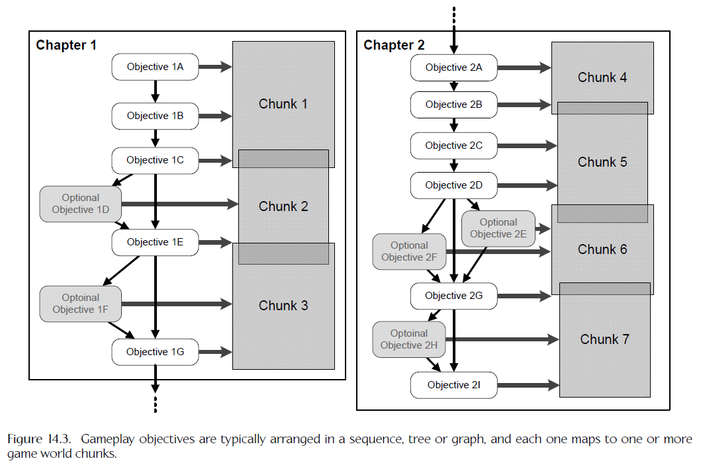
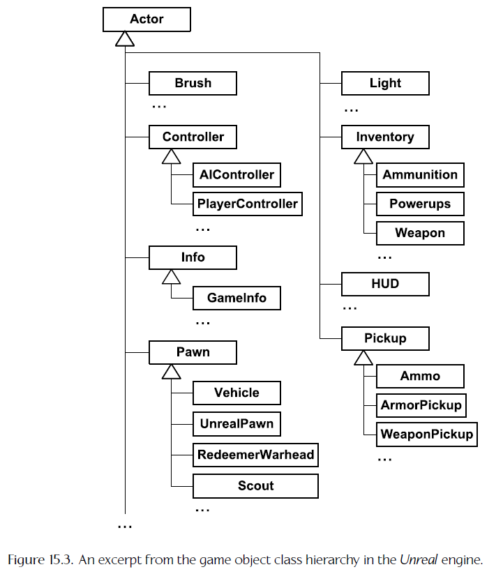
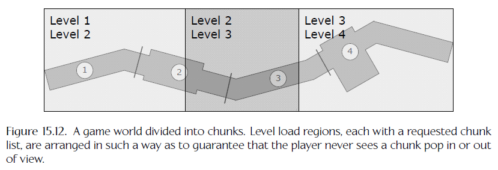

# Gameplay

## Introduction to Gameplay Systems

- 游戏玩法可以定义为玩游戏的整体体验。游戏机制（`game mechanics`）是游戏玩法更具体的说法，通常定义为一组管理游戏中各种实体间交互的规则，还定义玩家目标、胜利或失败标准、玩家角色能力、非玩家实体的数量和类型、游戏体验的整体流程等
- 论文 “A Survey of ‘Game’ Portability” 中将用于实现游戏玩法的软件系统集合称为 `G-factor`

### Anatomy of a Game World

#### World Elements

- 组成游戏世界的离散元素分为静态元素和动态元素
- 实现游戏玩法的软件系统主要关注动态元素的状态，游戏状态（`game state`）指作为一个整体的所有动态元素的当前状态
- 静态元素与动态元素的分别通常有点模糊（如具有可破坏环境的游戏），它们的分别主要用作优化工具
- `Static Geometry` 静态元素几何通常在 Maya 这样的工具中定义，组建游戏世界的静态部分时可以实例化多次
  - `Brush geometry` 画笔几何，来源于 Quake 引擎家族，可以构建静态元素和碰撞数据。一个画笔将一个形状描述为一组凸体，每个凸体以一组平面为界。画笔几何可以快速简单地创建和集成到基于 BSP 树的渲染引擎中。画笔对于快速组成游戏世界的内容非常有用，允许游戏玩法尽早进行测试。如果布局有价值，美术团队可以对画笔几何进行纹理映射和微调，或者将其替换为更详细的自定义网格资产；如果布局需要重新设计，画笔几何可以很容易地修改

#### World Chunks

- 大的虚拟游戏世界通常分为离散的可玩区域，称为世界块（`world chunks`），块也称为关卡（`levels`）、地图（`maps`）、阶段（`stage`）或区域（`areas`）
- 最初，关卡的概念用于在早期游戏硬件的有限内存中提供游戏玩法的变化；现在这个概念在许多方向分支，有些游戏块间界限并不明显，有些游戏使用星型拓扑，有些游戏使用图拓扑，有些游戏使用 LOD 技术提供一个广阔、开放世界的幻想
- 现在许多游戏世界仍然分为某种块
  - 内存限制仍然是重要约束
  - 块是控制游戏整体流程的方便的机制
  - 块可以用作分工机制

#### High-Level Game Flow

- 游戏的高级流程定义玩家目标的一个序列、树或图，目标有时称为任务（`tasks`）、阶段（`stages`）、关卡（`level`）或波（`waves`，如果游戏主要关于击败成群的敌人）。高级流程还提供每个目标成功的定义和失败的惩罚，在故事驱动游戏中还包含各种游戏内电影
- 早期游戏玩家目标与世界块一一对应，现在这种对应很少，一个目标可以关联多个块，且耦合很松，这种设计提供了独立改变游戏目标和世界划分的灵活性。许多游戏将目标分为粗略的游戏部分，通常称为章（`chapters`）或幕（`acts`）

  

### Implementing Dynamic Elements: Game Objects

- 动态元素通常设计为面向对象风格，可以用游戏对象（`game object / GO`）指代游戏世界中几乎任何动态元素，游戏对象通常也称为实体（`entities`）、行动者（`actors`）或代理（`agents`）等

#### Game Object Models

- 计算机科学中，术语对象模型有两个相关但是不同的意思
  - 可以指特定编程语言或正式设计语言提供的一组功能，例如 C++ 对象模型或 OMT 对象模型
  - 可以指特定面向对象编程接口，即设计为解决特定问题的一组类、方法和相互关系，例如 Microsoft Excel 对象模型
- 可以用游戏对象模型描述游戏引擎提供的能力，以允许建模和模拟虚拟游戏世界中的动态实体，因此，游戏对象模型有上面给出的两个定义的方面
  - 是特定面向对象编程接口，解决特定问题：模拟组成游戏的一组特定实体
  - 通常扩展编写引擎的编程语言。如果游戏用非面向对象语言如 C 实现，面向对象的能力可以通过程序员添加；如果用面向对象语言如 C++ 实现，通常会添加反射、持久化和网络复制等高级特性。游戏对象模型有时融合多个语言的特性

#### Tool-Side Design versus Runtime Design

- 几乎所有的游戏引擎有某种形式的工具端对象模型和该对象模型的相应运行时实现
  - 工具端对象模型由世界编辑器中设计师看到的一组游戏对象类型定义
  - 运行时对象模型由程序员用于运行时实现工具端对象模型的一组语言结构和软件系统定义，可能与工具端对象模型完全相同或直接映射到它，也可能与工具端对象模型完全不同

### Data-Driven Game Engines

- 当游戏的行为可以由美术师和设计师提供的数据而不是完全由程序员制作的软件全部或部分控制时，我们称引擎为数据驱动的
- 数据驱动架构可以提高团队效率和迭代时间，但是数据驱动特性通常付出了巨大代价，游戏引擎在何时选择引擎的哪些方面进行数据驱动要极度小心，权衡创建数据驱动或快速迭代特性的成本与该特性在整个项目期间期望节省的时间，并且在设计和实现数据驱动工具和引擎系统时坚持 KISS (“keep it simple, stupid”) 口头禅

### The Game World Editor

- 数据驱动的资产创建工具，如 Maya、Photoshop、Havok 内容工具等，在游戏空间中的模拟是游戏世界编辑器：允许游戏世界块由静态和动态元素定义和填充的一个或一套工具
- 所有商业游戏引擎都有某种世界编辑器工具
  - Radiant，用于为 Quake 和 Doom 引擎家族创建地图
  - Hammer，之前用名称 Worldcraft 和 The Forge 发布的编辑器，由 Valve 的 Source 引擎提供
  - CryENGINE 3 的沙盒编辑器

#### Typical Features of a Game World Editor

- `World Chunk Creation and Management` 世界创建的单元通常是块，游戏世界编辑器通常允许创建新块，重命名、分割、合并或销毁已有块
  - 每个块可以链接到一个或多个静态网格或其他静态数据元素如 AI 导航地图、玩家可以抓取的壁架的描述、掩护点定义等
  - 一些引擎中，块由单个背景网格定义，没有一个就无法存在；其他引擎中，块可以单独存在，可能由包围体定义，且可以用零个或多个网格或画笔几何填充
  - 一些世界编辑器提供专门的工具创作地形、水和其他特殊静态元素；其他引擎中，这些元素可以使用标准 DCC 应用程序创作，但以某种方式标记指示资产调节流水线或运行时引擎它是特殊的，例如神秘海域和最后生还者中水创作为三角网格，但用一个特殊材质映射指示它被视为水
  - 有时，特殊的世界元素在单独的独立工具中创建和编辑，例如荣耀勋章：血战太平洋中的高度场地图用从 EA 中另一个团队获得的自定义工具版本创作，而不是将地形编辑器集成到 Radiant 中
- `Game World Visualization` 几乎所有的世界编辑器通过某种方式提供世界的一个三维透视图或二维正交投影
  - 直接集成一个自定义渲染引擎到编辑器
  - 编辑器自身集成到 3D 几何编辑器如 Maya 或 3ds Max 中
  - 编辑器与真实的游戏引擎通信，用它渲染三维透视图
  - 编辑器集成到引擎中
- `Navigation` 一些编辑器提供导航的一系列便利功能，包括
  - 选定和聚焦一个对象
  - 保存各种相关摄像头位置，然后在它们之间跳转
  - 各种摄像头移动速度模式，用于粗略导航和精细摄像头控制
  - 类似 Web 浏览器的导航历史记录，用于在游戏世界中跳转等等
- `Selection` 世界编辑器的用户需要能单独选定元素来进行编辑
  - 可以通过正交视图中的橡皮筋盒或者三维视图中的射线投射风格拾取选定对象
  - 许多编辑器还显示所有世界元素的滚动列表或树视图，这样对象可以通过名称查找和选定
  - 一些编辑器还允许命名和保存选定，供以后恢复
  - 游戏世界对象分布密集时对象选定有时很困难。当使用射线投射选定对象时，可以允许用户循环遍历射线当前相交的所有对象，或者允许暂时隐藏当前选定对象
- `Layers` 一些编辑器允许对象分组为预先定义或用户定义的层，整个层可以隐藏或显示，可以作为分工策略的重要部分
- `Property Grid` 世界元素通常有各种用户编辑的属性，属性可以是简单的键值对，或更复杂的数据数组、嵌套的复合数据结构。大多数世界编辑器在一个滚动属性网格视图中显示当前选定对象的属性
  - `Editing Multiobject Selections` 可以选定多个对象的编辑器中，多个对象选中时编辑器只显示对象共有的属性
  - `Free-Form Properties` 对象关联的属性和这些属性的数据类型一般基于每个对象类型定义，一些编辑器允许用户基于每个实例定义额外的“自由格式”属性，这些属性通常实现为键值对的扁平表，用户可以自由选择每个自由格式属性的名称、数据类型和值
- `Object Placement and Alignment Aids` 世界编辑器以特殊方式处理一些对象属性，例如位置、方向、缩放、资产链接等，许多世界编辑器在基本平移、旋转和缩放工具外提供大量对象放置和对齐辅助工具，这些功能大量借鉴商业图形和 3D 建模工具如 Photoshop、Maya、Visio 等的功能集，包括捕捉到网格、捕捉到地形、对齐到对象等
- `Special Object Types` 特定对象类型也需要特殊处理
  - `Lights` 光源，通常使用特殊图标表示，因为它们没有网格，编辑器可能尝试显示光源的大概效果
  - `Particle emitters` 构建在独立渲染引擎上的编辑器中，粒子效果的可视化比较困难，因此粒子发射器可能只用图标显示，或尝试在编辑器中模仿粒子效果。如果编辑器在游戏中或可以与运行中游戏通信，则这不是问题
  - `Sound sources` 3D 渲染引擎将声源建模为 3D 点或体，为它们提供专门的编辑工具十分方便，例如可视化全向发声器的最大半径或定向发声器的方向向量和椎体
  - `Regions` 是一个用于检测相关事件的空间体，可以建模为球、定向盒、k-DOP 等。如果区域总是球形的，可以使用“半径”属性；但是为了定义和修改任意形状的区域，几乎肯定需要一个特殊的编辑工具
  - `Splines` 世界编辑器通常需要提供显示样条的能力，用户可以选定和操作样条的个别控制点。一些编辑器支持两种选择模式，一个“粗略”模式用于选定对象，一个“详细”模式用于选定已选中对象的个别组件
  - `Nav meshes for AI` 许多游戏中，NPC 通过在游戏世界的可导航区域内执行寻路算法导航，这些可导航区域必须定义，在编辑器中创建、可视化和编辑，例如导航网格是一个二维三角网格，提供可导航区域边界的简单描述以及连接信息
  - `Other custom data` 每个游戏有自己的具体数据要求，世界编辑器可能被要求提供这些数据的可视化和编辑能力，例如游戏空间中供 AI 系统使用的“联觉效应”的描述（窗口、门口、可能的攻击或防御点），描述一些东西如玩家角色或 NPC 使用的掩护点或可抓取壁架的几何特征
- `Saving and Loading World Chunks` 引擎间加载和保存世界块的粒度不同，一些按块，一些按层；数据格式也不同，一些使用自定义二进制格式，一些使用文本格式如 XML 或 JSON
- `Rapid Iteration` 好的游戏世界编辑器通常支持一定程度的动态调整以快速迭代

#### Integrated Asset Management Tools

- 一些引擎中，游戏世界编辑器集成了游戏资产数据库管理的其他方面，例如定义网格和材质属性、定义动画、混合树、动画状态机、设置对象的碰撞和物理属性、管理纹理资源等
- 这个设计比较著名的一个例子是 UnrealEd，构建在 Unreal 引擎上的游戏用于创建内容的编辑器
- `Data Processing Costs` 游戏资产从源格式转化到游戏引擎所需格式通常有两步处理，首先，资产从 DCC 应用程序导出为平台无关的中间格式，然后，资产处理为针对特定平台进行了优化的格式
  - 工具流水线间的一个关键不同是平台特定优化步骤的执行点。UnrealEd 在资产首次导入编辑器时执行，这在快速迭代中得到回报，但更改源资产十分痛苦；其他引擎如 Source 引擎和 Quake 引擎在游戏运行前烘焙关卡时进行资产优化；Halo 为用户提供随时更改原始资产的选项

## Runtime Gameplay Foundation Systems

### Components of the Gameplay Foundation System

- 大多数游戏引擎提供一套运行时软件组件，它们一起提供一个框架，游戏的独特规则、目标和动态世界元素可以在这个框架上构造。这些组件没有标准名称，可以统称为引擎的游戏基础系统（`gameplay foundation system`）
- 如果引擎与游戏的分界线可以合理绘制，则游戏基础系统刚好在这条线下面；然而实际上这些系统几乎总是包含特定游戏类型细节，甚至在一些游戏引擎中游戏基础系统被视为完全在分界线之上。每个游戏引擎以不同的方式解决这个游戏软件设计问题，然而大多数引擎以某种形式提供了以下主要子系统
  - `Runtime game object model` 运行时游戏对象模型，通过世界编辑器向游戏设计师广告的抽象游戏对象模型的一个实现
  - `Level management and streaming` 关卡管理和流式传输。关卡数据在游戏期间流式传输到内存，提供一个大的无缝世界的错觉（实际上它被分成离散的块）
  - `Real-time object model updating` 实时对象模型更新。为了让游戏对象表现地自主，每个对象必须周期性更新，这是引擎中所有不同系统真正融合成一个有凝聚力的整体的地方
  - `Messaging and event handling` 消息和事件处理。大多数游戏对象需要与其他对象通信，这通常通过一个抽象消息系统完成。对象间消息通常表示游戏世界状态的变化，称为事件，所以消息系统有时也称为事件系统
  - `Scripting` 使用 C 或 C++ 这样的语言编写高级游戏逻辑十分笨重，为了快速迭代和把更多权力交给非程序员，游戏引擎通常集成一个脚本语言，如基于文本的 Python 和 Unreal 的图形语言 Kismet
  - `Objectives and game flow management` 目标和游戏流程管理。通常使用目标序列、树或图描述，目标通常分组成章。游戏流程管理系统管理游戏的整体流程，跟踪玩家的目标完成情况并在目标完成时将玩家从一个区域锁定到下一个区域。一些设计师称它为游戏的“脊柱”
- 运行时对象模型可能是最复杂的，提供了以下大部分功能
  - `Spawning and destroying game objects dynamically` 动态产生和销毁游戏对象。一些游戏引擎提供一个系统管理动态产生的游戏对象关联的内存和其它资源，一些引擎简单禁止游戏对象的创建或销毁
  - `Linkage to low-level engine systems` 与底层引擎系统的联系。大多数游戏对象用三角形网格在视觉上表示，可以有粒子效果、声音、动画、碰撞、动态模拟等，游戏基础系统的一个主要职责就是确保每个游戏对象可以访问依赖的引擎系统服务
  - `Real-time simulation of object behaviors` 对象行为的实时模拟。游戏引擎是基于代理的模型的一个实时动态电脑模拟，所有游戏对象的状态需要随时间动态更新，且由于对象间的依赖、子系统上的依赖和子系统间的依赖，需要以特定的顺序更新
  - `Ability to define new game object types` 定义新的游戏对象类型的能力。游戏需求随开发会变化，游戏对象模型必须足够灵活，能简单添加新的对象类型并暴露到世界编辑器，理论上这个定义可以是完全数据驱动的方式，实际上一般需要程序员的服务
  - `Unique object ids` 唯一对象 ID。每个对象需要有某种类型的唯一 ID，字符串 ID 可读性好但性能差，整数 ID 性能好但可读性差，一个比较好的解决方案是使用哈希字符串 ID
  - `Game object queries` 游戏对象查询。游戏基础系统必须提供查找游戏世界内对象的方法，通过 ID 查找特定对象，查找某个类型的所有对象或执行基于任意标准的高级查询
  - `Game object references` 游戏对象的引用。可以是简单的指针，也可以更复杂，如句柄或引用计数的智能指针
  - `Finite state machine support` 有限状态机支持。许多类型的游戏对象最好使用有线状态机建模，游戏对象可以处于多个可能状态中的一个，每个状态有自己的属性和行为特征
  - `Network replication` 网络复制。网络多人游戏中，多个游戏机器通过 LAN 或 Internet 连在一起，一个特定游戏对象的状态通常被一个机器所有和管理，然而它的状态必须复制到多人游戏中的其它机器，让所有玩家有这个对象的一致视图
  - `Saving and loading / object persistence` 对象持久化。可用于支持一个“随时随地保存”的游戏保存系统、作为实现网络复制的一种方式、加载游戏世界块的主要方法等。对象持久化通常依赖于具体语言特性，如运行时类型识别（`runtime type identification / RTTI`）、反射（`reflection`）和抽象构造（`abstract construction`），如果选择的语言原生不支持这些特性，则需要手动添加

### Runtime Object Model Architectures

- 两种基本架构风格
  - `Object-centric` 对象为中心，每个工具端游戏对象运行时使用单个类实例或一小组互连的实例表示，对象的属性和行为封装在实例的类中
  - `Property-centric` 属性为中心，每个工具端游戏对象运行时只使用一个唯一 ID 表示，对象的属性分布在多个数据表中，每个属性类型一张表，使用对象 ID 做键。属性本身通常实现为硬编码类的实例。游戏对象的行为由组成它的属性集隐式定义

#### Object-Centric Architectures

- `A Simple Object-Based Model in C: Hydro Thunder` 雷霆快艇扩展 C 语言实现了两个重要的 OOP 特性：继承和多态

  ```C
  struct WorldOb_s
  {
    Orient_t m_transform; /* position/rotation */
    Mesh3d* m_pMesh; /* 3D mesh */
    /* ... */
    void* m_pUserData; /* custom state */
    void (*m_pUpdate)(); /* polymorphic update */
    void (*m_pDraw)(); /* polymorphic draw */
  };
  typedef struct WorldOb_s WorldOb_t;
  ```

- `Monolithic Class Hierarchies` 整体类层次结构，游戏对象模型中几乎所有的类都继承自一个共同的基类，如 Unreal 引擎的游戏对象模型

  

- `Problems with Deep, Wide Hierarchies` 深且宽的整体类层次结构的问题
  - `Understanding, Maintaining and Modifying Classes` 理解、维护和修改类
  - `Inability to Describe Multidimensional Taxonomies` 无法描述多维分类法
  - `Multiple Inheritance: The Deadly Diamond` C++ 的多重继承特性可以解决多维分量问题，但是有许多实际问题，大多数游戏工作室禁止或严格限制多重继承的使用
  - `Mix-In Classes` 混合类，没有基类的独立类。一些团队允许多重继承的一个限制形式，一个类可以有多个父类，但只有一个爷爷，即一个类只能继承自主继承层次结构上的一个类，但同时还可以继承自任意数量的混合类。然而这样的类通常使用组合（`compose`）或聚合（`aggregate`）更好
  - `The Bubble-Up Effect` 冒泡效应。随着越来越多的功能加入到游戏，多个无关类间的共享代码的期望开始导致功能在层次结构中“冒泡”，Unreal 引擎的 `Actor` 类是一个经典的例子
- `Using Composition to Simplify the Hierarchy` 继承是 "is-a" 关系，组合是 "has-a" 关系。如果一个对象与另一个对象通过指针或引用链接但不管理它的生命周期，则称为聚合关系
  - `Converting Is-A to Has-A` "is-a" 关系到 "has-a" 关系的转换是一种有用的技术，可以降低游戏类层次结构的宽、深和复杂度
  - `Component Creation and Ownership` 组件创建后拥有它的类需要持有它并管理它的生命周期，最简单的一个方法是使用指针，在构造方法中将其设为空，析构方法中将其释放，子类可以自由设置父类持有的组件但不用在析构方法中将其释放
- `Generic Components` 另一个灵活但实施起来也比较棘手的方法是根游戏对象类提供一个通用的组件链表，组件通常派生自一个共同基类，允许我们迭代链表并执行多态操作
- `Pure Component Models` 组件可以通过 ID 链接到一个逻辑组，可以用纯组件模型来描述这种结构
  - 组件的初始化不由游戏对象处理，而是使用工厂模式，或使用数据驱动模型，在文本文件中定义
  - 组件间的通信可以通过组件查询完成，或使用更高效的方式，例如将组件预先连接到循环列表中
  - 对象间的通信需要提前知道要通信的组件或多播到组成游戏对象的所有组件，两种选择都不理想

#### Property-Centric Architectures

- 属性为中心的对象模型成功使用在许多商业游戏中，如杀出重围 2 和神偷系列游戏
- 属性为中心的设计更像一个关系数据库而不是对象模型，每个属性像关系数据库中的一张表，主键为游戏对象的 ID
- 对象行为的定义在以下两个地方
  - 在属性本身中
  - 通过脚本代码
- `Implementing Behavior via Property Classes` 每个属性类型可以实现为一个属性类，每个属性类通过它的硬编码方法提供行为，特定游戏对象的整体行为由它所有属性的行为聚合决定
- `Implementing Behavior via Script` 另一个选项是将属性值作为原始数据保存到一个或多个类似数据库的表中，使用脚本代码实现游戏对象的行为。每个游戏对象可以有一个特殊的称为类似 `ScriptId` 的属性，定义将管理对象行为的脚本代码块。脚本代码也可用于允许游戏对象响应游戏世界中发生的事件
  - 一些属性为中心的引擎中，工程师提供一组核心硬编码属性类，但允许游戏设计师或程序员完全在脚本中实现新的属性类型，这个方法成功用于地牢围攻项目
- `Properties versus Components` 纯组件模型和属性为中心设计的差异很小，本质上都是一个逻辑游戏对象由一组子对象组成并从中得到它的行为。属性为中心设计中，子对象定义游戏对象的特定属性；基于组件的设计中，子对象表示到特定底层引擎子系统的链接
- `Pros and Cons of Property-Centric Designs` 属性为中心设计的优缺点
  - 优点
    - 往往更节省内存，因为只需要保存实际使用的属性数据
    - 更容易用数据驱动的方式构建这样一个模型，可以定义新的属性而不重编译游戏，因为没有物理对象定义变化
    - 比对象为中心模型更加缓存友好，因为相同类型的数据在内存中连续保存，可以降低或消除缓存未命中，这个数据设计方法有时称为数组结构（`struct of arrays`）技术，与传统的结构数组（`array of structs`）方法相反
  - 缺点
    - 仅仅通过拼凑一组属性对象的细粒度行为很难实现一个期望的大规模行为
    - 更难调试，无法在调试器的观察窗口中一次性检查游戏对象的所有属性

### World Chunk Data Formats

- 世界块通常包含静态和动态元素。静态几何可以表示为一个大的三角网格或多个小网格，静态数据通常包含保存为三角形集合的碰撞信息、一组凸形状或其它简单形状、用于检测事件或划分区域的体积区域、AI 导航网格、描述背景几何内边缘的一组可被抓取的线段等；动态部分包含块内游戏对象的某种表示，通常包含
  - `The initial values of the objects’ attributes` 对象属性的初始值
  - `Some kind of specification of the object’s type` 对象类型的定义，对象为中心引擎中可能是一个字符串、ID 或哈希字符 ID，属性为中心引擎中可以显式保存或由组成对象的属性集合隐式定义

#### Binary Object Images

- 保存一组游戏对象的一个方法是将每个对象的二进制镜像写进文件，但这通常不是一个好主意
  - 保存 C++ 类实例的二进制镜像需要特殊处理指针和虚函数表
  - 需要处理端交换（`endian-swap`）
  - 不灵活，不易于做出改变

#### Serialized Game Object Descriptions

- 保存游戏对象的内部状态的表示到磁盘文件的另一个方法是序列化
- 一些语言原生支持序列化，如 C# 和 Java，一些语言原生不支持，需要自己实现，如 C++
- 序列化通常使用比二进制镜像更方便、更便携的方式。XML 是一个流行选择，但解析很慢，许多引擎转向使用基于文本的 JSON 数据格式
- 序列化机制通常以两种基本方式之一实现
  - 在基类中引入一对称为类似 `SerializeOut()` 和 `SerializeIn()` 的虚函数，每个派生类可以提供它们的自定义实现
  - 为 C++ 类实现一个反射系统，然后实现一个可以自动序列化任何反射信息可用的 C++ 对象的通用系统

#### Spawners and Type Schemas

- 二进制对象镜像和序列化格式有一个致命问题，它们都由游戏对象类型的运行时实现定义，因此都需要世界编辑器亲密了解游戏引擎的运行时实现
- 可以以实现无关的方式抽象游戏对象的描述，对于世界块数据文件中的每个游戏对象，我们保存一小块数据，通常称为生成器（`spawner`）。一个生成器是一个游戏对象的轻量的仅数据表示，用于运行时实例化和初始化游戏对象。它包含游戏对象工具端类型的 ID 和描述游戏对象初始属性的键值对表
- 生成器可以配置加载后立即生成它的游戏对象，或者处于休眠状态，直到游戏后续期间要求它生成游戏对象。生成器可以实现为第一类对象
- 生成器可以用于其他目的，例如神秘海域和最后生还者中，设计师使用生成器定义游戏世界中重要的点或坐标轴，称为位置生成器（`position spawners`）或定位器生成器（`locator spawners`），定位器在游戏中有许多用处，例如
  - 定义 AI 角色的兴趣点
  - 定义一组坐标轴，一组动画相对于它们可以完美同步播放
  - 定义粒子效果或音频效果应该起源的位置
  - 定义沿赛道的航路点等等
- `Object Type Schemas` 使用基于生成器设计的游戏世界编辑器中，游戏对象类型可以由数据驱动模式（`schema`）表示，它定义当创建或编辑这个类型的一个对象时应该对用户可见的一组属性。运行时，工具端对象类型可以通过硬编码或数据驱动的方式映射到必须实例化以生成给定类型的一个游戏对象的一个或一组类
  - 对象类型模式可以提供额外的信息给世界编辑器，例如编辑属性时应该用哪种 GUI 元素，GUI 使用的元信息等
  - 一些游戏引擎允许对象类型模式像类一样被继承
- `Default Attribute Values` 在模式中为许多属性定义默认值十分有用，实现它的一个简单方式是省略那些值与默认值没有区别的属性的键值对。一些引擎允许默认值在派生对象类型中覆盖
- `Some Beneifts of Spawners and Type Schemas` 简单、灵活、健壮。与引擎实现细节的耦合非常松散

### Loading and Streaming Game Worlds

#### Simple Level Loading

- 最早期游戏使用的加载方式，一次只允许加载一个游戏世界块。可以用基于栈的分配器实现，栈底是所有游戏关卡都需要的数据，称为加载并保留（`load and stay resident / LSR`）资产，栈指针在 LSR 资产完全加载后记录。这种设计非常简单，但玩家看到的世界是离散的块，关卡资源数据加载期间玩家被迫观看加载界面

#### Toward Seamless Loading: Air Locks

- 为了避免无聊的关卡加载界面，一个简单的方法是将内存分为相等的两块，一块加载当前关卡，另一块加载下一个关卡，这个方法的主要问题是将每个关卡的大小减少了一半
- 可以将内存分为大小不等的两块，一个大块包含一个完整的大世界块，一个小块包含一个小世界块，这个小世界块有时称为空气锁（`air lock`）。当玩家通过完整的大世界块进入空气锁时，某种类型的门或障碍确保玩家无法看到和返回到之前的世界区域，然后完整的大世界块可以被卸载，新的完整的大世界块可以通过异步文件 I/O 被加载，在此期间玩家在空气锁中忙着完成某些任务，如从走廊的一端走到另一端，或者像解谜或打击一些敌人这样更吸引人的东西

#### Game World Streaming

- 理想情况下，玩家不应该定期困在小的空气锁中，世界最好在玩家面前尽可能自然和可信地展开，现代游戏引擎通过使用流式传输技术支持这种无缝世界，世界流式传输的主要目标为
  - 在玩家做常规游戏任务的同时加载数据
  - 管理内存，消除内存碎片，同时根据需要加载和卸载数据
- 粗粒度的方法：将内存分为多个大小相等的缓冲，每个缓冲保留一个世界块，玩家离开一个世界块足够远，无法再看到它时可以将它卸载并加载新的世界块。这要求所有的世界块大小大致相同，足够填充缓冲且不大于缓冲
- 细粒度的方法：将每个游戏资产，从世界块到前景网格到纹理到动画银行，分为大小相等的数据块，而不是流式传输相对大的世界块。然后使用一个基于池的大块内存分配系统根据需要加载和卸载资源数据，不用担心内存碎片。顽皮狗的神秘海域和最后生还者引擎使用了这个技术，并且还使用了一些复杂的技术来利用不完整块末端未使用的空间
- `Determining Which Resources to Load` 使用细粒度的大块内存分配器的一个问题是引擎如何知道游戏给定时刻要加载哪些资源，神秘海域和最后生还者中使用一个相对简单的关卡加载区域（`level load regions`）系统控制资产的加载和卸载。每个关卡加载区域包括一个地理块，包含当玩家在该区域内时应该在内存中的世界块的一个列表

  

- `PlayGo on the PlayStation 4` PS4 的新特性 PlayGo 通过只下载玩游戏第一部分所需的最小数据子集工作，游戏的剩余内容在后台下载，玩家可以继续体验游戏而不被打断。为了使这个运作良好，游戏必须支持无缝关卡流式传输

#### Memory Management for Object Spawning

- 动态分配很慢且会导致内存碎片
- `OffLine Memory Allocation for Object Spawning` 离线在世界编辑器中分配游戏对象，作为世界块的一部分。允许世界块动态加载和卸载，但在加载块后立即加载所有动态游戏对象，此后，没有游戏对象可以被创建或销毁。这不会比任何其他资源数据更容易造成内存碎片，且让游戏的内存使用模式高度可预测，但有时想提供大量对象时需要找到方法回收对象
- `Dynamic Memory Management for Object Spawning` 动态内存管理，需要处理内存碎片问题
  - `One Memory Pool per Object Type` 为每个唯一游戏对象大小使用单独的内存池，所有相同大小的对象类型可以共享一个池。这可以避免内存碎片，但是要维护大量的池，要有根据地判断每种对象类型需要多少，如果一个池的元素太多则浪费内存，太少则无法满足对象分配
  - `Small Memory Allocators` 小内存分配器，允许游戏对象从池中分配，池的元素比对象本身大。这可以减少所需内存池的数量、显著加快小数据块的分配、避免内存碎片，以每个池中一些可能浪费的内存为代价。无法从池中分配的大对象可以直接使用通用堆分配器分配
  - `Memory Relocation` 内存重定位，移动分配的内存块到相邻的空闲洞来移除碎片，需要仔细修正任何被移动的内存块内的指针

#### Saved Games

- 保存游戏系统保存和重新加载游戏状态，让玩家在游戏世界保存和重新加载前后不会感受到差异。保存游戏文件往往只包含局部状态信息，远小于世界块文件，可能更多地强调数据压缩和省略
- `Checkpoints` 保存游戏的一个方法是限制保存到游戏中的特定点，称为检查点。基于检查点的保存游戏文件可以非常小，缺点是用户沮丧的可能性，尤其当检查点很少且很远
- `Save Anywhere` 一些引擎支持随处保存，这使得保存游戏文件的大小显著增加，包含与世界块基本相同的信息，减去世界块的静态部分

### Object References and World Queries

#### Pointers

- 许多游戏引擎大量使用指针，因为它们是目前实现对象引用最快、最高效和最简单的工作方式，但是有一些缺点
  - `Orphaned objects` 孤儿对象，仍然占据内存但不再被系统中任何其它对象需要或引用的对象
  - `Stale pointers` 陈旧的指针，对象删除后它的所有指针需要设为空，否则会出现陈旧的指针，指向已经被释放的内存，通过该指针读或写数据会导致程序崩溃或不正确的程序行为
  - `Invalid pointers` 非法的指针，如解引用一个空指针，或一段数据被误解为指针解引用，前者可以通过断言宏进行保护检查，后者通常导致程序崩溃或其它可能很难调试的严重问题
  - 一些游戏团队出于使用更安全的编程实践的期望或出于必要转而使用更复杂的对象引用，例如，如果游戏引擎运行时重定位分配的数据块来消除内存碎片，则不能使用简单的指针
- `Smart Pointers` 智能指针，大多数意图和目的就像指针，但避免了 C/C++ 原生指针的大多数固有问题。最简单的，一个智能指针包含一个原生指针作为数据成员，同时提供一组重载运算符，使它在大多数方面像一个指针，同时可以包含额外的元信息或采取额外的步骤
  - 智能指针可以相互合作以确定特定对象的引用数量，有助于对象生命周期管理，这称为引用计数（`reference counting`），通常也可以作为垃圾回收系统的核心
  - 智能指针有其共同的问题，易于实现但难以正确，因此最好尽量远离智能指针，如果必须使用，最好使用成熟的实现而不是试图自己动手，如 Boost C++ 模板库
  - 智能指针的实现可能是一个艰巨的任务，有各种各样的问题
    - 智能指针的类型安全
    - 智能指针与不完整类型一起使用的能力
    - 异常发生时正确的智能指针行为
    - 运行时成本可能很高
- `Handles` 句柄，通过句柄表提供简单的间接，句柄基本上是全局句柄表的一个整数索引，句柄表在这个索引处包含句柄所指的对象的指针。句柄比原始指针更安全和灵活，但很容易引用陈旧的对象，一个简单的解决方案是在每个句柄中包含对象的唯一 ID，解引用句柄时同时检查整数索引和对象 ID。全局句柄表的一个附带好处是提供了系统中所有激活游戏对象的现成列表

#### Game Object Queries

- 游戏团队通常判断在游戏开发期间最有可能需要哪种类型的查询，并实现特殊的数据结构来加速这些特定类型的查询，例如
  - `Finding game objects by unique id` 游戏对象的指针或句柄可以保存到哈希表或二叉查找树中，键为对象 ID
  - `Iterating over all objects that meet a particular criterion` 假设提前知道标准，则游戏对象可以基于标准预先分类保存到链表中
  - `Finding all objects in the path of a projectile or with line of sight to some target point` 碰撞系统通常被用来执行这种类型的游戏对象查询，大多数碰撞系统提供快速射线投射和其他形状投射
  - `Finding all objects within a given region or radius` 可以将游戏对象保存到某种类型的空间哈希数据结构，例如放置在整个游戏世界中的横向网格，或更复杂的四叉树、八叉树、kd 树等

### Updating Game Objects in Real Time

- 大多数底层引擎子系统需要周期性更新，游戏对象系统也如此，几乎所有的游戏引擎将更新游戏对象状态作为主游戏循环的一部分
- 因为游戏是动态的基于时间的模拟，所以一个游戏对象的状态描述它在特定时刻的配置
- 通常游戏引擎维护多个时钟，一个完全跟踪真实时间，其它的可能对应也可能不对应真实时间。时钟提供绝对时间 $t$ 或游戏循环迭代间的时间变化 $\Delta t$。驱动游戏对象状态更新的时钟通常允许与真实时间不同，允许游戏对象行为暂停、放慢、加速或甚至反转，对游戏调试和开发也非常宝贵
- 游戏对象更新系统是计算机科学中动态、实时、基于代理的电脑模拟（`dynamic, real-time, agent-based computer simulation`）的一个例子，还展示了离散事件模拟（`discrete event simulations`）的一些方面
- 与所有高层游戏引擎系统一样，每个引擎使用略微或有时完全不同的方法

#### A Simple Approach (That Doesn’t Work)

- 更新一组游戏对象的状态的最简单方法是迭代对象集合并依次调用每个对象的类似 `Update()` 的虚函数，这在主游戏循环的每个迭代期间通常执行一次，即每帧一次。前一帧开始的时间增量可以传递给更新函数
- `Maintaining a Collection of Active Game Objects` 激活游戏对象通常由单例管理类维护，使用一个链表保存游戏对象的指针、智能指针或句柄。不允许游戏对象动态创建和销毁的引擎中通常使用静态大小的数组而不是链表
- `Responsibilities of the Update() Function` 游戏对象的 `Update()` 方法主要负责给定游戏对象的前一个状态 $S_i(t-\Delta t)$ 判断它在当前离散时间索引的状态 $S_i(t)$。完成这个可能包含应用一个刚体动态模拟给对象、采样预先制作的动画、对当前时间步中发生的事件做出反应等
  - 大多数游戏对象与多个引擎子系统交互，直接在游戏对象的更新函数中简单更新这些子系统的状态似乎是合理和直观的，但在商业级游戏引擎中通常不可行

#### Performance Constraints and Batched Updates

- 大多数底层引擎系统有严格的性能限制，它们操作大量数据，每帧要尽可能快地执行大量运算，因此大多数引擎系统受益于批量更新（`batched updating`）
- 大多数商业游戏引擎中，每个引擎子系统由主游戏循环直接或间接更新，而不是基每个游戏对象更新。使用批量更新的原因不仅是性能优势，一些引擎子系统当基于每对象更新时根本无法运作，例如碰撞系统
- 批量更新提供许多性能优势，例如
  - `Maximal cache coherency` 允许引擎子系统实现最大缓存一致性，因为它的每对象数据在内部维护，可以安排在 RAM 的单个连续区域中
  - `Minimal duplication of computations` 全局计算可以执行一次并重用于多个游戏对象
  - `Reduced reallocation of resources` 资源可以每帧分配一次并重用于批处理中的所有对象
  - `Efficient pipelining` 高效的流水线，利用专门的硬件资源

#### Object and Subsystem Interdependencies

- 每对象更新方法过于简单的两个原因
  - 游戏对象间存在相互依赖
  - 引擎子系统间存在相互依赖
- `Phased Updates` 分阶段更新。游戏对象也可能依赖于引擎子系统计算的中间结果，许多游戏引擎允许游戏对象在每帧期间的多个点运行更新逻辑，例如顽皮狗引擎更新游戏对象三次。每个对象都更新三次显然是耗时且不灵活的，通用回调机制是一个更好的选择，避免多余的更新操作，且任何客户端都允许注册一个回调，而不仅仅是游戏对象
- `Bucketed Updates` 分桶更新。游戏对象的相互依赖可以用依赖树的森林表示，可以从森林的根部到叶子按层更新游戏对象，每层为一个单独分组，称为桶。对于每个桶，执行所有游戏对象和引擎系统的完整更新，完成所有更新阶段，然后重复整个过程直到没有桶。许多游戏引擎显式限制依赖森林的深度，使用固定数量的桶
  - 这在实践中可能比较复杂，一些引擎子系统，例如物理引擎，可能不支持桶的概念。不过顽皮狗基本上使用分桶更新实现了神秘海域系列游戏和最后生还者，这种方法已被证明是实用且合理有效的
- `Object State Inconsistencies and One-Frame-Off Lag` 所有游戏对象的状态在更新循环前和后是一致的，但是在更新期间是不一致的，这是混乱和错误的一个重要来源，最常出现在当游戏对象在更新循环期间查询其他对象的状态信息时。如果需要被查询对象的最新状态但该对象还没有更新，则会有更新顺序问题，会导致称为一帧滞后（`one-frame-off lags`）的一类错误，一个对象的状态落后于另一个对象的状态一帧
  - 一个解决方案是分桶更新，游戏对象只允许查询先前更新的桶内的对象的状态
- `Object State Caching` 提高游戏对象状态一致性的另一个方法是在更新期间计算每个对象的新状态时缓存前一个状态，而不是原地覆盖它
  - 优点
    - 允许安全地查询任何对象的前一个状态而不用考虑更新顺序
    - 确保了一个完全一致的状态总是可用的，甚至在新状态更新期间
    - 可以在前一个状态和新状态之间线性插值得到两个时间点之间任意时刻对象的近似状态，例如 Havok 物理引擎维护模拟中每个刚体的前一状态和当前状态就是为了这个目的
  - 缺点
    - 消耗两倍于原地更新方法的内存
    - 只解决了问题的一半，前一个状态是一致的，但新状态仍然有潜在的不一致性
  - 这个技术是纯函数编程的核心
- `Time-Stamping` 提高游戏对象状态一致性的一个简单且低成本的方法是给它们加时间戳，更新循环期间查询对象状态的任意代码可以断言或显式检查时间戳以确保获得合适的状态信息。时间戳不能解决更新一个桶期间的状态不一致，不过可以检查被查询对象的桶和当前更新的桶并断言它们不等来防止（仅更新循环为单线程时有效）

#### Designing for Parallelism

- `Parallelizing the Game Object Model Itself` 游戏对象更新理论上可以并行完成，为了让它变得实用，需要仔细设计整个对象模型以确保游戏对象不会直接访问其他游戏对象的状态信息，所有的对象间通信必须通过消息传递完成，需要一个高效的游戏对象间的消息传递系统，即使这些对象位于完全独立的内存空间或由不同的物理 CPU 核处理
  - 一些研究已使用分布式编程语言编码游戏对象模型，如 Ericsson 的 Erlang 语言，这样的语言提供对并行处理、消息传递的内置支持，且比 C 或 C++ 这样的语言更高效快速地处理线程间的上下文切换。它们的编程习惯使程序员从不“破坏规则”，允许并发、分布式、多代理设计正确高效地运行
  - 可以使用状态缓存，不需使用互斥或临界区锁而安全地直接访问其它对象的前一个状态
- `Interfacing with Concurrent Engine Subsystems` 引擎的大多数性能关键部分从并行处理中受益最多，如渲染、动画、音频、物理等，因此不管游戏对象模型在单线程中更新还是跨越多个核，都需要与几乎可以肯定是多线程的底层引擎系统连接。开始思考异步和批处理是一个游戏程序员必须做出的重要转变，使用异步批处理方法转换同步非批处理代码的一个特别棘手的方面是确定在游戏循环期间何时启动请求、等待并使用结果
  - `How early can we kick off this request?` 对于任何给定请求，应该确定有足够信息启动它的帧期间的最早点，在那里启动它
  - `How long can we wait before we need the results of this request?` 许多情况下，给定一些思考、代码重构以及可能一些额外的中间数据缓存，使用请求结果的代码实际上可以推迟到帧的后期。也许可以容忍一帧滞后，使用上一帧的结果更新这一帧的对象状态，一些像 AI 这样的子系统甚至可以容忍更长的滞后时间

### Events and Message-Passing
