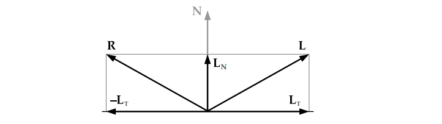
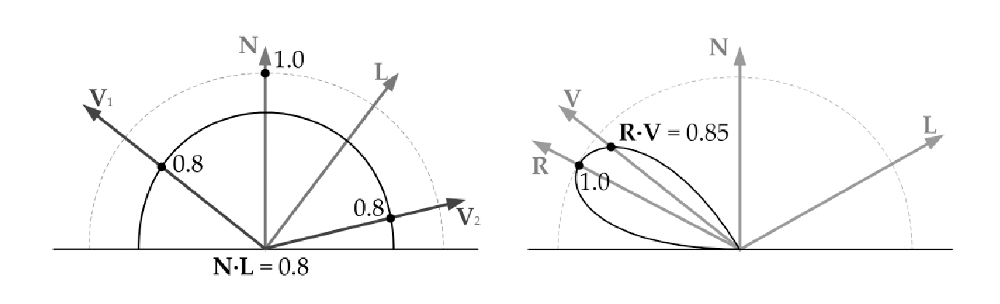
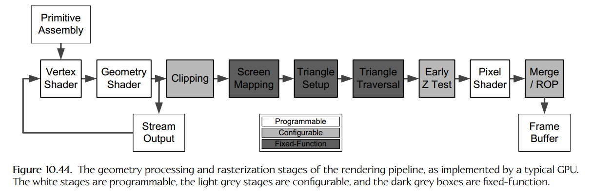

# Graphics

## Depth-Buffered Triangle Rasterization

### Describing a Scene

- `Triangle Mesh` 三角网格，用于模拟复杂物体表面
  - `Winding Order` 三角形绕序，顺时针或者逆时针
  - `Triangle Lists` 三角形列表构成三角网格
    - `Indexed Triangle Lists` 顶点数据在一处缓存保存，顶点索引列表在另一处缓存保存
    - `Strips and Fans` 顶点数据以条状或扇形排列，每个新加入顶点与已有的两个顶点构成三角形
    - `Vertex Cache Optimization` 通过离线的几何处理工具排序顶点，优化缓存顶点的复用
- `Back-face culling` 通过三角形绕序判断物体背面并剔除，避免浪费资源渲染物体不可见部分
- `Tessellation` 细分曲面技术，根据物体表面与镜头距离自动镶嵌顶点，使表面表现得平滑
- `Triangle-to-pixel density` 自动镶嵌顶点的目标：一个三角形对应一个像素
- `Level of detail (LOD)` 多细节层次，根据物体与镜头距离切换层次，每个层次是物体表面一个可替换的三角网格，常用于水面和各种地形
- `Model Space` 模型空间、本地空间、物体空间，网格顶点在物体本地的坐标系中表示
- `World Space` 自然空间，多个网格通过在自然空间中定位和定向组成一个完整的场景
- `Mesh Instancing` 物体的三角网格的顶点从模型空间变换到自然空间

### Describing the Visual Properties of a Surface

- `Light-Object Interactions` 光在可以被吸收、反射（漫反射和镜面反射）、衍射（一般不考虑）、散射、折射
- `Color Model` 用三元组或四元组表示色彩的数学模型
- `Color Space` 色彩模型所能定义的色彩范围即色彩空间、色域
- `Vertex Attributes` 顶点属性可以用来描述物体表面的视觉特性
  - `Position vector` 顶点在模型空间的位置
  - `Vertex normal` 顶点处的单位表面法线
  - `Vertex tangent and bitangent` 与顶点法线一起两两垂直，构成一个坐标系 `tangent space`（切线空间），用于逐像素照明计算
  - `Diffuse color` 漫反射色
  - `Specular color` 高光反射色
  - `Texture coordinates` 纹理坐标，用于将二维或三维位图映射到网格表面上（`texture mapping`），描述顶点在纹理的二维归一化坐标空间（`texture space`）中的位置，左下角（0，0），右上角（1，1）
  - `Skinning weights` 蒙皮权重,一个顶点受连接骨骼的多个关节影响
- `Vertext Formats` 保存的顶点属性的数据结构的布局
- `Attribute Interpolation` 渲染三角形基于逐像素而不是逐顶点,所以需要对顶点属性进行插值得到内部点的属性
- `Gouraud shading` 高洛德着色，对顶点的色彩属性进行插值
- `Textures` 纹理，包含色彩信息和其他信息，可以映射到网格的三角形上；一些图形硬件约束纹理位图的大小为2的幂
  - `Diffuse map` 漫反射贴图，描述物体表面每个纹素上的漫反射表面色彩
  - `Albedo map` 无光颜色贴图，同漫反射贴图
  - `Normal map` 法线贴图，保存每个纹素的单位法线，RGB编码
  - `Gloss map` 光泽贴图，保存每个纹素的亮度
  - `Environment map` 环境贴图，保存一张周围环境的图片，用于渲染反射
- `Texture Addressing Modes` 纹理寻址模式，处理超出范围的纹理坐标的方法
  - `Wrap` 纹理直接重复
  - `Mirror` 纹理翻转后重复，相邻纹理镜像对称
  - `Clamp` 超过范围的纹素颜色为纹理边界颜色
  - `Border color` 超过范围的纹素颜色由用户定义
- `Texture Formats` 保存在磁盘上：tga/png/bmp/tif；保存在内存中：RGB888/RGBA8888/RGB565/RGBA5551；压缩纹理：DXT/S3TC
- `Texel Density` 纹素与像素的比例称为纹素密度；纹素密度小于1可能会看到纹素的边，纹素密度大于1可能会造成不必要的内存消耗和镜头微调时像素点的闪烁；纹素密度为1时最佳
- `Mipmapping` 多层次纹理贴图，与 `LOD` 多层次模型相似；创建多个纹理级别，每个级别纹理的宽和高都是的上一个级别的一半，图形硬件选择其中一个或相邻的两个级别用于纹理映射，使得纹素密度尽可能接近1
- `World-Space Texel Density` 纹素与自然空间物体表面积的比例；不需要接近1，但是所有物体需要一致
- `Texture Filtering` 渲染三角形的一个像素时，图形硬件通过像素中心在纹理空间的落点，采样多个纹素并混合结果色作为实际采样的纹素颜色，这个过程叫纹理过滤
  - `Nearest neighbor` 选择最接近像素中心的纹素；选择纹素密度大于等于1且最接近1的 `mip level`
  - `Bilinear` 选择像素中心周围的4个纹素，混合权重基于纹素中心与像素中心的距离；选择纹素密度最接近1的 `mip level`
  - `Trilinear` 选择纹素密度分别大于等于1和小于等于1且最接近1的2个 `mip level`，依次 `Bilinear` 并将结果进行线性插值
  - `Anisotropic` 各向异性过滤；视角变化导致物体表面倾斜时，在一个梯形（或矩形、平行四边形）区域内进行纹素采样，提高该场景下的纹理质量；与 `Isotropy`（各向同性，包括双线性和三线性过滤） 相对
- `Materials` 材质，包含纹理和其他高级别特性，例如着色器程序、着色器程序入参、其他控制图形加速硬件功能的参数
  - `Mesh-material pairs` 包含渲染一个物体所需的所有信息，因此有时也称为 `render packets`，`geometric primitive`（几何图元）的概念有时也扩展包含 `Mesh-material pairs`
  - `Submeshes` 一个 3D 模型通常使用多个材质，因此网格经常划分为子网格，分别对应单个材质

### Lighting Basics

- `Shading` 着色处理，光线加其他视觉效果的广泛概况
- `Light transport models` 渲染引擎使用的光线-表面和光线-体交互的数学模型
  - `Direct lighting` 直接光，从光源发出、在物体表面反弹一次后射到虚拟镜头的光照
  - `Indirect lighting` 间接光，从光源发出、在多个表面反弹多次后射到虚拟镜头的光照
  - `Local illumination models` 局部光照模型，只考虑直接光，一个物体不会影响另一个物体的外观
  - `Global illumination models` 全局光照模型，考虑直接光和间接光，一些全局光照模型旨在模拟特殊的视觉现象，如逼真的阴影、反射面、物体间光线相互反射、水面或闪亮金属表面强烈反射的光学焦散效果；另一些则模拟广泛的光学现象，如 `Ray tracing`（光线追踪）和 `radiosity methods`（辐射度方法）技术
- `Rendering equation` / `Shading equation` 描述全局光照的数学公式，由 J. T. Kajiya 在一个意义重大的 `SIGGRAPH`（计算机图形学专业组）论文中提出 ；每个渲染技术都可以看作是渲染方程的完整或部分解决方案
- `The Phong Lighting Model` 冯氏光照模型，最常采用的局部光照模型
  - `Ambient` 环境光，对场景整体光照水平进行建模，是场景中间接光的总体效果的近似
  - `Diffuse` 漫反射光，光源照射到粗糙物体表面然后向各个方向反射
  - `Specular` 高光，光源照射到光滑物体表面然后反射到镜头
- 冯氏光照模型的入参
  
  参数 | 解释
  :-|:-
  $V\ =\ [V_x\ V_y\ V_z]$ | 观察方向向量，从反射点到镜头焦点
  $A\ =\ [A_R\ A_G\ A_B]$ | 环境光三个颜色通道上的强度
  $N\ =\ [N_x\ N_y\ N_z]$ | 反射点的法线
  $K_A\ =\ [K_{AR}\ K_{AG}\ K_{AB}]$ | 表面反射特性：环境光反射率
  $K_D\ =\ [K_{DR}\ K_{DG}\ K_{DB}]$ | 表面反射特性：漫反射率
  $K_S\ =\ [K_{SR}\ K_{SG}\ K_{SB}]$ | 表面反射特性：镜面反射率
  $\alpha$ | 表面反射特性：镜面光泽度指数
  $C_i\ =\ [C_{iR}\ C_{iG}\ C_{iB}]$ | 每个光源的颜色和强度
  $L_i$ | 反射点到每个光源的方向向量

- 冯氏光照模型一个点反射光强度 $I$ 的计算
  - $I\ =\ (K_A\bigotimes A)+\sum_i[K_D(N\cdot L_i)+K_S(R_i\cdot V)^\alpha]\bigotimes C_i$
  - $R$ 与 $L$ 和 $N$ 的关系如下图，计算公式为 $R\ =\ 2L_N-L$ 或 $R\ =\ 2(N\cdot L)N-L_T$ 
  
    

- `Blinn-Phong` 冯氏模型的变种（高光反射计算不同），精度更低（尽管对于某些表面比冯氏模型更贴近实际效果），运行时效率更高，几乎只用于早期电脑游戏和硬连线到早期GPU的固定功能流水线。
  - 高光部分为 $(N\cdot H)^\alpha$，与冯氏模型的 $(R\cdot V)^\alpha$ 对应，其中 $H$ 在 $V$ 和 $L$ 的中间
- `BRDF Plots` / `bidirectional reflection distribution function` 双向反射分布函数，一种通用本地反射模型，计算延观察方向 $V$ 反射的辐射亮度 `radiance` 与延入射光线 $L$ 入射的辐射照度 `irradiance` 的比例；一个 `BDRF` 可以看做一个半球图（`plot`），离球心越远的点可以看到的光的强度越低，冯氏模型中漫反射光和高光的半球图如下

  

- `Modeling Light Sources` 对真实世界的光源进行建模
  - `Static Lighting` 提前计算好网格每个顶点的冯氏反射保存为顶点属性，或者提前计算每个像素的光照保存在 `light map`中
    - `Light map` 光照贴图，一种纹理贴图；每个光源生成一个光照贴图，运用在光源影响区域内的所有物体上；可以使经过光源的动态物体被正确照亮；分辨率一般比漫反射纹理贴图低；纯的光照贴图比包含漫反射色信息的光照贴图更好压缩
  - `Ambient Lights` 环境光，与视角无关且没有方向，所以只用一个颜色建模，强度和颜色在游戏世界的不同区域不同
  - `Directional Lights` 平行光，太阳光，光源离物体无限远，所以用颜色 $C$ 和方向 $L$ 建模
  - `Point (Omnidirectional) Lights` 点光源，在特定位置向所有方向发射光线；用光源位置 $P$，光源颜色和强度 $C$，最大半径 $r_{max}$建模；点光源不影响最大半径外的物体
  - `Spot Lights` 聚光灯，手电筒光源，光线限制在一个圆锥体区域内的点光源；用光源位置 $P$，光源颜色 $C$，中心方向 $L$，最大半径 $r_{max}$，内圆锥偏角 $\theta_{min}$ 和外圆锥偏角 $\theta_{max}$ 建模；内圆锥光线强度最大，内圆锥外、外圆锥内光线强度随偏角增大而减小直到 0
  - `Area Lights` 真实的光源是有区域的，可以投射出本影（`umbra`）和半影（`penumbra`）。渲染引擎一般不对这种光源进行建模，而是采用其他方法模拟区域光源的效果，例如混合多个阴影或者模糊阴影边界来模拟半影
  - `Emissive Objects` 自发光物体，使用自发光纹理贴图建模
    - `Emissive texture map` 自发光纹理贴图，纹理颜色的强度不受周围光线影响，始终最大
- `Flashlight - Effect Combination` 手电筒是多种光源效果组合的简单实例
  - 镜头正对手电筒：自发光物体
  - 手电筒发射光线到场景中：聚光灯
  - 手电筒的光锥：黄色半透明网格
  - 眩光：镜头前的透明卡片
  - `bloom` 泛光效果：`high dynamic range light` 高动态范围图像
  - 焦散效果：投射纹理

### The Virtual Camera

- `The Virtual Camera` 焦点加焦点前的矩形虚拟感应面 / 成像矩阵 `imaging rectangle`；成像矩阵包含方形或矩形虚拟光线感应器，每个感应器对应屏幕上的一个像素。渲染就是决定这些虚拟感应器要记录的光线的颜色和强度的过程
- `View Space`/ `Camera Space` 虚拟摄像头的焦点是观察空间的原点，且一般摄像头正对 z 轴正或负方向，上对 y 轴正方向，左或右对 x 轴正方向；渲染网格时，网格顶点需要从模型空间变换到自然空间再到观察空间
- `Projections` 投影，将 3D 的场景变换到 2D 的图像平面。
  - `perspective` 透视投影，有 `perspective foreshortening`（透视收缩，物体离镜头越远看起来越小）的效果
  - `orthographic` 等距正交投影，渲染 3D 模型的平面图或者 2D 图形
- `View volume` 视体，可视空间，镜头可以看到的区域。由 6 个平面定义
  - `Near plane` 近平面，即成像矩阵
  - `Four side planes` 虚拟屏幕的边
  - `Far plane` 远平面，用于渲染优化，保证极远的物体不被绘制
  - `Frustum` 平截头体，透视投影渲染时的视体；正交投影时视体为长方柱
- `Homogeneous Clip Space` 透视投影和正交投影都是将点从观察空间变换到齐次裁剪空间中（从观察空间视体到 `Canonical View Volume` 正规化视体）
  - 该空间独立于采用的投影类型、屏幕的分辨率和宽高比（`aspect ratio`）
  - 一般为左手坐标系（`left-handed`）
  - 正规化视体为长方柱，便于对三角形进行裁剪
  - x 轴和 y 轴坐标范围为 $[-1,1]$，z 轴坐标范围为 $[-1,1]$（OpenGL）或 $[0,1]$（DirectX）
  - 齐次向量转换为三维坐标时 x/y/z 分量都要除以 w 分量，透视投影时变换的齐次向量的 w 分量是 z 坐标乘一个常数，所以齐次裁剪空间的坐标都除以了 z 坐标，造成透视收缩的效果
- `Perspective-Correct Vertex Attribute Interpolation` 透视校正插值。顶点属性插值是在屏幕空间（`Screen space`）执行的，透视投影时的顶点属性插值需要考虑到透视收缩效果。
- `Screen space` 屏幕空间是以屏幕像素为单位长度的二维坐标，一般原点在屏幕左上角，x 轴向右，y 轴向下（CRT 从上到下扫描屏幕）；渲染三角形时可以直接使用齐次裁剪空间中的 x/y 坐标，只需要对 x/y 进行简单的缩放和平移操作（该操作称为 `Screen mapping`）
- `The frame buffer` 帧缓冲，位图颜色缓冲，保存最终被渲染的图像，渲染引擎一般维护至少两个帧缓冲
  - `double buffering` 双重缓冲技术，缓冲 A 正在被 CRT 扫描时缓冲 B 可以被引擎更新；两个缓冲在 `vertical blanking interval`（垂直回扫期）内交换，可以保证 CRT 每次扫描的都是完整的缓冲，避免 `tearing`（撕裂效果）的产生
  - `triple buffering` 三重缓冲技术，缓冲 A 正在被 CRT 扫描，B 已经被引擎更新完成时，C 可以被接着更新而不需要等待 A 扫描完成
  - `Render Targets` 渲染目标，引擎在其中绘制图形的缓冲；渲染引擎使用各种离屏渲染目标来保存渲染结果
- `Triangle Rasterization and Fragments` 栅格化是填充三角形覆盖的像素的过程，即将矢量图转化为位图。该过程中，三角形表面被分成多个分段，每个分段对应屏幕上的一个像素（`multisample antialiasing` 场景一个分段对应一个像素的一部分）。分段写入帧缓冲的时候需要通过一些测试，测试失败分段被丢弃，测试成功分段被写入缓冲或与缓冲中像素已有颜色混合
- `Occlusion and the Depth Buffer` 渲染引擎需要保证重叠的三角形能正确显示，单纯像画家一样从后到前渲染无法解决两个三角形穿插在一起的场景。渲染引擎使用深度缓冲（`depth buffering`）或 z 缓冲（`z-buffering`）实现三角形的正确遮挡，不依赖渲染顺序。每个分段有一个 z 坐标表示离屏深度，分段的颜色写入帧缓冲时深度也保存到深度缓冲中；其他分段写入相同像素时，引擎会比较两个分段的深度，选择深度小离屏幕近的分段保存
- `z-Fighting and the w-Buffer` 深度缓冲精度是有限的，当两个平面无限靠近时依靠深度缓冲无法确定前后，导致后平面一些像素被绘制到前平面上，产生的图像噪音效果叫 `z-fighting`；使用裁剪空间的 z 分量作为深度导致离屏远的平面深度精度比离屏近的平面深度精度低，因为观察空间 z 坐标和裁剪空间的 z 分量是倒数关系；使用观察空间 z 坐标或裁剪空间 w 分量作为深度可以使离屏远近不同的平面有相同的深度精度，这个技术叫 w 缓冲（`w-buffering`）；w 缓冲无法直接对深度进行线性插值，所以比 z 缓冲更慢

## The Rendering Pipeline

### Overview of the Rendering Pipeline

- `Pipeline` 多个计算阶段（`Stage`）的有序链，每个阶段是独立的单元，有特定目标、操作输入数据流、产生输出数据流，前面阶段的输出作为后面阶段的输入。阶段的独立性赋予流水线结构优秀的平行处理能力，链中每个阶段可以同时处理数据、每个阶段可以同时处理多条数据。
  - `Throughput` 吞吐量，流水线的吞吐量计量流水线每秒完整处理的数据量
  - `Latency` 时延，流水线的时延计量流水线完整处理一条数据的时间；阶段的时延计量阶段处理一条数据的时间；时延最大的阶段决定了流水线的吞吐量，是流水线吞吐量的瓶颈
- `High-level stages in pipeline` 高层次的阶段划分
  - `Tools stage (offline)` 离线工具阶段，定义几何图形和材质
  - `Asset conditioning stage (offline)` 离线资源调节阶段，资源调节流水线（`Asset conditioning pipeline` / `ACP`）将几何图形和材质处理为引擎可用的格式
  - `Application stage (CPU)` CPU应用阶段，CPU 识别出可视网格实例，将网格实例和材质提交给图形硬件进行渲染
  - `Geometry processing stage (GPU)` GPU 几何处理阶段，GPU 将顶点变换、照亮、投影到齐次裁剪空间；可选的几何着色器处理三角形并以视锥体（`View frustum`）裁剪三角形
  - `Rasterization stage (GPU)` GPU 光栅化阶段，GPU 将三角形转换为着色且通过不同测试（z-test, alpha test, stencil test, etc.）的分段，最终混合存入帧缓冲
- 每个阶段的数据转换
  - 工具阶段：处理网格和材质
  - CPU 阶段：处理网格实例和子网格
  - GPU 阶段
    - 几何处理阶段：子网格分成大量顶点平行处理，最后再将完整变换和着色的顶点重构成三角形
    - 光栅化阶段：三角形分成分段，这些分段要么丢弃，要么作为颜色信息存入帧缓冲

### The Tools stage

- 网格由数据内容创造（`Digital content creation` / `DCC`）应用程序（Maya, 3ds Max, Lightwave, Softimage/XSI, SketchUp, etc.）建模产生，用 NURBS，四边形或三角形等定义，但是在渲染前都会被流水线的运行时部分曲面细分为三角形
- 网格顶点蒙皮，将顶点与骨骼关节联合并说明蒙皮权重。蒙皮信息和骨骼用于动画系统驱动一个模型的运动
- 材质定义，为材质选定着色器、着色器需要的纹理，定义配置参数和着色器的选项，使用 DCC 应用程序中直观的工具将纹理映射到表面，以及定义其他的顶点属性；材质的定义一般使用商用或内部的材质编辑器，材质编辑器可以是 DCC 应用程序的插件、单独的应用程序、实时连接到游戏中（可以预览材质在游戏中的显示），甚至允许编辑和调试着色器程序
- 网格和材质的关系是松散的，许多游戏团队会建立材质库供选择

### The Asset Conditioning Stage

- 该阶段本身也是一个流水线，称为资源调节流水线或工具流水线（`tools pipeline`）
- 导出、处理、连接多个类型的资源，例如一个 3D 模型的组成包括几何图形（顶点和索引缓冲）、材质、纹理、可选的骨骼。ACP 确保 3D 模型引用的这些资源可用且可以被引擎直接加载
- 几何图形和材质由 DCC 应用程序以平台无关的中间格式导出保存，然后再处理为一个或多个特定平台的格式。理想情况下这些特定平台的资源在运行时加载到内存后不需要做其他处理就可以使用
- 高层次的场景图（`scene graph`）可以在这个阶段进行计算。例如静止的几何图形可以处理生产一个 BSP 树
- 耗时的照明计算可以在这个阶段离线进行计算，称为静态照明（`static lighting`）

### A Brief History of the GPU

- 早期游戏开发所有的渲染工作都是 CPU 做的，随着游戏的流行，图形硬件开始发展起来，减轻了 CPU 的工作
- 最开始的图形加速器只处理渲染流水线中最耗时的光栅化阶段，随后开始支持几何处理阶段
- 最开始的图形硬件只提供一个硬连线可配置的实现，即固定功能流水线（`fixed-function pipeline`），这个技术称为硬件转换和照明（`hardware transformation and lighting` / `hardware T&L`）；后来，部分子阶段开始可编程，开发者可以编写称为着色器的程序来控制流水线如何处理顶点（`vertex shaders`）、分段（`fragment shaders` / `pixel shaders`）；DirectX 10 加入了第三种着色器 `geometry shader`，允许渲染引擎修改、剔除、创建完整的图元（三角形、线、点）
- 图形硬件逐渐演化为一个特殊的微处理器，称为 `graphics processing unit` / `GPU`，GPU 设计通过使用巨量的平行计算来最大化流水线的吞吐量
- GPU 逐渐演化为通用的高性能计算引擎，使用 GPU 编程完成图形无关的的任务称为 GPU 通用计算（`general-purpose GPU computing` / `GPGPU`）。GPU 通用计算中，图形无关的计算由特殊的着色器 `compute shaders` 来处理，它对 GPU 带宽的高效利用是在 PS4 或 Xbox One 上实现高性能的重要手段

### The GPU Pipeline

- 几乎所有的 GPU 将流水线分为以下几个子阶段

  

- `Vertex Shader` 顶点着色器，可编程，负责顶点的转化、着色、光照。
  - 输入：单个顶点，位置和法线一般在模型空间或自然空间中表示
  - 处理：模型空间到观察空间的转换；透视投影；每个顶点的光照、纹理计算、动画角色的蒙皮；通过改变顶点位置执行过程动画，如风中摆动的树叶或波动的水面
  - 输出：完全转换且点亮的顶点，位置和法线在齐次裁剪空间中表示
  - 其他：现代 GPU 中，顶点着色器可以完全访问纹理数据，在过去，只有像素着色器拥有这个能力，这有利于纹理被用作单独的数据结构，如 heightmaps / look-up tables
- `Geometry Shader` 几何着色器，可编程，可选阶段
  - 输入：齐次裁剪空间中的完整几何图形（三角形、线、点）
  - 处理：修改、剔除输入图元或创建新的图元，常用于阴影体推出（`shadow volume extrusion`）、渲染立方体贴图（`cube map`）的 6 个面、fur fin extrusion around silhouette edges of meshes、通过点数据创建粒子四元组、动态细分曲面、闪电效果线段的不规则细分、模拟布等
  - 输出：齐次裁剪空间中的完整几何图形
- `Stream Output` 流输出，一些 GPU 允许处理到流水线这点的数据可以写回内存，然后从流水线的顶端开始进一步处理。流输出使 GPU 可以在没有 CPU 帮助的情况下完成一些有趣的视觉效果，例如头发的渲染
  - 有 CPU 帮助时，头发的物理模拟在 CPU 上完成，CPU 将表示头发的立方体样条曲线细分为线段，交给 GPU 渲染
  - 无 CPU 帮助时，头发的物理模拟在 GPU 的顶点着色器阶段完成，GPU 的几何着色器将样条细分为线段，然后通过流输出写回内存，这些数据从流水线顶端开始进一步处理完成渲染
- `Clipping` 裁剪阶段，固定功能，可配置，可以裁剪三角形跨出视椎体的部分，也可以配置剔除视椎体外的三角形。
  - 裁剪通过找到视椎体外的点，然后找到对应的边与视椎体面的交点，这些交点作为新的顶点定义一个或多个裁剪三角形完成
- `Screen Mapping` 屏幕映射阶段，固定功能，不可配置，将顶点从齐次裁剪空间缩放和移动到屏幕空间
- `Triangle Set-up` 三角形装配阶段，固定功能，不可配置，在这个阶段，光栅化硬件初始化以确保三角形到分段的高效转化
- `Triangle Traversal` 三角形遍历阶段，固定功能，不可配置，三角形被分为分段，每个分段对应一个像素（使用某些抗锯齿技术时多个分段对应一个像素）；对顶点属性进行插值得到每个分段的属性作为像素着色器的输入，在需要时使用透视校正插值
- `Early z-Test` / `early depth test` 早期深度测试阶段，固定功能，可配置，对分段的深度进行测试，丢弃被挡住的像素
- `Pixel Shader` 像素着色器，可编程，对分段进行着色
  - 输入：每个分段的属性
  - 处理：可以丢弃分段（如分段完全透明），处理一个或多个纹理贴图，运行每个像素的光照计算，以及其他决定分段颜色的工作
  - 输出：每个分段的颜色
- `Merging / blending / Raster Operations Stage / ROP` 流水线最后一个阶段，固定功能，高度可配置，负责运行各种分段测试，包括深度测试、alpha 测试、模板测试。如果分段通过了所有测试，则分段的颜色与帧缓冲中对应像素的颜色混合保存
  - `alpha blending function` alpha 混合函数的基础结构是硬连线的，但运算符和参数可配置，可以产生各种各样的混合操作，控制颜色混合
  - 通用混合方程为 $C'_D=(w_S\bigotimes C_S)+(w_D\bigotimes C_D)$，$C$ 为颜色，$C'$ 为混合结果色，$_S$ 代表源即计算的分段，$_D$ 代表目的即帧缓冲中的像素，$w$ 为 0/1、源或目的色、源或目的透明度、1 减源或目的色、1 减源或目的透明度的一个子集
  - alpha 混合时，不透明几何图形渲染到帧缓冲中后，半透明表面必须按照从后到前的顺序保存和渲染，否则深度测试会丢弃部分表面，造成最终混合不完整

### Programmable Shaders

- 着色器架构从 DirectX 8 开始初具可编程性，早期着色器模型（`shader models`）只支持汇编语言，像素着色器与顶点着色器的指令集和寄存器组有着显著不同。DirectX 9 开始支持 C 风格的着色器语言，如 Cg（C for graphics），HLSL（High-Level Shading Language—微软实现的 Cg），GLSL（OpenGL shading language）。DirectX 10 引入了几何着色器，以及一个统一着色器架构 `shader model 4.0`（DirectX 的叫法），该模型中，所有的着色器粗略支持同样的指令集、有同样的能力集，包括读纹理内存的能力
- `Accessing Memory` 因为 GPU 实现了一个数据处理流水线，所以对 RAM 的访问是非常小心的。着色器程序无法直接访问内存，而是通过寄存器或纹理贴图的方式访问（PS4 的 GPU 提供了一个新颖的特性 `shader resource tables` / `SRTs`，允许 GPU 通过高速 `garlic` 总线直接访问主 RAM，节省了渲染前装配场景的 CPU 时间）
  - `Shader Registers` GPU 寄存器为 128 位 SIMD 格式，每个寄存器保留 4 个 32 位浮点数或整数（齐次裁剪空间的四元组向量或 RGBA 格式的颜色，每个颜色 32 位浮点数），单个 32 位标量（一般重复四次），有些 GPU 可以对 16 位数据进行操作
    - `Input registers` 输入寄存器，着色器的主要输入，GPU 在调用着色器前自动从视频 RAM 读取设置
    - `Constant registers` 常量寄存器，着色器的第二输入，应用程序在提交要渲染的图元时设置，例如模型-观察转换矩阵、投影矩阵、光照参数和其他无法作为顶点属性但着色器需要的参数
    - `Temporary registers` 临时寄存器，由着色器内部使用，保存计算的中间结果
    - `Output registers` 输出寄存器，由着色器填充作为着色器的唯一输出形式，GPU 可以将输出写回 RAM 作为流水线下一阶段的输入，通常 GPU 将这些数据缓存复用以减少计算，例如 `post-transform vertex cache` 缓存了顶点着色器最近处理的顶点
  - `Textures` 着色器可以通过纹理坐标（而不是绝对内存地址）直接只读访问一个纹理贴图
    - GPU 的纹理采样器自动过滤纹理数据（`Texture filtering`），适当混合相邻纹素间或相邻 `mipmap level` 间的值
    - 可以禁用贴图过滤来获取对特定纹素值的直接访问能力，这在纹理贴图用作数据表时十分有用
    - 着色器可以将场景渲染到在后续渲染传递中被解释为纹理贴图的离屏帧缓冲中，着色器只能通过这种间接方式写入纹理贴图
- `High-Level Shader Language Syntax` 高级着色器语言语法，Cg 或 CLSL 中定义的 `struct` 和变量被着色器编译器直接映射到寄存器
  - `Semantics` 语义，变量和 `struct` 成员后面可以跟一个冒号加一个称为语义的关键字，语义声明了变量或成员与特定顶点或分段属性的绑定关系  
    ```C
    struct VtxOut
    {
      float4 pos : POSITION; // map to position attribute
      float4 color : COLOR; // map to color attribute
    };
    ```
  - `Input versus output` 关键字`in` 和 `out` 声明了变量与输入输出寄存器的映射关系
    ```C
    VtxOut vshaderMain(VtxIn in) // maps to input registers
    {
      VtxOut out;
      // ...
      return out; // maps to output registers
    }
    ```
  - `Uniform declaration` 关键字 `uniform` 声明了变量与常量寄存器的映射关系，模型-观察转换矩阵可以如下传递给顶点着色器
    ```C
    VtxOut vshaderMain(
      VtxIn in,
      uniform float4x4 modelViewMatrix)
    {
      VtxOut out;
      // ...
      return out;
    }
    ```
  - `Arithmetic operations` 算术远算可以用 C 风格的运算符或调用内部函数
    ```C
    VtxOut vshaderMain(VtxIn in,
      uniform float4x4 modelViewMatrix)
    {
      VtxOut out;

      out.pos = mul(modelViewMatrix, in.pos);
      out.color = float4(0, 1, 0, 1); // RGBA green

      return out;
    }
    ```
  - 读纹理数据需要调用读特定纹理坐标处纹素值的内部函数，这些函数可以读一维、二维、三维的各种格式的纹理，使用或不使用纹理过滤；特殊的纹理寻址模式可用于访问立方体贴图或阴影贴图（`shadow map`）
  - `texture sampler` 纹理采样器，特殊的数据格式，可以声明对纹理贴图的引用，例如 `sampler2D` 声明一个对二维纹理的引用，下面简单的 Cg 像素着色器应用一个漫反射贴图到三角形
    ```C
    struct FragmentOut
    {
      float4 color : COLOR;
    };
    FragmentOut pshaderMain(float2 uv : TEXCOORD0,
      uniform sampler2D texture)
    {
      FragmentOut out;
      // look up texel at (u,v)
      out.color = tex2D(texture, uv);
      return out;
    }
    ```
- `Effect Files` 一个着色器程序描述了一个渲染传递（`pass`）内应用的的操作，但是有些视觉效果需要多个渲染传递，且 PC 平台为了兼容性需要定义视觉效果的退却版本。将多个着色器程序连接起来作为一个完整的视觉效果，这样的文件格式称为效果文件
  - 不同渲染引擎的实现不同，Cg 中的效果文件格式称为 `CgFX`，ORGE 中使用与 `CgFx` 十分相似的 `material file`，GLSL 使用基于 XML 的 `COLLADA`
  - 通常采用的分层结构
    - 全局定义 `struct`、着色器程序和全局变量（被映射到应用程序定义的常量参数）
    - 定义多个技术，每个技术对应渲染特殊视觉效果的一个方式，一般提供一个实现最高质量的主技术和多个用于低速图形硬件的退却技术
    - 每个技术内定义多个传递，一个传递描述如何渲染单个全帧图像，通常包含一个着色器程序的引用，各种参数绑定和可选的渲染状态设置

### Antialiasing

- 光栅化时三角形的边可能会产生台阶一样的效果，称为锯齿，使用离散的像素集合对平滑连续的图像进行采样造成了锯齿的出现。术语抗锯齿描述任何降低这种视觉失真的技术。
- 抗锯齿有很多方法，但基本所有的技术都是通过混合周边像素来软化三角形的边。
- `Full-Screen Antialiasing (FSAA)` / `super-sampled antialiasing (SSAA)` 全屏 / 超级采样抗锯齿，将场景渲染到一个比实际屏幕大的帧缓冲中，然后再将过大的结果图像进行缩小采样（`downsample`）得到期望的分辨率。例如 $4\times$ `FSAA` 的图像宽和高都是屏幕宽和高 $\times 2$，帧缓冲占用内存 $\times 4$，GPU 处理时间 $\times 4$
- `Multisampled Antialiasing (MSAA)` 多重采样抗锯齿，与 `FSAA` 一样的视觉质量，但消耗更少的 GPU 时间。对一个像素内的 $N$ 个点进行次级采样（`subsample`），深度、模板、颜色缓冲大小 $\times N$，每个像素对应缓冲中的 $N$ 个槽，每个槽对应一个次级采样；三角形光栅化时每个分段中的这 $N$ 个次级采样点都要跑 $1$ 次覆盖测试和深度测试，当至少一个次级采样点通过测试时运行一次像素着色器，像素着色器将颜色保存到落在三角形内的次级采样点对应的槽；渲染完成后，将过大的颜色缓冲缩小采样并平均每个像素对应的 $N$ 个槽的颜色值得到屏幕分辨率的图像。多重采样在 GPU 带宽方面比 `FSAA` 优秀，因为着色远比覆盖和深度测试耗时
- `Coverage Sample Antialiasing (CSAA)` 覆盖取样测试，Nvidia 提出的对 `MSAA` 优化的技术。对于 $4\times$ `CSAA`，像素着色器运行一次，每个分段有四个次级采样点要运行深度测试以及存储颜色，但是每个分段有 $16$ 个次级采样点（“coverage subsamples”）要执行像素覆盖测试，得到的抗锯齿效果与 $8\times$ 甚至 $16\times$ `MSAA` 相似，但内存占用只相当于 $4\times$ `MSAA`
- `Morphological Antialiasing (MLAA)` 形态学抗锯齿，集中解决场景中受锯齿影响最严重的区域。场景按正常大小渲染，然后扫描识别台阶状模式，找到后对其进行模糊以减轻锯齿效果。
- `Fast approximate antialiasing (FXAA)` 快速近似抗锯齿，Nvidia 开发的与 `MLAA` 方法相似的优化的技术

### The Application Stage

- CPU 应用阶段，驱动 GPU 工作的阶段
  - `Visibility determination` 只将可以看见的物体提交给 GPU
  - `Submitting geometry to the GPU for rendering` 通过渲染调用或者直接构造 GPU 指令表将子网格-材质对提交给 GPU。场景需要多个传递渲染时几何图形可能会提交多次给 GPU，所以为了优化几何图形可能会被缓存
  - `Controlling shader parameters and render state` 通过常量寄存器传递给着色器的参数由 CPU 基于每个图元设置。同时，CPU 要设置流水线不可编程阶段所有可配置的参数来保证每个图元的正确渲染
- `Visibility Determination` 构造可见网格实例列表的过程
  - `Frustum Culling` 视椎体裁剪，将所有完全在视椎体外的物体从渲染列表移除。给定一个候选网格实例，可以通过对物体的包围体（`bounding volume`）和视椎体六个面的简单测试判断它是否在视椎体内。可以将包围体球心代入视椎体平面方程得到球心离平面的高，然后比较高与包围体半径判断包围体是否在平面内
  - `Occlusion and Potentially Visible Sets`
    - `Occlusion culling` 遮挡裁剪，将视椎体内被完全挡住的物体从可见列表移除。在拥挤的场景中极其重要，但是在不拥挤的场景或俯瞰场景时弊大于利
    - `Potentially visible set (PVS)` 潜在可见集合，大规模环境总的遮挡裁剪可以通过提前计算 `PVS` 完成。给定一个相机视角，一个 `PVS` 列出场景中所有可能可见的物体。一个 `PVS` 错误在多包含了不可见物体，而不是少包含了可见物体
    - 一个实现 `PVS` 的方法是将场景分为不同区域，每个区域提供一个列表，这个列表包含当相机在该区域时可以看到的其他区域。这些 `PVS` 可以由美术师或游戏设计师定义，或者更多地由离线工具根据用户定义的区域自动生成。这样的工具一般从区域内随机的相机视角渲染场景，然后从结果帧缓冲中查找区域的编码色。自动 `PVS` 工具不完善，一般提供一个机制供用户调整结果（手动放置相机视角进行测试或手动配置明显包含或不包含的区域）
  - `Portals` 在门户渲染中，游戏世界被分为多个半关闭区域，通过洞互相连接，例如窗口或者门，这些洞称为门户，通常用多边形描述门户的边界。渲染有门户的场景时，先渲染相机所在的区域，然后对于该区域的每个门户，使用门户边界向相机焦点-门户边界方向延伸产生的平面围成的类似于视椎体的门户体裁剪其他区域的内容
  - `Occlusion Volumes (Antiportals)` 遮挡物体轮廓边向相机焦点-遮挡物体轮廓边方向延伸产生的平面围成的遮挡体，可以描述场景中被遮挡不可见的物体，与门户体的作用相反。门户体最好用于封闭的室内环境，占视椎体的小部分，剔除室外大量的物体；遮挡体最好用于附近物体遮挡大量视线的室外环境，占视椎体的大部分，剔除大量的物体
- `Primitive Submission` 图元的提交，可见几何图元列表生成后，需要提交到 GPU 流水线进行渲染，这个动作可以通过 API 调用如 DirectX 的 `DrawIndexedPrimitive()` 或 OpenGL 的 `glDrawArrays()` 实现
  - `Render State` GPU 流水线的许多阶段功能固定但可配置，甚至可编程阶段也部分被可配置参数驱动，所有可配置参数的集合称为硬件状态（`hardware state`）或渲染状态（`render state`），由应用程序保证渲染状态的正确配置。理想情况下子网格对应的材质已经完整描述了渲染状态设置，应用程序只需要遍历可见网格实例的每个子网格-材质对，根据材质的定义调用 API 设置渲染状态。一些可配置参数的如下
    - 自然-观察矩阵
    - 光照方向向量
    - 纹理绑定（材质和着色器使用哪个纹理）
    - 纹理寻址和过滤模式
    - 滚动纹理和其他动画效果的时间轴
    - 启用或禁用深度测试
    - alpha 混合选项
  - `State Leaks` 状态泄露，前一个图元使用的设置泄露到下一个图元，导致物体使用了错误的纹理或光照效果等。需要应用程序保证状态泄露永远不会出现
  - `The GPU Command List` 应用阶段与 GPU 通过一个指令表通信，这些指令间插渲染状态设置和几何图形的引用。GPU 指令表构造和提交通过 API 调用如 `DrawIndexedPrimitive()` 完成，这些 API 对于有些应用成本太高，为了最大化性能，一些游戏引擎手动构造 GPU 指令表或调用底层渲染 API 如 PS3 的 libgcm 库
- `Geometry Sorting` 几何图形排序，渲染状态是全局的，应用于整个 GPU，改变渲染状态时整个 GPU 流水线都需要刷新然后应用新的设置，所以，需要按照材质排序几何图形来减少渲染状态的改变。
  - `Overdraw` 过度绘制，一些像素被多个重叠的三角形多次填充。透明和半透明表面的过度绘制是必需的，但不透明像素的过度绘制浪费 GPU 带宽。
  - 早期深度测试可以丢弃被遮挡的分段避免过度绘制，但是需要从前到后渲染几何图形，与按照材质排序几何图形的做法冲突
  - `z-Prepass to the Rescue` GPU 的特性 `z-prepass` 通过渲染场景两次解决了这个冲突，第一次高效生成 z 缓冲，第二次渲染帧缓冲；由于 z 缓冲的原因第二次渲染帧缓冲不会过度绘制；GPU 提供了一个特殊的双速渲染模式，禁用像素着色器，只更新 z 缓冲，保证第一次生成 z 缓冲的高效
  - `Order-independent transparency (OIT)` 不透明几何图形渲染后，透明和半透明表面可以从后往前渲染，这个强力的方法可以保证实现适当的 alpha 混合结果。顺序无关的透明是一个允许透明几何图形按任意顺序渲染的技术，它为一个像素保存多个分段，在整个场景都渲染完成后排序每个像素的所有分段并混合。这个方法在不提前排序几何图形时能产生正确结果，但是内存成本很高，因为帧缓冲要足够大来保存每个像素的所有半透明分段
- `Scene Graphs` 现代游戏世界非常大，大多数场景下几何图形的大部分不在视锥体内，所以视锥体裁剪十分浪费。场景图可以管理场景中的所有几何图形，在视锥体裁剪前快速丢弃大量不在视锥体附近的几何图形，同时也可以帮助排序几何图形。一般是树的数据结构，包括四叉树、八叉树、BSP 树、kd 树和空间哈希技术等
  - `Quadtrees and Octrees` 四叉树和八叉树递归地将空间分为四个或八个空间，每个空间可以保存可渲染的图元如网格实例、地势几何图形的子区域、大型静态网格的部分三角形等。这些图元保存在树的叶子节点，且每个叶子节点保存的图元数基本一致。对于一个节点，如果该节点对应的空间与视椎体不相交，则该节点或其所有后代叶子节点保存的图元都在视椎体外
  - `Bounding Sphere Trees` 包围球树分层将空间分为球状区域。叶子节点保存图元的包围球，然后将这些图元逻辑分组并计算每组新的包围球，直到最后计算的包围球包含整个世界。
  - `Binary Space Partitioning (BSP) Trees`  二进制空间划分树递归地将空间分为两半，直到每个半空间都满足一些预定义标准。用于碰撞检测、构造实体几何、视椎体裁剪性能优化、几何排序。划分空间使用一个平面，与这个平面交叉的三角形分为新的三个三角形，这样划分后的三角形要么在这个平面前，要么在这个平面后，要么和这个平面共面；这个特性使得 BSP 树可用于三角形的严格排序，这在早期游戏如 Doom 中十分重要，因为当时无法使用 z 缓冲，只能使用画家算法
  - `kd-tree` kd 树是 BSP 树概念在 k 维的通用化
- `Choosing a Scene Graph` 选择哪种场景图，选用哪种数据结构，依赖于要渲染怎样的场景，需要什么和不需要什么
  - 格斗游戏，两个角色在基本静态的环境中格斗，一般不需要场景图
  - 游戏在封闭的室内环境中，则 BSP 树或门户
  - 室外相对平坦的地形，或俯瞰场景，则一个简单的四叉树就可以实现高速渲染
  - 室外地面上的第一人称视角需要剔除机制辅助。人口稠密的场景可以使用遮挡体，因为遮挡者很多；但是遮挡者非常稀疏的情况下使用遮挡体反而会影响渲染效率
  - 要考虑渲染引擎实际测量性能得到的数据

## Advanced Lighting and Global Illumination

### Image-Based Lighting

- 许多高级光照和阴影技术大量使用一般为二维纹理贴图格式的图像数据，这些技术称为基于图像的光照算法
- `Normal Mapping` 法线贴图，定义了表面每个纹素的法线方向向量，允许 3D 建模器向渲染引擎提供对表面形状非常细节的描述，而不是将模型高度曲面细分（如果相同的信息由顶点法线提供时需要曲面细分）。法线向量一般用纹理的 RGB 颜色通道编码并做一些偏斜，因为 RGB 通道严格为正但是法线向量的分量可以为负。有时只在纹理中保存两个坐标，因为如果表面法线是单位向量的话第三个坐标可以很容易计算出来
- `Heightmaps` 高度图，对三角形表面以上或以下的理想表面高度编码。通常使用灰度图编码，保存每个纹素的高度值。高度图可用于一些技术，使得平坦表面看起来有高度的变化
  - `Bump mapping` 凹凸贴图，一个轻量的方法来生成表面法线。主要用于早期 3D 绘图，现在一般将法线信息保存在法线贴图中
  - `Parallax occlusion mapping` 视差遮挡贴图，渲染一个平坦表面时使用高度图中的信息人工调整纹理坐标，使得镜头移动时表面看起来包含了正确移动的表面细节。在神秘海域系列游戏中用于子弹效果贴花
  - `Displacement mapping` / `Relief mapping` 置换贴图、地形起伏图，通过实际地细分曲面、然后推出表面多边形、然后通过高度图确定置换顶点的数量来产生真实的表面细节。这样能生成最真实的效果，可以适当地自遮挡和自阴影，因为会生成真实的几何图形
- `Specular map` 高光贴图，表面不都是完全光滑的，例如一个人的脸有汗且脏，则湿的区域有光泽，干的和脏的区域显得暗。将高度细节的高光信息编码到一个特殊的纹理贴图叫高光贴图
  - `Gloss map` 光泽贴图，在高光贴图的纹素中保存镜面反色率 $K_S$，可以控制每个纹素的镜面反射。也叫高光掩模（`specular mask`），因为 $K_S$ 为 $0$ 的纹素不会应用镜面反射
  - `Specular power map` 高光指数贴图，在高光贴图中保存镜面光泽度系数 $\alpha$，可以控制高光在每个纹素上的“焦点”量
- `Environment Mapping` 环境贴图，看起来像从场景中一个物体的角度拍摄的环境的全景照片，覆盖了水平的 360 度和垂直的 180 或 360 度。类似一个物体周边通常的光照环境的描述，一般用于轻量渲染反射
  - `Spherical environment maps` 球状环境贴图，映射到一个以渲染物体为中心，无限大的球的内部。缺点是使用球坐标，当方位角垂直时，天顶的分辨率降低到一纹素
  - `Cubic environment maps` 立方体环境贴图，映射到一个以渲染物体为中心，无限大的立方体的内部。避免了球状环境贴图分辨率的问题
- `Three-Dimensional Textures` 3D 纹理，可以认为是 2D 纹理的一个栈。给定一个三维纹理坐标 $(u,v,w)$，GPU 知道如何处理和过滤一个 3D 纹理。对于描述物体的外观或体积属性十分有用，例如渲染一个可以被任意平面切割的大理石球

### High Dynamic Range Lighting

- 帧缓冲中的颜色通道范围为 $[0,1]$，但是真实世界中光强度可以任意增大。高动态范围照明（`HDR`）用于捕捉大范围内的光强度
- HDR 计算不会随意夹紧结果强度，结果图像保存的格式允许强度大于 1，这样图像的极暗或极亮区域不会丢失细节
- `tone mapping` 图像在屏幕上显示之前，色调映射可以将图像的强度范围映射为屏幕设备支持的范围。这使得渲染引擎可以仿造许多真实世界中的视觉效果，如从暗室走出到光亮区域时的暂时失明，光似乎从明亮的背光物体后面流出（称为`bloom`）
- 实现 HDR 图像的一个方法是将 R/G/B 通道保存为 32 位浮点数而不是 8 位整数，另一个方法是使用完全不同的颜色模式
- `log-LUV color model` HDR 的一个流行选择。颜色表示为一个强度通道（L）和两个色度通道（U/V），L通道为 16 位，U/V 通道各 8 位，L 表示为对数标度（基数 2），这样可以保存非常大范围的光强度，人眼对光强度的变化比色度的变化更敏感

### Global Illumination

- 计算光线从光源到虚拟相机的路径上，与场景中的多个物体交互的一类算法
- `Shadow Rendering` 阴影的渲染
  - `Shadow Volumes` 阴影体，阴影投射物体轮廓边向光源发射光线方向延伸产生的平面围成的体，是描述光线被遮挡空间的几何图形。利用模板缓冲可以生产阴影，模板缓冲相当于一个掩模，可以设置 GPU 只渲染相应模板值非 0 的分段，甚至设置 GPU 使用不同方式渲染相应模板值不同的分段
    - 第一个传递，生成未投影的图形，模板缓冲清零
    - 第二个传递，以相机视角渲染阴影体，阴影体正面对应的模板值加一，阴影体背面对应的模板值减一，正面和背面都可视时对应的模板值为零、没有阴影体对应的模板值为零，遮挡阴影体背面的几何图形值为一（相机和几何图形都在阴影体中）
    - 第三个传递，渲染阴影，将模板值非 0 的对应区域变暗
  - `Shadow Maps` 阴影贴图，从光源视角而不是相机视角进行的分段深度测试。
    - 第一个传递，从光源视角渲染场景，生成阴影贴图保存到深度缓冲
    - 第二个传递，正常渲染场景，使用阴影贴图判断分段是否在阴影中
    - 阴影贴图只包含深度信息，因此一般使用双速模式渲染
    - 对于点光源，渲染阴影贴图使用透视投影；对于平行光，渲染阴影贴图使用正交投影
    - `Light space` 生成阴影贴图时使用的观察空间称为光线空间。最终渲染时，计算出分段在光线空间的坐标 $(x,y)$ 将其转换为阴影贴图的纹理坐标 $(u,v)$，然后比较光线空间坐标 $z$ 和阴影贴图对应纹素的深度值，如果 $z$ 离光源比纹素远则在阴影中，反之不在阴影中
- `Ambient Occlusion` 环境光遮蔽，用于建模接触阴影（`contact shadows`）即场景只被环境光照亮时出现的柔和的阴影。一般描述表面上每个点对光线的“可访问性"，例如对于一个管道，管道中间的部分比两端的部分更不接近环境光，所以阴天放置在外时中间部分看起来比两端更暗。
  - 对表面一个点的环境光遮蔽的测量方式：以这个点为中心构造一个半径很大的半球，计算这个点可见区域占半球的百分比
  - 对于静态物体，环境光遮蔽可以提前离线计算，因为环境光遮蔽与观察视角和光线入射方向无关。一般在纹理贴图中保存每个纹素的环境光遮蔽级别
- `Reflections` 反射有多种实现方式，环境贴图用于生成周边环境在光泽物体表面的一般反射；在平滑表面如镜子上的直接反射可以通过两个传递完成
  - 第一个传递，找到相机关于反射平面对称的点，以该点视角将场景渲染到纹理中
  - 第二个传递，将纹理应用于反射平面
- `Caustics` 焦散现象，由于光泽表面如水或抛光金属表面的强烈反射或折射产生的明亮的镜面高光。当反射表面如水面移动时，焦散效果会在他们落下的表面闪烁并“游动”。通过将包含半随机亮点的（可能是动画的）纹理投影到受影响的表面，可以产生焦散效果
- `Subsurface Scattering` 次表面散射，光线从表面一个点进入，在表面下散射，在表面的另一个点重新出现。这种现象是造成人体皮肤、蜡和大理石雕像的“暖光”的原因
  - 由 `BRDF` 的高级变体双向表面散射反射分布函数（`bidirectional surface scattering reflectance distribution function` / `BSSRDF`）描述
  - 次表面反射有多种模拟方式，基于深度贴图的次表面反射渲染一个阴影贴图，只是这个阴影贴图不用于判断哪个像素在阴影中，而是用于计量一束光在遮挡物体中完全穿过必须行进多远，然后在物体的阴影侧提供一个人工的漫反射照明项，其强度与行进距离成反比，使得物体在光源相反的一侧相对较薄的位置看起来稍微发亮
- `Precomputed Radiance Transfer (PRT)` 预计算辐射传输，一种流行技术，试图实时模拟基于光能传递的渲染方法的效果。预先计算并存储关于入射光线从每个可能方向如何与表面交互的完整描述（反射、折射、散射等）；运行时，可以查询特定入射光线的响应并快速转换为精确的照明结果。
  - 通常，光在表面一个点的响应是一个复杂的函数，定义在以该点为中心的半球上。这个函数的一个紧凑表示对于 `PRT` 技术的实用性十分重要
  - 常用的方法是将这个函数逼近为球谐基函数的线性组合，这本质上是将简单标量函数编码为移位和缩放正弦波的线性组合的三维等效

### Deferred Rendering

- 传统基于三角形光栅化的渲染中，所有的照明和阴影计算在自然空间、观察空间或切线空间的三角形分段上执行，这个技术的问题在于它本质上是低效的，可能会做一些我们不需要做的工作，例如对三角形的顶点进行着色，但是这个三角形可能在光栅化阶段通过深度测试剔除。早期深度测试帮助消除了着色器评估不需要的像素，但即使这样也不完美，更重要的是，为了处理一个有很多灯光的复杂场景，我们最终得到了不同版本的顶点和像素着色器-这些版本可以处理不同数量的灯光，不同类型的灯光，不同数量的蒙皮权重，等等
- 延迟渲染技术是解决这些问题的一种方法。在延迟渲染中，主要的照明计算在屏幕空间完成，而不是观察空间。我们高效地渲染场景而不用担心照明。在此阶段，我们在称为 G 缓冲（`G-buffer`）的“深”帧缓冲中存储了点亮像素需要的所有信息。场景渲染完成后，使用 G 缓冲中保存的信息执行照明和阴影计算
- G 缓冲的物理实现可能是缓冲的一个集合，但是概念上讲，G 缓冲是单个的缓冲区，包含一组丰富的关于场景中物体在屏幕每个像素的照明和表面属性的信息。一个典型的 G 缓冲可能包含的像素属性：深度、观察空间或自然空间的表面法线、漫反射色、高光指数、甚至 PRT 系数
- 游击队游戏的杀戮地带 2

### Physically Based Shading

- 传统的游戏照明引擎需要对大量有时不直观的参数进行调整，来实现游戏中期望的“外观”。这个处理十分艰巨和耗时，更糟糕的是可移植性差，一些照明条件下的参数设置可能在其他的照明场景下效果不好。
- 基于物理的阴影模型试图模拟光在真实世界中传播、与材质交互的方式，允许使用直观的、以实际单位衡量的现实世界数量来调整着色器参数

## Visual Effects and Overlays

### Partical Effects

- 粒子渲染系统用于渲染无定形物体如烟雾、火花、火焰等。这些称为粒子效果
- 粒子效果与其他可渲染几何图形的关键区别
  - 由**大量的相对简单的**几何图形组成，最常见的简单卡片称为四边形，由两个三角形组成
  - 几何图形通常是**面对相机**的，意味着引擎必须采取措施保证每个四边形的表面法线要直接指向相机焦点
  - 它的材质几乎总是**半透明或透明**的，因此，粒子效果具有一些严格的渲染顺序的约束，这些约束不适用于场景中的大多数不透明对象
  - 粒子以各种各样的方式**生成动画**，他们的位置、方向、大小、纹理坐标和许多其他着色器参数每一帧都在发生变化，这些变化由手动动画曲线或程序方法定义
  - 粒子通常会**不断产生并杀死**，粒子发射器是以用户定义速率创建粒子的一个逻辑体；当粒子与预定义的死亡面碰撞，存活时间达到用户定义时长或满足其他用户定义的标准时被杀死
- 粒子效果可以由合适的着色器使用规则三角形网格几何图形渲染，但是，由于以上特性，真正的制作游戏引擎使用专门的粒子效果动画和渲染系统来实现他们

### Decals

- 贴花是相对小的几何图形，覆盖在场景中规则几何图形上面，允许表面的视觉外观动态变化，如弹孔、脚印、划痕、裂纹
- 现代引擎最常见的方法是将贴花模型转换为矩形区域，该矩形区域将沿着射线投影到场景中。这在 3D 空间中产生矩形棱柱。首先与棱柱相交的表面成为贴花的表面。相交几何图形的三角形使用贴花投影棱柱的四个包围面裁剪拿出，然后使用贴花纹理进行纹理映射，纹理映射完成的三角形再渲染到规则场景的顶部，同时使用视差贴图给它们深度的幻觉，并轻微调整 z 坐标避免 `z-fighting`

### Environmental Effects

- `Skies` 天空距离相机无限远，不可建模
  - 一个简单的方法是渲染 3D 几何图形前先将天空纹理填充到帧缓冲中。渲染的纹素密度约为 1，纹理可以随镜头的动作而旋转和滚动，同时需要将所有像素对应的深度值设为最大可能值。雷霆快艇中使用了该方式
  - 现代游戏平台像素着色成本很高，所以天空的渲染通常在场景其他部分渲染之后。首先将 z 缓冲清为最大值，渲染场景，然后关闭深度写，使用最大值减一作为深度测试值渲染天空。
  - `Sky box` / `Sky home` 对于玩家可能从任意方向观察的游戏，使用天空盒。天空盒总是以相机当前位置为中心渲染，所以他似乎位于无穷远处。在其他 3D 几何图形前渲染，同时将所有像素对应的深度值设为最大。这意味着相对于场景中的其他物体，天空盒实际上可能很小。它的大小是无关紧要的，只要它在绘制时填充整个帧缓冲
  - 云也通常使用专门的渲染和动画系统实现。早期游戏如毁灭战士和雷神之锤中，云只是具有滚动半透明云纹理的平面。更近一些的技术包括面向相机的卡片（广告牌）、基于粒子效果的云、体积云效果
- `Terrain` 地形，有时在像 Maya 这样的包中明确地建模，但是如果玩家可以从很远的距离看到，通常需要动态曲面细分或者 LOD 系统，同时可能还需要限制呈现非常大的户外区域所需的数据
  - `Height field terrain` 高度场地图，建模巨大地形区域的流行选择。大多数基于高度场地的地形系统中，水平面（$y=0$）以规则的网格模式细分，地形顶点的高度通过采样高度场地纹理决定。
  - 地形系统通常提供专门的工具用于绘制高度场地，雕刻出地形特性如路、河等。地形系统的纹理贴图通常是四个或更多纹理的混合，这样可以通过简单暴露其中一个纹理层来绘制草、泥土、碎石和其他地形特性。这些层可以交叉混合来提供平滑的纹理过渡。有些地形工具允许地形部分割除，然后将建筑、壕沟和其他专门的地形特性以规则网格几何图形的形式插入。地形创作工具有时直接集成进游戏世界编辑器，有时可能作为单独的工具
- `Water` 